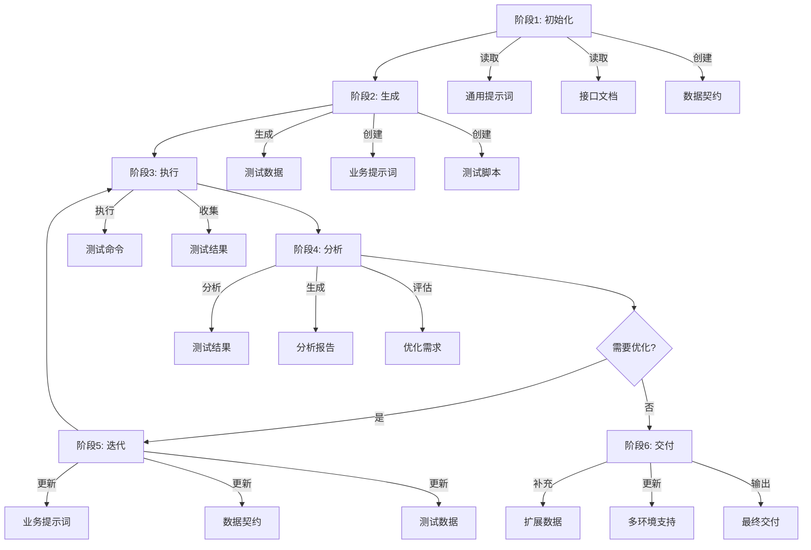

# 通用迭代式调试流程工作流

## 1. 工作流概述

### 1.1 核心目标
提供通用的、可复用的迭代式调试流程，指导用户从零开始搭建接口测试项目，通过持续的测试、分析、优化迭代，逐步完善测试覆盖率和数据质量。

### 1.2 适用场景
- 接口测试项目搭建
- 数据驱动测试（DDT）项目实施
- 自动化测试流程设计
- 测试数据优化迭代
- 多环境测试支持

### 1.3 核心原则
- **迭代优化**：通过多轮测试-分析-优化循环，持续提升测试质量
- **数据驱动**：基于测试数据驱动测试执行和优化决策
- **流程标准化**：建立标准化的工作流程和交付物规范
- **文档先行**：前置文档准备充分，确保流程可追溯
- **质量保障**：每个阶段都有明确的质量标准和验证方法

---

## 2. 完整工作流架构



**阶段说明**：
- **阶段1: 初始化** - 读取通用提示词、接口文档，创建数据契约
- **阶段2: 生成** - 生成测试数据、业务提示词、测试脚本
- **阶段3: 执行** - 选择环境，执行测试，收集结果
- **阶段4: 分析** - 分析结果，生成报告，评估优化需求
- **阶段5: 迭代** - 更新提示词/契约/数据，重新测试
- **阶段6: 交付** - 补充扩展数据，更新多环境支持

---

## 3. 阶段1: 初始化与规则提取

### 3.1 前置文档准备清单

在开始阶段1之前，请确保以下文档已准备就绪：

| 文档类型 | 文件路径 | 必需性 | 说明 |
| :--- | :--- | :--- | :--- |
| 通用提示词 | `.trae/rules/DDT测试数据管理智能体提示词.md` | 必需 | 定义DDT测试数据生成的通用规则和工作流程 |
| 接口文档 | `docs/<业务名>_api_analysis.md` | 必需 | 接口的完整文档，包括功能、参数、响应等 |
| 业务背景 | `docs/<业务名>_业务背景.md` | 可选 | 业务的背景知识、业务规则、约束条件 |
| 环境配置 | `config/env_config.json` | 可选 | 各环境的配置信息（IP、端口、认证等） |

**验证方法**：
```powershell
# 检查文件是否存在
Test-Path e:\AI测试用例\.trae\rules\DDT测试数据管理智能体提示词.md
Test-Path e:\AI测试用例\接口测试\docs\意图识别_api_analysis.md
```

### 3.2 执行步骤

#### 步骤1: 读取通用提示词
- **操作**：使用Read工具读取通用提示词文件
- **文件路径**：`e:\AI测试用例\.trae\rules\DDT测试数据管理智能体提示词.md`
- **提取内容**：
  - DDT测试数据设计方法论
  - 测试设计方法体系（边界值、等价类、错误猜想、正交试验、决策表等）
  - 通用工作流程和交付物规范
- **建议**：理解通用提示词的核心原则，为后续业务定制做准备

#### 步骤2: 读取接口文档
- **操作**：使用Read工具读取接口文档文件
- **文件路径**：`e:\AI测试用例\接口测试\docs\<业务名>_api_analysis.md`
- **提取内容**：
  - 接口功能和用途
  - 请求参数（名称、类型、必填性、约束）
  - 响应字段（名称、类型、含义）
  - 业务规则和约束条件
  - 错误码和异常处理
- **建议**：重点关注业务规则和约束条件，这些将影响测试数据设计

#### 步骤3: 创建数据契约文档
- **操作**：使用Write工具创建数据契约文档
- **文件路径**：`e:\AI测试用例\接口测试\rules\<业务名>_数据契约文档.md`
- **内容要求**：
  - 字段名称、类型、描述
  - 业务规则和约束条件
  - 示例值和测试用例
  - 调整指南和注意事项
- **建议**：数据契约是测试数据生成的核心依据，务必准确完整

### 3.3 下一步计划
- 进入阶段2: 测试数据生成
- 生成初始测试数据
- 创建业务提示词和测试脚本

### 3.4 交付物
- 数据契约文档：`rules/<业务名>_数据契约文档.md`

---

## 4. 阶段2: 测试数据生成

### 4.1 前置条件
- 阶段1已完成，数据契约文档已创建
- 通用提示词已理解
- 接口文档已分析

### 4.2 执行步骤

#### 步骤1: 生成初始测试数据
- **操作**：基于数据契约文档生成测试数据CSV
- **文件路径**：`e:\AI测试用例\接口测试\data\<业务名>_test_data_v1.csv`
- **数据要求**：
  - 覆盖正向场景（正常业务流程）
  - 覆盖负向场景（异常输入、错误处理）
  - 覆盖边界场景（边界值、临界点）
  - 覆盖异常场景（极端情况、特殊字符）
  - 确保数据的多样性和代表性
- **建议**：初始数据建议30-50条，覆盖主要场景即可

#### 步骤2: 创建业务提示词
- **操作**：使用Write工具创建业务提示词
- **文件路径**：`e:\AI测试用例\接口测试\rules\<业务名>_DDT优化提示词.md`
- **内容要求**：
  - 业务特定的测试场景定义
  - 测试数据调整决策树
  - 优化规则和策略
  - Few-Shot示例（输入输出对）
  - 命令执行规范
  - 文件路径规范
- **建议**：业务提示词应简洁高效，重点突出决策逻辑和规则

#### 步骤3: 创建测试脚本
- **操作**：创建测试脚本（JMeter/Python/其他）
- **文件路径**：`e:\AI测试用例\接口测试\scripts\<业务名>_test.jmx`
- **功能要求**：
  - 配置接口请求和断言
  - 支持多环境切换（dev/test/prod）
  - 使用CSV数据文件进行数据驱动测试
  - 支持命令行参数传递
- **建议**：测试脚本应具备良好的可维护性和可扩展性

### 4.3 下一步计划
- 进入阶段3: 执行测试
- 选择测试环境
- 执行测试并收集结果

### 4.4 交付物
- 测试数据：`data/<业务名>_test_data_v1.csv`
- 业务提示词：`rules/<业务名>_DDT优化提示词.md`
- 测试脚本：`scripts/<业务名>_test.jmx`

---

## 5. 阶段3: 执行测试

### 5.1 前置条件
- 阶段2已完成，测试数据、业务提示词、测试脚本已创建
- 测试环境已准备就绪
- 环境配置信息已确认

### 5.2 执行步骤

#### 步骤1: 选择测试环境
- **操作**：确定测试环境（dev/test/prod）
- **环境配置**：
  - 开发环境（dev）：用于开发和调试
  - 测试环境（test）：用于集成测试
  - 生产环境（prod）：用于生产验证（慎用）
- **建议**：首次执行建议使用dev环境

#### 步骤2: 执行测试脚本
- **操作**：使用命令行执行测试脚本
- **命令格式**：
  ```powershell
  # JMeter示例
  jmeter -n -t e:\AI测试用例\接口测试\scripts\<业务名>_test.jmx -Jenv=dev -l e:\AI测试用例\接口测试\reports\<业务名>_results.jtl
  
  # Python示例
  python e:\AI测试用例\接口测试\scripts\<业务名>_test.py --env=dev --data e:\AI测试用例\接口测试\data\<业务名>_test_data_v1.csv
  ```
- **注意事项**：
  - 使用完整的绝对路径
  - 指定正确的环境参数
  - 确认结果文件路径
- **建议**：首次执行建议使用小数据集（10-20条）快速验证

#### 步骤3: 收集测试结果
- **操作**：保存测试结果到结果文件
- **文件路径**：`e:\AI测试用例\接口测试\reports\<业务名>_results.jtl`
- **验证内容**：
  - 检查测试执行日志
  - 确认测试用例覆盖率
  - 统计成功/失败数量
- **建议**：记录测试执行时间、环境信息等元数据

### 5.3 下一步计划
- 进入阶段4: 结果分析与优化
- 分析测试结果
- 生成分析报告
- 评估优化需求

### 5.4 交付物
- 测试结果：`reports/<业务名>_results.jtl`

---

## 6. 阶段4: 结果分析与优化

### 6.1 前置条件
- 阶段3已完成，测试结果已收集
- 测试数据CSV文件已准备
- 分析脚本已准备（如需要）

### 6.2 执行步骤

#### 步骤1: 分析测试结果
- **操作**：读取和分析测试结果文件
- **文件路径**：
  - 测试结果：`e:\AI测试用例\接口测试\reports\<业务名>_results.jtl`
  - 测试数据：`e:\AI测试用例\接口测试\data\<业务名>_test_data_v1.csv`
- **分析内容**：
  - 统计测试用例总数、成功数、失败数
  - 计算成功率和失败率
  - 分析失败原因和模式
  - 识别高频失败场景
- **建议**：使用分析脚本自动化生成统计信息

#### 步骤2: 生成分析报告
- **操作**：执行分析脚本生成报告
- **命令格式**：
  ```powershell
  python e:\AI测试用例\接口测试\scripts\analyze_test_results.py --jtl e:\AI测试用例\接口测试\reports\<业务名>_results.jtl --csv e:\AI测试用例\接口测试\data\<业务名>_test_data_v1.csv --output e:\AI测试用例\接口测试\reports\test_analysis_report.md
  ```
- **文件路径**：`e:\AI测试用例\接口测试\reports\test_analysis_report.md`
- **报告内容**：
  - 测试统计概览（总数、成功数、失败数、成功率）
  - 响应时间统计（90%平均、最大、最小、平均）
  - 失败用例分析（按失败类型分组、失败用例详情）
  - 优化建议（数据调整、场景补充、脚本优化）
- **建议**：报告应清晰直观，便于快速定位问题

#### 步骤3: 评估优化需求
- **操作**：基于分析报告评估是否需要优化
- **评估维度**：
  - 成功率是否达到预期（建议>80%）
  - 是否存在可优化的失败场景
  - 测试覆盖率是否充分
  - 响应时间是否合理
- **决策逻辑**：
  - 成功率<80% → 需要优化，进入阶段5
  - 成功率≥80%且无优化需求 → 进入阶段6
  - 存在明确的优化点 → 需要优化，进入阶段5
- **建议**：结合业务需求调整优化阈值

### 6.3 下一步计划
- 如果需要优化 → 进入阶段5: 优化迭代
- 如果无需优化 → 进入阶段6: 最终交付

### 6.4 交付物
- 分析报告：`reports/test_analysis_report.md`

---

## 7. 阶段5: 优化迭代

### 7.1 前置条件
- 阶段4已完成，分析报告已生成
- 已识别需要优化的场景和问题

### 7.2 执行步骤

#### 步骤1: 更新业务提示词
- **操作**：根据测试结果优化业务提示词
- **文件路径**：`e:\AI测试用例\接口测试\rules\<业务名>_DDT优化提示词.md`
- **更新内容**：
  - 优化测试数据规则
  - 调整断言逻辑
  - 补充决策树分支
  - 更新Few-Shot示例
- **建议**：记录每次调整的决策过程和结果

#### 步骤2: 更新数据契约
- **操作**：根据测试结果更新数据契约
- **文件路径**：`e:\AI测试用例\接口测试\rules\<业务名>_数据契约文档.md`
- **更新内容**：
  - 补充业务规则
  - 完善边界条件
  - 添加异常场景
  - 更新字段定义和约束
- **建议**：确保数据契约与实际业务保持一致

#### 步骤3: 更新测试数据
- **操作**：根据优化建议调整测试数据
- **文件路径**：`e:\AI测试用例\接口测试\data\<业务名>_test_data_v1.csv`
- **调整策略**：
  - 修正错误的预期值
  - 补充缺失的测试场景
  - 调整边界值
  - 增加异常用例
- **建议**：使用决策树指导数据调整，避免盲目修改

#### 步骤4: 重新执行测试
- **操作**：重复阶段3和阶段4
- **执行流程**：
  1. 执行测试脚本
  2. 收集测试结果
  3. 分析测试结果
  4. 生成分析报告
  5. 评估优化效果
- **验证内容**：
  - 成功率是否提升
  - 失败用例是否减少
  - 测试覆盖率是否提高
- **建议**：每次迭代后对比前后指标，评估优化效果

### 7.3 迭代终止条件
满足以下任一条件可终止迭代：
- 成功率≥90%
- 连续3次迭代成功率提升<5%
- 所有优化点已处理
- 业务方确认测试质量满足要求

### 7.4 下一步计划
- 如果仍需优化 → 继续阶段5
- 如果优化完成 → 进入阶段6: 最终交付

### 7.5 交付物
- 更新的业务提示词：`rules/<业务名>_DDT优化提示词.md`
- 更新的数据契约：`rules/<业务名>_数据契约文档.md`
- 更新的测试数据：`data/<业务名>_test_data_v1.csv`
- 新的分析报告：`reports/test_analysis_report.md`

---

## 8. 阶段6: 最终交付

### 8.1 前置条件
- 阶段4或阶段5已完成
- 测试质量达到预期
- 优化需求已满足

### 8.2 执行步骤

#### 步骤1: 补充扩展测试数据
- **操作**：生成扩展测试数据
- **文件路径**：`e:\AI测试用例\接口测试\data\<业务名>_test_data_v2.csv`
- **数据要求**：
  - 补充100条扩展测试数据
  - 覆盖多场景和边界条件
  - 确保测试数据质量和多样性
  - 包含回归测试用例
- **建议**：扩展数据应覆盖所有已识别的场景

#### 步骤2: 更新脚本支持多环境
- **操作**：确保测试脚本支持多环境切换
- **文件路径**：`e:\AI测试用例\接口测试\scripts\<业务名>_test.jmx`
- **功能要求**：
  - 支持不同环境（dev/test/prod）的配置切换
  - 使用命令行参数`-Jenv`或`--env`切换环境
  - 确保环境配置的正确性和独立性
- **建议**：提供环境配置文档，说明各环境的差异

#### 步骤3: 输出最终交付物
- **操作**：整理并输出所有交付物
- **交付清单**：参见第9章

### 8.3 下一步计划
- 项目交付完成
- 可进入维护和持续优化阶段

### 8.4 交付物
- 扩展测试数据：`data/<业务名>_test_data_v2.csv`
- 多环境测试脚本：`scripts/<业务名>_test.jmx`
- 完整交付物清单：参见第9章

---

## 9. 交付物清单

### 9.1 首次交付（阶段1-3完成）

| 文件类型 | 文件路径 | 说明 |
| :--- | :--- | :--- |
| 通用提示词 | `.trae/rules/DDT测试数据管理智能体提示词.md` | DDT测试数据生成的通用规则 |
| 接口文档 | `docs/<业务名>_api_analysis.md` | 接口的完整文档 |
| 数据契约 | `rules/<业务名>_数据契约文档.md` | 测试数据格式和业务规则 |
| 测试数据 | `data/<业务名>_test_data_v1.csv` | 初始测试用例数据 |
| 业务提示词 | `rules/<业务名>_DDT优化提示词.md` | 业务特定的优化规则 |
| 测试脚本 | `scripts/<业务名>_test.jmx` | 测试脚本（支持多环境） |
| 测试结果 | `reports/<业务名>_results.jtl` | 测试执行结果 |

### 9.2 优化交付（阶段5完成）

| 文件类型 | 文件路径 | 说明 |
| :--- | :--- | :--- |
| 业务提示词 | `rules/<业务名>_DDT优化提示词.md` | 更新后的优化规则 |
| 数据契约 | `rules/<业务名>_数据契约文档.md` | 更新后的数据契约 |
| 测试数据 | `data/<业务名>_test_data_v1.csv` | 更新后的测试数据 |
| 测试脚本 | `scripts/<业务名>_test.jmx` | 更新后的测试脚本 |
| 测试结果 | `reports/<业务名>_results.jtl` | 重新执行的测试结果 |
| 分析报告 | `reports/test_analysis_report.md` | 测试分析报告 |

### 9.3 最终交付（阶段6完成）

| 文件类型 | 文件路径 | 说明 |
| :--- | :--- | :--- |
| 扩展测试数据 | `data/<业务名>_test_data_v2.csv` | 补充100条扩展测试数据 |
| 多环境脚本 | `scripts/<业务名>_test.jmx` | 支持dev/test/prod环境切换 |
| 完整交付包 | `delivery/<业务名>_delivery.zip` | 所有交付物的压缩包 |

---

## 10. 关键决策树

### 10.1 测试数据调整决策树


### 10.2 测试场景覆盖决策树


### 10.3 优化迭代决策树


---

## 11. 命令执行规范

### 11.1 测试执行命令

```powershell
# JMeter测试执行
jmeter -n -t e:\AI测试用例\接口测试\scripts\<业务名>_test.jmx -Jenv=dev -l e:\AI测试用例\接口测试\reports\<业务名>_results.jtl

# Python测试执行
python e:\AI测试用例\接口测试\scripts\<业务名>_test.py --env=dev --data e:\AI测试用例\接口测试\data\<业务名>_test_data_v1.csv
```

### 11.2 分析脚本执行命令

```powershell
python e:\AI测试用例\接口测试\scripts\analyze_test_results.py --jtl e:\AI测试用例\接口测试\reports\<业务名>_results.jtl --csv e:\AI测试用例\接口测试\data\<业务名>_test_data_v1.csv --output e:\AI测试用例\接口测试\reports\test_analysis_report.md
```

### 11.3 环境切换命令

```powershell
# 开发环境
jmeter -n -t e:\AI测试用例\接口测试\scripts\<业务名>_test.jmx -Jenv=dev -l e:\AI测试用例\接口测试\reports\<业务名>_results_dev.jtl

# 测试环境
jmeter -n -t e:\AI测试用例\接口测试\scripts\<业务名>_test.jmx -Jenv=test -l e:\AI测试用例\接口测试\reports\<业务名>_results_test.jtl

# 生产环境
jmeter -n -t e:\AI测试用例\接口测试\scripts\<业务名>_test.jmx -Jenv=prod -l e:\AI测试用例\接口测试\reports\<业务名>_results_prod.jtl
```

---

## 12. 文件路径规范

所有文件路径使用完整的绝对路径，禁止使用相对路径。

| 文件类型 | 文件路径 |
| :--- | :--- |
| 通用提示词 | `e:\AI测试用例\.trae\rules\DDT测试数据管理智能体提示词.md` |
| 业务提示词 | `e:\AI测试用例\接口测试\rules\<业务名>_DDT优化提示词.md` |
| 数据契约 | `e:\AI测试用例\接口测试\rules\<业务名>_数据契约文档.md` |
| 接口文档 | `e:\AI测试用例\接口测试\docs\<业务名>_api_analysis.md` |
| 测试数据v1 | `e:\AI测试用例\接口测试\data\<业务名>_test_data_v1.csv` |
| 测试数据v2 | `e:\AI测试用例\接口测试\data\<业务名>_test_data_v2.csv` |
| 测试脚本 | `e:\AI测试用例\接口测试\scripts\<业务名>_test.jmx` |
| 测试结果 | `e:\AI测试用例\接口测试\reports\<业务名>_results.jtl` |
| 分析报告 | `e:\AI测试用例\接口测试\reports\test_analysis_report.md` |

---

## 13. 错误处理规范

### 13.1 文件不存在
- **验证方法**：使用Test-Path命令验证文件存在性
- **处理流程**：
  1. 文件不存在时报错并终止执行
  2. 检查文件路径是否正确
  3. 确认文件是否已创建
- **示例**：
  ```powershell
  if (-not (Test-Path e:\AI测试用例\接口测试\data\<业务名>_test_data_v1.csv)) {
      Write-Error "文件不存在: e:\AI测试用例\接口测试\data\<业务名>_test_data_v1.csv"
      exit 1
  }
  ```

### 13.2 数据格式错误
- **验证方法**：读取文件内容进行格式验证
- **处理流程**：
  1. 数据格式错误时记录错误日志
  2. 跳过该条数据继续执行
  3. 在报告中标记格式错误的数据
- **示例**：
  ```python
  try:
      data = pd.read_csv(csv_file)
  except Exception as e:
      log_error(f"CSV格式错误: {e}")
      continue
  ```

### 13.3 测试执行失败
- **验证方法**：检查测试执行日志和退出码
- **处理流程**：
  1. 检查JMeter执行日志
  2. 分析失败原因（环境问题、脚本问题、数据问题）
  3. 根据失败原因决定是否重试或终止
- **示例**：
  ```powershell
  $process = Start-Process -FilePath "jmeter" -ArgumentList $args -Wait -PassThru
  if ($process.ExitCode -ne 0) {
      Write-Error "测试执行失败，退出码: $($process.ExitCode)"
      exit 1
  }
  ```

---

## 14. 质量保障规范

### 14.1 测试数据质量标准
- **覆盖率**：覆盖所有业务场景、边界条件、异常情况
- **多样性**：确保测试数据的多样性和代表性
- **准确性**：预期值准确反映业务规则
- **完整性**：必填字段完整，数据格式正确

### 14.2 测试覆盖率要求
- **场景覆盖率**：≥90%的业务场景被覆盖
- **成功率目标**：≥80%（首次），≥90%（最终）
- **边界覆盖率**：所有边界值都被测试
- **异常覆盖率**：主要异常场景被覆盖

### 14.3 报告质量标准
- **完整性**：包含测试统计、响应时间、失败分析、优化建议
- **准确性**：统计数据准确无误
- **可读性**：报告清晰直观，易于理解
- **可操作性**：优化建议具体可行

### 14.4 质量验证方法
- **数据验证**：使用数据契约验证测试数据格式
- **脚本验证**：使用小数据集快速验证脚本正确性
- **报告验证**：人工抽查报告内容准确性
- **回归验证**：定期执行回归测试验证稳定性

---

## 15. 持续优化规范

### 15.1 经验积累机制
- **记录调整过程**：记录每次调整的决策过程和结果
- **建立失败模式库**：收集和分类失败模式
- **优化决策树**：根据实际经验优化决策树分支
- **更新最佳实践**：将成功经验固化为最佳实践

### 15.2 迭代优化流程
- **定期评估**：定期评估测试质量和覆盖率
- **持续优化**：根据评估结果持续优化测试数据
- **策略调整**：根据业务变化调整测试策略
- **工具升级**：持续升级和优化测试工具

### 15.3 知识沉淀方法
- **更新业务提示词**：将优化经验记录到业务提示词中
- **更新数据契约**：将业务规则更新到契约文档中
- **更新测试数据**：将测试数据更新到CSV文件中
- **建立知识库**：建立测试知识库，共享经验

---

## 16. 快速参考

### 16.1 常见任务快速定位

| 任务类型 | 快速定位章节 | 关键操作 |
| :--- | :--- | :--- |
| **开始新项目** | 3. 阶段1 | 准备前置文档 |
| **生成测试数据** | 4. 阶段2 | 创建数据契约和测试数据 |
| **执行测试** | 5. 阶段3 | 执行测试命令 |
| **分析结果** | 6. 阶段4 | 运行分析脚本 |
| **优化数据** | 7. 阶段5 | 应用决策树调整数据 |
| **最终交付** | 8. 阶段6 | 补充扩展数据 |
| **查看命令** | 11. 命令执行规范 | 命令速查表 |
| **查看路径** | 12. 文件路径规范 | 路径速查表 |

### 16.2 关键文件速查

| 文件类型 | 文件路径 | 用途 |
| :--- | :--- | :--- |
| **通用提示词** | `.trae/rules/DDT测试数据管理智能体提示词.md` | DDT通用规则 |
| **业务提示词** | `rules/<业务名>_DDT优化提示词.md` | 业务优化规则 |
| **数据契约** | `rules/<业务名>_数据契约文档.md` | 数据格式定义 |
| **测试数据** | `data/<业务名>_test_data_v1.csv` | 测试用例数据 |
| **测试脚本** | `scripts/<业务名>_test.jmx` | 测试执行脚本 |
| **分析报告** | `reports/test_analysis_report.md` | 测试分析报告 |

---

## 17. 附录

### 17.1 术语表
- **DDT**：Data-Driven Testing，数据驱动测试
- **JTL**：JMeter Test Log，JMeter测试日志文件
- **CSV**：Comma-Separated Values，逗号分隔值文件
- **JMX**：JMeter XML，JMeter测试计划文件

### 17.2 参考文档
- `e:\AI测试用例\.trae\documents\Workflow_标准版.md`
- `e:\AI测试用例\.trae\rules\DDT测试数据管理智能体提示词.md`
- `e:\AI测试用例\接口测试\rules\意图识别DDT优化提示词.md`

### 17.3 版本历史
| 版本 | 日期 | 修改内容 |
| :--- | :--- | :--- |
| v1.0 | 2026-01-13 | 初始版本，提炼通用迭代式调试流程工作流 |
