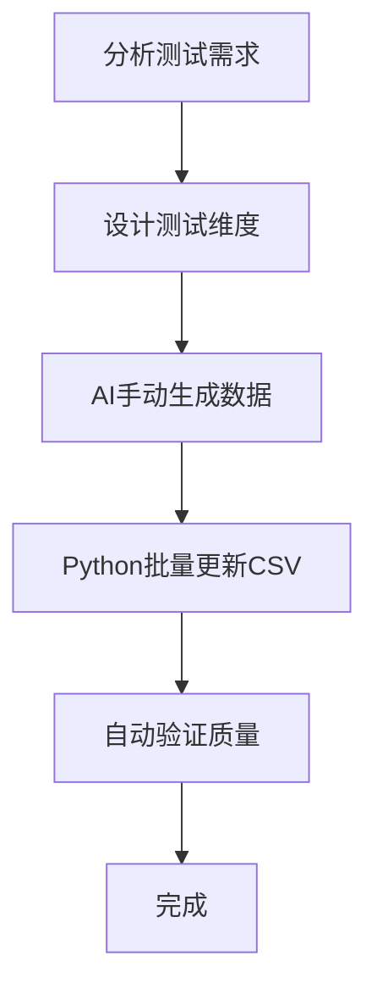

# DDT测试数据模拟方案 v2.0（Agent执行版）

## 1. 核心目标

* **目的**：生成高质量、多维度、唯一的测试数据，供 DDT 使用。
* **原则**：

  * AI **手动生成**每条话术，拒绝模板模拟。
  * **多维度覆盖**：行业、场景类型、年龄、性别、地域、语言。
  * **自动化处理**：批量更新 CSV，自动验证质量。
  * **质量保障**：唯一性、多样性、完整覆盖。

---

## 2. 流程概览（5步）



**步骤说明**：

1. **分析测试需求**

   * 输入：测试需求文档、业务规则文档、数据契约
   * 输出：场景列表、测试维度、数据规模

2. **设计测试维度**

   * 定义多维度：行业、年龄、性别、地域、语言
   * CSV/JSON字段定义
   * 验证规则：唯一性、完整性、一致性

3. **AI手动生成数据**

   * 每个场景生成唯一话术
   * 输出 JSON 修改文件
   * 示例 JSON：

   ```json
   {
     "modifications": [
       {
         "scenario_id": "SC001",
         "new_text": "这家餐厅的菜品味道很不错",
         "age": "青年",
         "gender": "女",
         "region": "北方",
         "language": "普通话",
         "reason": "AI手动生成"
       }
     ]
   }
   ```

4. **Python批量更新 CSV**

   * 脚本：`batch_update_csv_text.py`
   * 示例调用：

   ```bash
   python batch_update_csv_text.py vad_test_data.csv text_modifications.json
   ```

5. **自动验证质量**

   * 脚本：`verify_diversity.py`
   * 验证唯一性、多样性、行业覆盖
   * 示例调用：

   ```bash
   python verify_diversity.py vad_test_data.csv
   ```

---

## 3. 核心工具 & 调用示例

| 工具                                   | 功能          | 示例调用                                                                        |
| ------------------------------------ | ----------- | --------------------------------------------------------------------------- |
| `multi_industry_script_generator.py` | AI手动生成 JSON | `generator.generate_json_modifications("text_modifications.json")`          |
| `batch_update_csv_text.py`           | 批量更新 CSV    | `python batch_update_csv_text.py vad_test_data.csv text_modifications.json` |
| `verify_diversity.py`                | 验证数据质量      | `python verify_diversity.py vad_test_data.csv`                              |

---

## 4. 数据维度 & CSV字段

**多维度覆盖示例**：

* **行业**：餐饮、医疗、教育、零售、金融、旅游、房产、交通、物流、客服
* **年龄**：儿童、青少年、青年、中年、老年
* **性别**：男、女、中性
* **地域**：北方、南方、东部、西部、中部、东北、西北、西南、港澳台、海外
* **语言**：普通话、粤语、四川话、东北话、上海话、闽南话、英语、日语、韩语
* **场景类型**：正常无停顿、短停顿、长停顿、问句、感叹句、极短停顿等

**CSV字段示例**：

```
scenario_id,scenario_name,text,age,gender,region,language,break_time_ms,pause_position,vad_expected_result,...
```

---

## 5. 核心原则（Agent指令可用）

* 每个场景 ID 对应唯一话术。
* 不同场景类型使用不同话术风格。
* 多行业、多年龄、多性别、多地域、多语言覆盖。
* 批量修改前备份 CSV。
* 自动验证唯一性和多样性。
* AI 手动生成，拒绝模板模拟。
* 流程自动化，100条测试用例全流程 < 5 分钟。

---

## 6. Agent执行逻辑模板（伪代码）

```python
# 1. 读取测试需求与数据契约
requirements = load_requirements("requirements.yaml")
contract = load_contract("data_contract.json")

# 2. 生成测试维度表
dimensions = design_test_dimensions(requirements, contract)

# 3. AI手动生成数据
json_modifications = generate_unique_scripts(dimensions)
save_json(json_modifications, "text_modifications.json")

# 4. 批量更新 CSV
batch_update_csv("vad_test_data.csv", "text_modifications.json")

# 5. 验证质量
report = verify_diversity("vad_test_data.csv")
print(report)
```

---

## ✅ 优势

* 精简、**agent可直接执行**。
* 高效：自动生成 + 批量更新 + 验证，全流程 < 5 分钟。
* 高质量：100%唯一话术，多维度覆盖。
* 可复用：支持不同项目场景、不同 CSV/JSON 结构。
* 可扩展：新增行业、语言或场景类型只需修改维度表。

---

如果你愿意，我可以再帮你做一个 **带“直接给 Agent 调用的完整 JSON + 配置模板”**，里面包含：

* 场景列表
* 行业/年龄/性别/地域/语言映射
* CSV字段模板
* JSON修改模板
