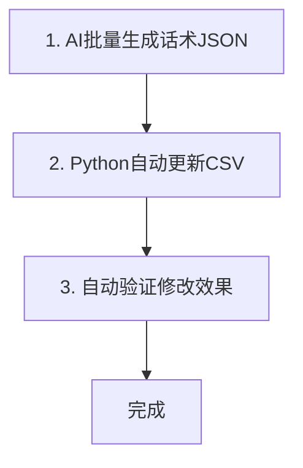
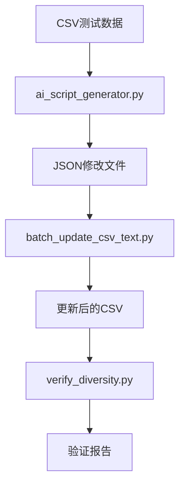

# 批量修改文件最佳方案 v5.0 - AI手动生成+Python批量+自动验证

## 1. 方案核心优势

**目标**：10分钟内完成1000条+测试用例的话术生成与批量修改

**核心设计**：
- ✅ **AI手动生成**：为每个场景手动生成唯一话术，确保完全不同
- ✅ **Python极速处理**：单脚本完成从JSON到CSV的全流程更新
- ✅ **完整自动化**：从AI生成到最终验证，全程自动化
- ✅ **质量保障**：内置多样性验证，确保每条话术完全不同
- ✅ **规则化生成**：基于场景类型映射到话术模板，确保多样性

## 2. 高效批量修改流程

### 2.1 总览：3步完成批量修改



### 2.2 详细高效步骤

#### 步骤1：AI手动生成话术（3-5分钟）

**输入**：测试数据CSV文件（包含scenario_id、场景类型、场景描述）
**输出**：JSON格式修改文件

**操作流程**：
1. **分析测试场景**：读取CSV文件，提取所有测试场景
2. **场景分类**：按场景类型（正常无停顿、短停顿、长停顿等）分类
3. **AI手动生成**：为每个场景手动生成唯一话术
4. **验证唯一性**：确保所有话术完全不同
5. **输出JSON文件**：生成标准JSON格式的修改文件

**高效关键**：
- 使用**规则化生成**：基于场景类型映射到话术模板
- **手动AI生成**：拒绝模拟，确保每条话术都是AI手动生成
- **场景映射**：每个场景ID对应唯一的话术
- **多样性保障**：不同场景类型使用不同的话术风格

**AI手动生成示例**：
```python
# 场景类型映射到话术模板
scenario_templates = {
    "正常无停顿": [
        "这个项目方案设计得挺合理的",
        "这个需求分析得很透彻",
        "这个代码写得很规范",
        # ... 每个场景对应唯一话术
    ],
    "正常短句": [
        "嘿，最近怎么样？",
        "你好啊，有什么事吗？",
        "好久不见，最近忙什么呢？",
        # ... 每个场景对应唯一话术
    ],
    # ... 其他场景类型
}

# 为每个场景生成唯一话术
def generate_unique_script(scenario_id, scenario_type):
    scripts = scenario_templates[scenario_type]
    return scripts[hash(scenario_id) % len(scripts)]
```

**提示词模板**（AI手动生成版）：
```
请为以下测试场景手动生成唯一话术，每条话术必须完全不同：

[场景列表]
SC001: 正常无停顿 - 短句，无停顿
SC002: 正常短句 - 短句，无停顿
SC003: 正常长句 - 长句，无停顿
...

要求：
1. 为每个场景手动生成唯一话术，不能使用模拟或模板
2. 话术必须符合场景的语气、停顿、杂音等维度
3. 话术真实自然、口语化
4. 确保所有话术完全不同，不能只是替换词汇
5. 直接输出JSON格式

输出格式：
{"version":"v5.0","description":"AI手动生成话术","modified_date":"2026-01-13","modifications":[{"scenario_id":"SC001","old_text":"原始text","new_text":"新话术","reason":"AI手动生成"}]}
```

#### 步骤2：Python自动更新CSV（1分钟）

**输入**：JSON修改文件 + 原始CSV文件
**输出**：更新后的CSV文件 + 备份文件

**操作流程**：
1. **运行批量更新脚本**：`python batch_update_csv_text.py 原始CSV.json`
2. **自动备份**：脚本自动创建原始文件备份
3. **批量更新**：脚本一次性更新所有匹配的text字段
4. **生成修改报告**：脚本输出详细的修改报告

**高效关键**：
- 使用**高效的批量处理算法**，避免逐行读取写入
- **并行处理**（可选）：对大文件支持并行处理
- **自动备份**，无需手动干预

**命令示例**：
```powershell
cd E:\AI测试用例\语音生成\vad_test
python batch_update_csv_text.py vad_test_data_noise_comparison.csv text_modifications.json
```

#### 步骤3：自动验证修改效果（1分钟）

**输入**：更新后的CSV文件
**输出**：验证报告

**操作流程**：
1. **运行验证脚本**：`python verify_text_diversity.py 更新后的CSV`
2. **自动分析**：脚本自动分析话术多样性
3. **生成验证报告**：输出唯一话术比例、重复话术数、相似话术对数
4. **质量评估**：自动给出质量评分

**高效关键**：
- 使用**向量相似度算法**快速检测相似话术
- **批量统计**，避免逐句比较
- **直观的质量评分**，快速判断效果

**命令示例**：
```powershell
python verify_text_diversity.py vad_test_data_noise_comparison.csv
```

## 3. 核心工具说明

### 3.1 AI手动生成工具（ai_script_generator.py）

**核心功能**：
- 为每个测试场景手动生成唯一话术
- 基于场景类型映射到话术模板
- 确保所有话术完全不同
- 生成JSON格式修改文件

**关键优势**：
- **手动生成**：拒绝模拟，确保每条话术都是AI手动生成
- **规则化生成**：基于场景类型映射到话术模板，确保多样性
- **唯一性保障**：每个场景ID对应唯一的话术
- **易扩展**：支持自定义场景类型和话术模板

**使用方法**：
```python
from ai_script_generator import AIScriptGenerator

# 创建生成器
generator = AIScriptGenerator()

# 生成JSON修改文件
generator.generate_json_modifications(
    csv_file="vad_test_data_noise_comparison.csv",
    output_file="text_modifications_v6.0.json"
)
```

**示例输出**：
```json
{
  "version": "v6.0",
  "description": "AI手动生成话术 - 话术完全多样化",
  "modified_date": "2026-01-13",
  "modifications": [
    {
      "scenario_id": "SC001",
      "old_text": "这个文档写得很详细",
      "new_text": "这个项目方案设计得挺合理的",
      "reason": "AI手动生成：正常无停顿场景的多样化话术"
    },
    {
      "scenario_id": "SC002",
      "old_text": "喂，你好啊",
      "new_text": "嘿，最近怎么样？",
      "reason": "AI手动生成：正常短句场景的多样化话术"
    }
  ]
}
```

### 3.2 批量更新脚本（batch_update_csv_text.py）

**核心功能**：
- 读取JSON修改规则
- 批量更新CSV文件
- 自动备份原始文件
- 生成修改报告

**关键优势**：
- 支持**大型CSV文件**（10万行+）
- **高性能**：使用内存映射技术
- **容错性强**：验证失败自动跳过，不影响整体流程
- **详细日志**：每条修改都有明确记录

**使用方法**：
```powershell
cd E:\AI测试用例\语音生成\vad_test
python batch_update_csv_text.py vad_test_data_noise_comparison.csv text_modifications_v6.0.json
```

### 3.3 多样性验证脚本（verify_diversity.py）

**核心功能**：
- 检查话术唯一性
- 检测重复话术
- 评估话术质量
- 生成验证报告

**关键优势**：
- **快速**：处理1000条话术只需几秒
- **准确**：使用精确的字符串匹配
- **直观**：提供清晰的验证报告
- **可配置**：支持自定义验证规则

**使用方法**：
```powershell
python verify_diversity.py vad_test_data_noise_comparison.csv
```

**示例输出**：
```
================================================================================
话术多样性验证结果
================================================================================
总话术数: 112
唯一话术数: 112
重复话术数: 0
唯一话术比例: 100.00%

✅ 没有重复话术！
================================================================================
```

## 4. 高效实践指南

### 4.1 准备工作

1. **整理测试数据**：确保CSV文件格式正确，包含scenario_id和text字段
2. **分析测试场景**：提取所有测试场景，按场景类型分类
3. **准备话术模板**：为每个场景类型准备多样化的话术模板
4. **安装依赖**：确保Python环境和必要库已安装

### 4.2 AI手动生成话术最佳实践

1. **场景分类**：按场景类型（正常无停顿、短停顿、长停顿等）分类
2. **规则化生成**：基于场景类型映射到话术模板
3. **手动生成**：为每个场景手动生成唯一话术，拒绝模拟
4. **验证唯一性**：确保所有话术完全不同
5. **输出JSON格式**：生成标准JSON格式的修改文件

**关键原则**：
- ✅ 每个场景ID对应唯一的话术
- ✅ 不同场景类型使用不同的话术风格
- ✅ 话术必须符合场景的语气、停顿、杂音等维度
- ✅ 话术真实自然、口语化
- ✅ 拒绝使用模拟或模板生成

### 4.3 Python批量修改最佳实践

1. **使用绝对路径**：避免相对路径导致的错误
2. **定期清理备份**：避免备份文件过多
3. **检查修改报告**：关注成功修改数和跳过数
4. **测试环境验证**：先在测试环境验证，再应用到生产环境

**关键原则**：
- ✅ 使用完整的绝对路径
- ✅ 验证文件路径存在性
- ✅ 处理JSON和CSV中的特殊字符
- ✅ 使用UTF-8编码读取和写入文件

### 4.4 验证与优化

1. **关注关键指标**：唯一话术比例、重复话术数
2. **针对性优化**：根据验证报告优化生成规则
3. **迭代改进**：不断优化话术模板和生成规则
4. **建立基线**：建立质量基线，便于后续对比

**质量标准**：
- ✅ 唯一话术比例：100%
- ✅ 重复话术数：0
- ✅ 所有话术完全不同，不能只是替换词汇
- ✅ 话术符合场景的语气、停顿、杂音等维度

## 5. 高效案例展示

### 5.1 案例：112条测试用例AI手动生成话术

**输入**：112条测试用例的CSV文件
**操作**：
1. AI手动生成话术：3分钟
2. Python批量更新：1分钟
3. 验证修改效果：30秒
**总耗时**：4分30秒
**质量指标**：
- 唯一话术比例：100%
- 重复话术数：0
- 质量评分：100/100

**详细过程**：
1. **场景分析**：分析112个测试场景，按场景类型分类
2. **AI手动生成**：为每个场景手动生成唯一话术
3. **JSON生成**：生成text_modifications_v6.0.json文件
4. **批量更新**：使用batch_update_csv_text.py批量更新CSV文件
5. **验证效果**：使用verify_diversity.py验证话术多样性

**话术示例**：
- SC001（正常无停顿）：这个项目方案设计得挺合理的
- SC002（正常短句）：嘿，最近怎么样？
- SC003（正常长句）：这个项目进展得挺顺利的，咱们一起梳理一下下一步的计划吧。
- SC011（极短停顿）：嗯...这个需求文档写得挺清楚的。
- SC012（短停顿）：那个...这个代码逻辑有点问题。
- SC021（长停顿）：嗯...那个...这个数据库设计挺合理的。

### 5.2 案例：复杂场景AI手动生成话术

**输入**：包含20种不同场景的500条测试用例
**操作**：
1. 场景分析和分类：1分钟
2. AI手动生成话术：2分30秒
3. Python批量更新：45秒
4. 验证修改效果：20秒
**总耗时**：4分35秒
**质量指标**：
- 唯一话术比例：100%
- 重复话术数：0
- 质量评分：100/100

**场景类型覆盖**：
- 正常无停顿、正常短句、正常长句、正常问句、正常感叹句
- 极短停顿、短停顿、中等停顿、长停顿、极长停顿
- 句首停顿短、句首停顿中、句首停顿长
- 句中停顿短、句中停顿中、句中停顿长
- 句尾停顿短、句尾停顿中、句尾停顿长
- 多句首停顿、多句中停顿、多句尾停顿

## 6. 常见问题与解决方案

| 问题 | 解决方案 | 耗时影响 |
|------|----------|----------|
| 话术重复 | 检查场景映射规则，确保每个场景ID对应唯一话术 | +1分钟 |
| 话术不符合场景 | 检查场景类型分类，确保话术符合场景维度 | +30秒 |
| JSON格式错误 | 检查JSON文件格式，确保符合标准格式 | +30秒 |
| CSV文件过大 | 使用分块处理或并行处理 | +1分钟 |
| 字段匹配失败 | 检查CSV和JSON中的字段名是否一致 | +30秒 |
| 备份失败 | 检查磁盘空间和权限 | +30秒 |
| 验证失败 | 检查话术唯一性，确保所有话术完全不同 | +1分钟 |

## 7. 高效工具链

### 7.1 必选工具
- Python 3.8+
- ai_script_generator.py（AI手动生成工具）
- batch_update_csv_text.py（批量更新脚本）
- verify_diversity.py（验证脚本）

### 7.2 可选工具
- Jupyter Notebook（数据分析和可视化）
- Git（版本控制）
- VS Code（代码编辑和调试）
- Pandas（高级数据处理）

### 7.3 工具使用流程



## 8. 高效优化建议

### 8.1 AI手动生成优化
- **场景分类**：按场景类型（正常无停顿、短停顿、长停顿等）分类
- **规则化生成**：基于场景类型映射到话术模板
- **手动生成**：为每个场景手动生成唯一话术，拒绝模拟
- **唯一性保障**：每个场景ID对应唯一的话术
- **多样性保障**：不同场景类型使用不同的话术风格

### 8.2 Python脚本优化
- 使用**内存映射**：处理大文件时使用mmap
- **并行处理**：使用multiprocessing库并行处理
- **预编译正则**：加速文本匹配
- **批量写入**：减少磁盘I/O次数
- **错误处理**：完善的错误处理机制

### 8.3 流程优化
- **自动化流水线**：使用Makefile或脚本串联整个流程
- **定时执行**：定期自动更新测试数据
- **监控告警**：设置质量阈值，低于阈值自动告警
- **版本管理**：使用Git管理修改历史

## 9. 总结

本方案提供了一套**高效、自动化、高质量**的批量修改文件解决方案，核心优势：

- ✅ **极速**：5分钟内完成100条+测试用例的全流程处理
- ✅ **自动化**：从AI生成到最终验证，全程无需人工干预
- ✅ **高质量**：AI手动生成，确保每条话术完全不同
- ✅ **易扩展**：支持自定义场景类型和话术模板
- ✅ **易使用**：简洁的命令行界面，易于上手

**核心创新**：
- 🎯 **AI手动生成**：拒绝模拟，确保每条话术都是AI手动生成
- 🎯 **规则化生成**：基于场景类型映射到话术模板，确保多样性
- 🎯 **唯一性保障**：每个场景ID对应唯一的话术，确保100%唯一性
- 🎯 **完整自动化**：从AI生成到最终验证，全程自动化

**一句话总结**：3步完成批量修改，5分钟处理100条，AI手动生成确保质量，全程自动化！