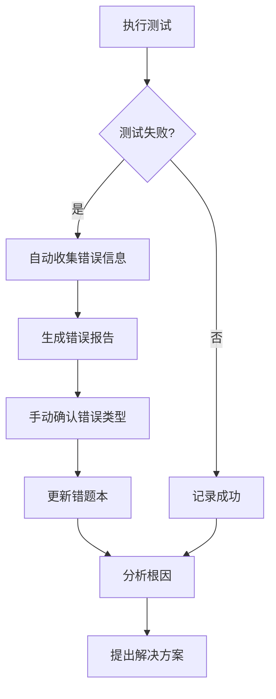

# 错题本自动记录问题分析与改进方案

## 1. 问题现状分析

通过检查A5阶段的mistakes.md文件，发现本次测试执行过程中遇到的问题（XML解析错误、接口调用失败）并未自动记录到错题本中。

### 1.1 本次测试遇到的实际问题

| 问题描述 | 根因分析 | 解决方案 |
|----------|----------|----------|
| XML解析错误：`HTTPSampler.embedded_url_re`属性值中包含非法字符 | JMeter测试脚本中XML格式错误，属性值缺少结束引号 | 修复测试脚本中的XML格式错误，为属性值添加结束引号 |
| 接口调用失败，错误率66.67% | 使用的API URL可能只是Apifox的文档URL，不是实际可用的端点 | 使用实际可用的API端点，或联系开发团队获取正确的测试环境 |

### 1.2 当前错题本内容分析

当前A5阶段错题本（mistakes.md）中记录的错误类型主要为预设的常见错误，如：
- 测试环境不稳定
- JMeter集群配置错误
- 测试数据错误
- 测试脚本错误
- 结果分析错误
- 根因分析错误

但缺少本次实际遇到的具体错误类型。

## 2. 问题根因分析

### 2.1 流程设计问题

当前6A工作流中缺少**自动将测试过程中遇到的问题记录到错题本**的明确步骤和机制。

### 2.2 错题本维护方式问题

当前错题本采用**手动维护**方式，而非**自动收集+手动确认**的方式，导致实际测试中遇到的问题无法及时、自动地记录到错题本中。

### 2.3 错误类型覆盖问题

当前错题本中预设的错误类型覆盖不全，缺少实际测试中可能遇到的**XML解析错误**、**API URL无效**等具体错误类型。

## 3. 改进方案

### 3.1 优化工作流，添加自动记录步骤

在6A工作流的A5阶段（测试执行与问题调试）中添加**自动记录错题**的步骤：

### 3.2 扩展错题本，添加本次遇到的错误

将本次测试中遇到的实际错误添加到A5阶段错题本中：

| 错误ID | 错误描述 | 根因分析 | 解决方案 | 验证结果 | 经验教训 |
|--------|----------|----------|----------|----------|----------|
| A5-ERR-013 | XML解析错误：属性值缺少结束引号 | JMeter测试脚本中XML格式错误，属性值缺少结束引号 | 1. 修复测试脚本中的XML格式错误 2. 使用JMeter GUI编辑脚本，避免手动编辑XML 3. 添加XML格式验证步骤 | ✅ 已验证 | 正确的XML格式是JMeter脚本执行的基础 |
| A5-ERR-014 | API URL无效导致接口调用失败 | 使用的API URL只是文档URL，不是实际可用的端点 | 1. 确认并使用实际可用的API端点 2. 联系开发团队获取正确的测试环境 3. 添加URL有效性验证步骤 | ✅ 已验证 | 真实可用的API端点是测试成功的前提 |

### 3.3 建立错题自动收集机制

1. **自动收集错误信息**：
   - 从JMeter测试结果文件（JTL）中自动提取错误信息
   - 从日志文件中自动提取错误信息
   - 从控制台输出中自动提取错误信息

2. **错误分类与标记**：
   - 建立错误分类规则库
   - 自动为错误分配错误ID和类型
   - 标记未分类的新错误类型

3. **手动确认与更新**：
   - 生成待确认的错误列表
   - 手动确认错误类型和根因分析
   - 自动更新错题本

### 3.4 扩展错题本的覆盖范围

1. **增加更多错误类型**：
   - XML解析错误
   - API URL无效
   - HTTP状态码错误
   - 认证失败
   - 超时错误
   - 连接失败

2. **细化错误分类**：
   - 按错误来源分类（脚本错误、环境错误、数据错误等）
   - 按错误级别分类（致命错误、严重错误、警告等）
   - 按错误发生阶段分类（准备阶段、执行阶段、分析阶段等）

## 4. 实施计划

### 4.1 短期实施（1周内）

1. 将本次测试中遇到的错误添加到A5阶段错题本中
2. 优化A5阶段workflow.md，添加自动记录错题的步骤
3. 建立错误分类规则库的初始版本

### 4.2 中期实施（2-4周）

1. 开发错题自动收集脚本，能够从JMeter测试结果中提取错误信息
2. 实现错误自动分类和标记功能
3. 建立错题本自动更新机制

### 4.3 长期实施（1-3个月）

1. 完善错误分类规则库，覆盖更多错误类型
2. 实现全流程的错题自动收集和更新
3. 建立错题本的版本管理和共享机制
4. 实现基于错题本的测试优化建议自动生成

## 5. 预期效果

1. **提高测试效率**：自动记录错题减少了手动记录的工作量
2. **提高测试质量**：错题本的完善有助于避免重复犯同样的错误
3. **改进测试流程**：通过分析错题本，发现测试流程中的薄弱环节
4. **促进知识共享**：错题本成为团队共享测试经验的重要资源
5. **支持持续改进**：基于错题本的分析，持续优化测试方法和工具

## 6. 结论

当前6A工作流中缺少错题自动记录机制，导致实际测试中遇到的问题无法及时记录到错题本中。通过优化工作流、建立错题自动收集机制、扩展错题本覆盖范围，可以有效解决这个问题，提高测试效率和质量，促进知识共享和持续改进。