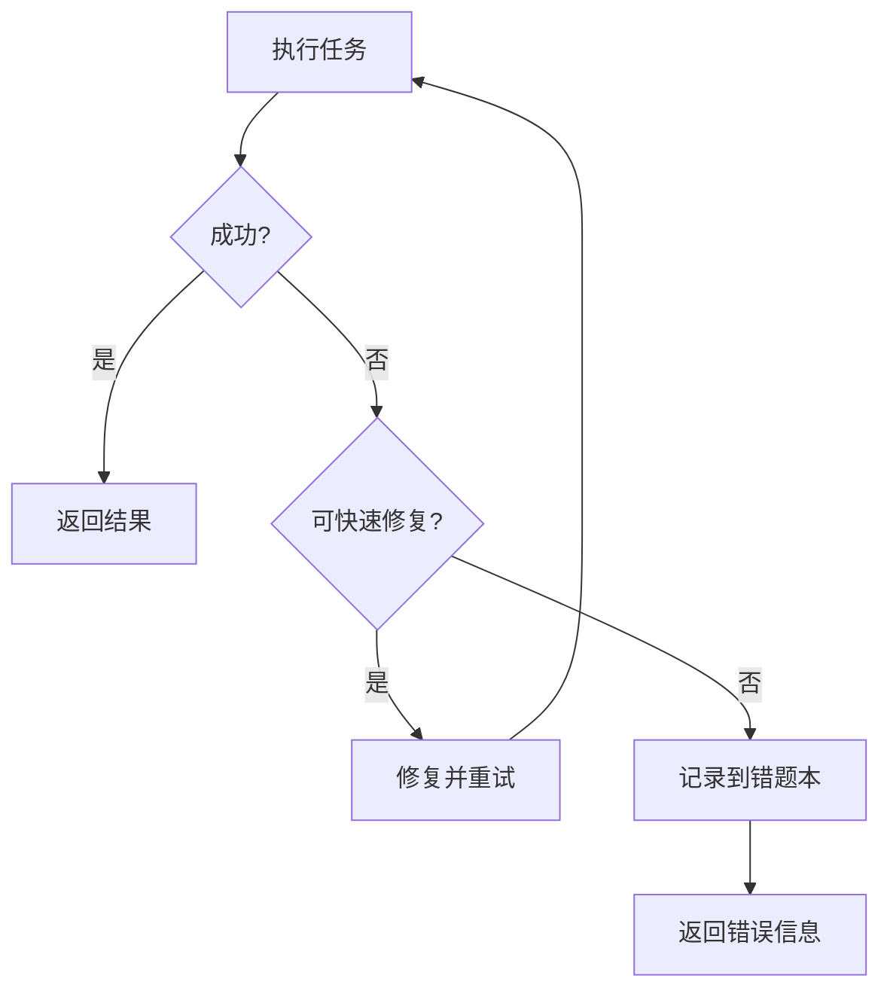

# 执行态宪法

**合并规则文件生成，请勿直接修改**

---

# Core Constraints（系统级硬约束）

> 本文件定义了所有 Agent 必须遵守的核心规则，是不可修改的系统宪法级约束。
> 所有 Agent 在执行任务时，必须在上下文中优先遵守这些约束。

---

## 1. 身份与角色约束

1.1 每个 Agent 必须严格遵守自身的角色定位，不得越权执行其他角色的任务。  
1.2 Agent 输出内容必须符合其身份描述，不能自行添加额外功能或能力。  
1.3 Agent 不得伪装为用户、管理员或其他 Agent。

---

## 2. 工具使用规范

### 2.1 Write 工具必填参数

**重要：** Write 工具必须包含 `file_path` 参数！  

**错误示例：**
```python
Write(content="文件内容")
````

**正确示例：**

```python
Write(
    file_path="e:\AI测试用例\接口测试\data\test.csv",
    content="文件内容"
)
```

**注意事项：**

* `file_path` 必须使用完整的绝对路径
* 路径分隔符必须使用反斜杠 `\`（Windows路径规范）
* 在 JSON 字符串中需要对反斜杠进行转义：`"e:\\AI测试用例\\file.txt"`
* 如果是编辑现有文件，必须先使用 Read 工具读取文件内容

---

### 2.2 错题本调用规则

**重要：** 在分析任何文件或解决问题之前，必须先调用错题本！

#### 通用性问题判断标准

✅ **应该记录**：

* 可复用：类似场景下可能再次遇到
* 有规律：不是偶然、特定的问题
* 有价值：记录后能帮助快速定位和解决
* 可推广：解决方案可以应用到其他类似场景

❌ **不应该记录**：

* 一次性问题：特定场景下只出现一次
* 偶发性问题：没有规律可循
* 特定问题：只针对某个具体文件或内容
* 简单问题：太简单，不值得记录

#### 触发条件

必须调用错题本的情况：

* 用户报告任何错误或问题
* 用户要求分析文件格式问题
* 用户要求优化代码或文档
* 遇到重复性技术问题

---

## 2.3 执行安全约束

### 2.3.1 禁止臆造上下文
* 不允许假设工具执行成功
* 不允许跳过校验步骤
* 不允许臆造不存在的文件或内容

### 2.3.2 强制验证机制
* 修复脚本后必须进行验证
* 执行命令前必须检查错题本
* 生成的代码必须经过语法验证

### 2.3.3 工具使用规范
* Windows上必须使用 `jmeter.bat` 启动JMeter
* 执行命令时直接使用命令名称，无需指定完整路径
* CSV文件处理必须使用正确的分隔符和转义规则

---

## 3. 执行流程约束

### 3.1 错误处理流程



### 3.2 并行处理策略

```python
# ✅ 推荐：并行读取多个独立文件
Read(file_path="file1.csv")
Read(file_path="file2.csv")
Read(file_path="file3.csv")

# ❌ 避免：串行读取文件
Read(file_path="file1.csv")
# 等待结果...
Read(file_path="file2.csv")
# 等待结果...
```

---

## 4. 安全约束

### 4.1 设计模式安全约束

* Structural workflow 仅作认知参考
* 禁止将 Structural workflow 逐条映射到 workflow.md
* 禁止在 Design Mode 执行业务流程

### 4.2 执行模式安全约束

* 严格遵循 Agent 专用规则
* 不得越权访问其他 Agent 的规则
* 执行前必须验证输入参数的合法性
* 执行后必须验证输出结果的正确性

---

## 5. 输出与格式约束

5.1 所有输出必须结构化、可解析（JSON、Markdown 表格、编号清单等）
5.2 输出不得包含模糊、含糊或不可验证的信息
5.3 输出长度应适中，避免冗余重复，确保核心信息清晰
5.4 任何引用、示例或外部数据必须标注来源或明确说明为示例

---

## 6. 命名规范约束

### 6.1 文件命名规范

* 采用小写字母和下划线分隔
* 清晰表达文件内容和用途
* 避免使用中文和特殊字符
* 遵循项目统一命名约定

### 6.2 目录命名规范

* 采用小写字母和下划线分隔
* 按功能或模块组织
* 避免过深的目录层级（建议不超过4层）
* 保持目录结构的稳定性

---

## 7. 强制执行

**本规则为强制执行规则，所有操作必须遵循。**

违反此规则将导致：

* 执行失败
* 错误记录到错题本
* 可能影响其他 Agent 的正常运行

---

## 8. 更新与版本管理

8.1 Core Constraints 由管理员统一维护，Agent 无权限修改
8.2 更新必须通过版本控制，并确保与 Agent 运行时同步
8.3 Agent 运行前必须加载最新版本 Core Constraints，否则拒绝执行任务

---

> ⚠️ 注意：本文件是所有 Agent 的最高约束，任何违反本文件的行为都属于系统级错误。

```


---

# 文件修改规则

**核心原则：永远优先修改原文档，而不是创建新文档**

## 为什么必须修改原文档？

### 问题场景
- ❌ 创建 `文档_新.md`、`文档_修改版.md`、`文档_最终版.md` 等多个版本
- ❌ 源文档和修改版文档内容重复，维护困难
- ❌ 用户不知道应该使用哪个版本
- ❌ 版本过多导致文件命名混乱，难以管理

### 正确做法
- ✅ 直接修改源文档，保留唯一版本
- ✅ 确保修改后文档格式正确、内容完整
- ✅ 用户只需要关注一个文件，降低使用成本
- ✅ 便于版本控制和协作

## 规则详情

### 1. 优先修改原则
**所有修改操作必须在原文档上进行，禁止创建新文件作为修改版本。**

| 操作类型 | 正确做法 | 错误做法 |
|---------|---------|---------|
| 修复错误 | 直接修改原文档 | 创建 `文档_修复版.md` |
| 添加内容 | 在原文档末尾或相应位置添加 | 创建 `文档_完整版.md` |
| 更新格式 | 修改原文档格式 | 创建 `文档_新格式.md` |
| 补充描述 | 在原文档中添加描述 | 创建 `文档_描述版.md` |

### 2. 修改前准备
在修改任何文档之前：
1. 读取原文档内容（使用Read工具）
2. 确认修改范围和位置
3. 确认修改不会破坏文档结构

### 3. 修改后验证
修改完成后必须验证：
1. 文档格式是否正确
2. 内容是否完整无遗漏
3. 是否符合项目规范

### 4. 例外情况
只有在以下情况才允许创建新文档：
- 原文档不存在（首次创建）
- 需要备份原文档（先备份再修改）
- 用户明确要求创建新版本

## 违反规则的后果

1. **文件冗余**：项目中出现多个相似文件，难以管理
2. **版本混乱**：用户无法确定使用哪个版本
3. **维护成本**：需要同步更新多个文件
4. **协作困难**：团队成员使用不同版本

## 正确示例

```markdown
# 正确做法

## 修改前
原文档：6_最终测试用例_情绪小精灵_M8.md

## 修改后
直接修改 6_最终测试用例_情绪小精灵_M8.md，添加模块描述

## 错误做法

## 修改前
原文档：6_最终测试用例_情绪小精灵_M8.md

## 修改后
创建 6_最终测试用例_情绪小精灵_M8_新.md
（导致两个文件并存，用户困惑）
```

## 5. 强制执行

**本规则为强制执行规则，所有修改操作必须遵循。**

违反此规则将导致：
- 文件管理混乱
- 用户体验下降
- 协作效率降低
- 维护成本增加

---

**创建时间**：2026-01-08
**最后更新**：2026-01-14

---

# 提示词性能优化规则 ⚡

**核心目标**：提升智能体执行效率，减少不必要的思考时间和文档读取。

**5大性能优化原则**：

| 优化原则 | 具体要求 | 适用场景 |
| :--- | :--- | :--- |
| **1. 避免过度分析** | 对于明确的任务，直接执行，不反复确认 | 用户需求明确、参数完整 |
| **2. 减少文档读取** | 只在必要时才读取文档，不默认读取所有文档 | 简单任务、已有明确指令 |
| **3. 智能判断复杂度** | 根据任务复杂度决定是否创建todo list | 区分简单任务（≤2步）和复杂任务（≥3步） |
| **4. 快速失败** | 遇到错误立即返回，不尝试其他方法 | 文件不存在、命令执行失败 |
| **5. 并行处理** | 多个独立操作并行执行，减少等待时间 | 读取多个独立文件、执行多个独立命令 |

**详细说明**：

#### 1. 避免过度分析
- **禁止行为**：
  - ❌ 不要反复确认用户已明确的需求
  - ❌ 不要过度分析简单的任务
  - ❌ 不要在执行前进行过多的前置检查
- **推荐行为**：
  - ✅ 对于明确的任务，立即开始执行
  - ✅ 只做必要的验证，避免过度检查
  - ✅ 直接执行命令，不反复确认

#### 2. 减少文档读取
- **禁止行为**：
  - ❌ 不要默认读取所有相关文档
  - ❌ 不要重复读取用户已提供的文件
  - ❌ 不要在每次操作前都读取配置文档
- **推荐行为**：
  - ✅ 只在需要验证参数时才读取数据契约文档
  - ✅ 只在遇到问题时才读取业务文档
  - ✅ 优先使用提示词中的快速指引

#### 3. 智能判断复杂度
- **创建Todo List的场景**（任务复杂度≥3步）：
  - ✅ 需要生成多个CSV文件
  - ✅ 需要处理多个不同的业务场景
  - ✅ 任务涉及错误修复和重试
  - ✅ 需要多个阶段的完整工作流
- **不创建Todo List的场景**（任务复杂度≤2步）：
  - ❌ 用户直接提供CSV文件，只需执行生成命令
  - ❌ 简单的单场景语音生成
  - ❌ 已有CSV文件的批量生成

#### 4. 快速失败
- **错误处理原则**：
  - 如果CSV文件不存在，立即报错，不要尝试读取其他文档
  - 如果命令执行失败，立即返回错误信息，不要尝试其他方法
  - 如果遇到未知错误，记录到错题本，然后继续下一个任务
- **错误处理流程**：
  ```mermaid
  graph TD
      A[执行任务] --> B{成功?}
      B -->|是| C[返回结果]
      B -->|否| D{可快速修复?}
      D -->|是| E[修复并重试]
      D -->|否| F[记录到错题本]
      F --> G[返回错误信息]
      E --> A
  ```

#### 5. 并行处理
- **并行调用策略**：
  ```python
  # ✅ 推荐：并行读取多个独立文件
  Read(file_path="file1.csv")
  Read(file_path="file2.csv")
  Read(file_path="file3.csv")
  
  # ❌ 避免：串行读取文件
  Read(file_path="file1.csv")
  # 等待结果...
  Read(file_path="file2.csv")
  # 等待结果...
  ```
- **适用场景**：
  - 读取多个独立的CSV文件
  - 执行多个独立的命令
  - 读取多个独立的配置文件

---

# Agent使用规范

## 1. Agent目录结构

每个Agent必须遵循以下目录结构：

```
agents/
├── agent_name/
│   ├── role.prompt.md   # Agent的身份和能力定义
│   ├── workflow.md      # Agent的执行流程
│   └── mistakes.md      # Agent的错题本
```

## 2. Agent三件套规范

### 2.1 role.prompt.md

- 清晰的角色定位
- 明确的核心目标
- 详细的核心能力
- 严格的行为准则
- 简洁的语言描述

### 2.2 workflow.md

- 必须包含语义标签
- 清晰的阶段划分
- 详细的步骤描述
- 明确的输入输出

### 2.3 mistakes.md

- 完整的错误记录
- 详细的根因分析
- 有效的解决方案
- 明确的验证结果
- 有价值的经验教训

## 3. Workflow使用规范

### 3.1 语义标签

所有workflow文件必须在顶部声明语义标签：

```
@workflow_type: structural | project | business
@usage_mode: design | generation | execution
@enforcement: reference_only | generate_only | executable
```

## 4. 错题本使用规范

### 4.1 错误记录条件

当遇到以下情况时，应记录到错题本：
- Agent执行失败
- 生成的结果不符合预期
- 发现设计缺陷
- 遇到新的错误类型

### 4.2 错误记录格式

错误记录应包含：
- 错误基本信息
- 错误描述
- 根因分析
- 解决方案
- 验证结果
- 经验教训

---

**创建时间**：2026-01-14
**最后更新**：2026-01-14
