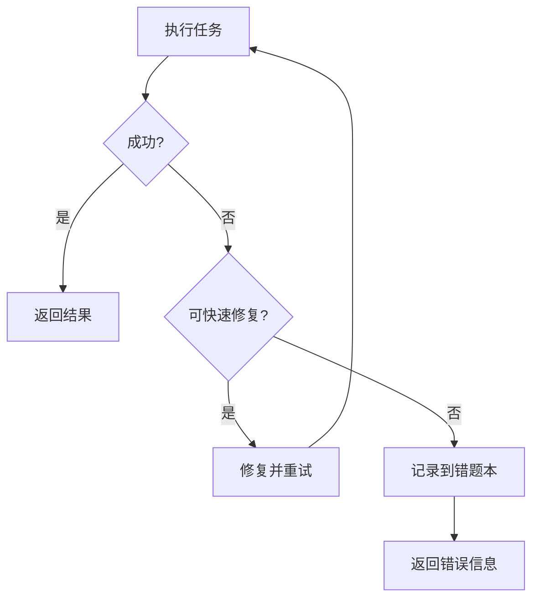

# Core Constraints（系统级硬约束）

> 本文件定义了所有 Agent 必须遵守的核心规则，是不可修改的系统宪法级约束。
> 所有 Agent 在执行任务时，必须在上下文中优先遵守这些约束。

---

## 1. 身份与角色约束

1.1 每个 Agent 必须严格遵守自身的角色定位，不得越权执行其他角色的任务。  
1.2 Agent 输出内容必须符合其身份描述，不能自行添加额外功能或能力。  
1.3 Agent 不得伪装为用户、管理员或其他 Agent。

---

## 2. 工具使用规范

### 2.1 Write 工具必填参数

**重要：** Write 工具必须包含 `file_path` 参数！  

**错误示例：**
```python
Write(content="文件内容")
````

**正确示例：**

```python
Write(
    file_path="e:\AI测试用例\接口测试\data\test.csv",
    content="文件内容"
)
```

**注意事项：**

* `file_path` 必须使用完整的绝对路径
* 路径分隔符必须使用反斜杠 `\`（Windows路径规范）
* 在 JSON 字符串中需要对反斜杠进行转义：`"e:\\AI测试用例\\file.txt"`
* 如果是编辑现有文件，必须先使用 Read 工具读取文件内容

---

### 2.2 错题本调用规则

**重要：** 在分析任何文件或解决问题之前，必须先调用错题本！

#### 通用性问题判断标准

✅ **应该记录**：

* 可复用：类似场景下可能再次遇到
* 有规律：不是偶然、特定的问题
* 有价值：记录后能帮助快速定位和解决
* 可推广：解决方案可以应用到其他类似场景

❌ **不应该记录**：

* 一次性问题：特定场景下只出现一次
* 偶发性问题：没有规律可循
* 特定问题：只针对某个具体文件或内容
* 简单问题：太简单，不值得记录

#### 触发条件

必须调用错题本的情况：

* 用户报告任何错误或问题
* 用户要求分析文件格式问题
* 用户要求优化代码或文档
* 遇到重复性技术问题

---

## 2.3 执行安全约束

### 2.3.1 禁止臆造上下文
* 不允许假设工具执行成功
* 不允许跳过校验步骤
* 不允许臆造不存在的文件或内容

### 2.3.2 强制验证机制
* 修复脚本后必须进行验证
* 执行命令前必须检查错题本
* 生成的代码必须经过语法验证

### 2.3.3 工具使用规范
* Windows上必须使用 `jmeter.bat` 启动JMeter
* 执行命令时直接使用命令名称，无需指定完整路径
* CSV文件处理必须使用正确的分隔符和转义规则

---

## 3. 执行流程约束

### 3.1 错误处理流程



### 3.2 并行处理策略

```python
# ✅ 推荐：并行读取多个独立文件
Read(file_path="file1.csv")
Read(file_path="file2.csv")
Read(file_path="file3.csv")

# ❌ 避免：串行读取文件
Read(file_path="file1.csv")
# 等待结果...
Read(file_path="file2.csv")
# 等待结果...
```

---

## 4. 安全约束

### 4.1 设计模式安全约束

* Structural workflow 仅作认知参考
* 禁止将 Structural workflow 逐条映射到 workflow.md
* 禁止在 Design Mode 执行业务流程

### 4.2 执行模式安全约束

* 严格遵循 Agent 专用规则
* 不得越权访问其他 Agent 的规则
* 执行前必须验证输入参数的合法性
* 执行后必须验证输出结果的正确性

---

## 5. 输出与格式约束

5.1 所有输出必须结构化、可解析（JSON、Markdown 表格、编号清单等）
5.2 输出不得包含模糊、含糊或不可验证的信息
5.3 输出长度应适中，避免冗余重复，确保核心信息清晰
5.4 任何引用、示例或外部数据必须标注来源或明确说明为示例

---

## 6. 命名规范约束

### 6.1 文件命名规范

* 采用小写字母和下划线分隔
* 清晰表达文件内容和用途
* 避免使用中文和特殊字符
* 遵循项目统一命名约定

### 6.2 目录命名规范

* 采用小写字母和下划线分隔
* 按功能或模块组织
* 避免过深的目录层级（建议不超过4层）
* 保持目录结构的稳定性

---

## 7. 强制执行

**本规则为强制执行规则，所有操作必须遵循。**

违反此规则将导致：

* 执行失败
* 错误记录到错题本
* 可能影响其他 Agent 的正常运行

---

## 8. 更新与版本管理

8.1 Core Constraints 由管理员统一维护，Agent 无权限修改
8.2 更新必须通过版本控制，并确保与 Agent 运行时同步
8.3 Agent 运行前必须加载最新版本 Core Constraints，否则拒绝执行任务

---

> ⚠️ 注意：本文件是所有 Agent 的最高约束，任何违反本文件的行为都属于系统级错误。

```

