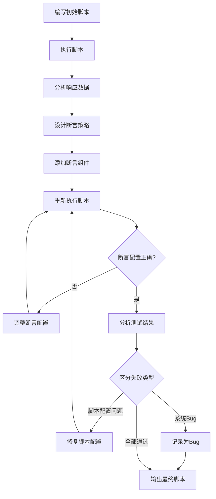

# 6A工作流生成测试用例

## 阶段1: Align（需求分析）
**目标：** 从需求文档中提取清晰、可测试的功能点和验收标准

### 要做的事：
1. 分析用户提供的需求文档，提取：
   - 核心功能点
   - 业务规则
   - 验收标准
   - 边界条件
2. 创建 `AI测试分析交付物/任务名/1_需求分析_任务名.md`，记录：
   - 原始需求（用户原话）
   - 提取的功能点列表
   - 业务规则明细
   - 验收标准
   - 疑问清单（需要用户确认的点）
3. 优先根据需求文档做假设，不确定时主动中断询问
4. 最后生成 `AI测试分析交付物/任务名/2_需求澄清_任务名.md`，包含双方确认后的需求和验收标准

### 必须达标：
- 需求清晰无歧义
- 功能点提取完整
- 验收标准明确可测

## 阶段2: Architect（测试架构设计）
**目标：** 设计测试策略和架构，确定测试范围和方法

### 要做的事：
基于上一阶段的验证需求文档，设计测试架构，输出 `AI测试分析交付物/任务名/3_测试架构设计_任务名.md`，包括：

- 测试策略（黑盒/白盒/灰盒）
- 测试范围（功能/非功能/接口）
- 测试维度覆盖（正例、反例、边界、异常、并发、鲁棒性、稳定性、操作体验性、兼容性、安全性）
- 测试工具建议
- 测试用例组织结构

### 原则：
- 覆盖所有关键测试维度
- 符合项目实际情况
- 可扩展性强

## 阶段3: Atomize（测试任务拆分）
**目标：** 拆分模块和功能，为每个功能点设计测试

### 要做的事：
基于测试架构文档，生成 `AI测试分析交付物/任务名/4_测试任务拆分_任务名.md`，执行：

1. 模块拆分：将系统拆分为可独立测试的模块
2. 功能拆分：将每个模块拆分为具体功能点
3. 为每个功能点分配测试维度
4. 建立功能点与测试维度的映射关系

同时输出测试任务依赖图（mermaid）。

### 原则：
- 每个功能点都被充分测试
- 测试维度覆盖完整，参考下面的测试维度精准匹配实现方案
- **架构与任务一致性**：确保测试架构中定义的全部维度，在任务拆分阶段均被合理分配，无遗漏。  
- **维度匹配合理性**：依据功能特性精准匹配测试维度，避免"一刀切"，参考测试维度精准匹配实现方案，维度取舍需有明确依据。
- 任务之间依赖清晰

### 测试维度精准匹配实现方案

#### 1. 架构与任务一致性保障措施
- **维度映射表**：为每个功能点创建维度映射表，确保所有测试架构中定义的维度都有明确的功能点与之对应
- **维度覆盖检查清单**：建立标准化的维度覆盖检查清单，在任务拆分完成后进行逐项检查
- **交叉验证机制**：安排不同测试人员对维度分配进行交叉验证，确保无遗漏

#### 2. 维度匹配合理性保障措施
- **功能特性分析法**：
  - 特性识别：分析功能的核心特性（输入、输出、状态、依赖关系）
  - 维度筛选：根据特性选择最相关的测试维度
  - 依据记录：为每个维度的选择提供明确的依据
- **维度优先级矩阵**：
  - 为每个功能点建立维度优先级矩阵
  - 根据功能重要性和风险程度确定维度优先级
  - 确保高优先级功能覆盖更多相关维度
- **差异化覆盖策略**：
  - 根据功能类型（核心/辅助）、用户使用频率、风险程度进行差异化分析
  - 只选择与功能特性相关的维度，避免"一刀切"
  - 为每个维度的取舍提供明确的依据文档

#### 3. 维度匹配示例
| 功能模块 | 功能点 | 匹配维度 | 匹配依据 |
|---------|-------|---------|---------|
| 战斗系统 | 技能释放 | 正例、反例、边界、异常、并发、鲁棒性、稳定性、操作体验性、兼容性、安全性 | 核心战斗功能，涉及用户操作、网络交互、状态管理等多种特性 |
| 背包系统 | 物品存储 | 正例、边界、反例 | 主要涉及容量限制和数据存储，无需并发、稳定性等维度 |
| 社交系统 | 好友添加 | 正例、反例、并发、安全性 | 涉及用户交互和数据安全，需要并发测试防止重复添加

## 阶段4: Approve（测试方案审批）
**目标：** 确认测试方案的完整性和可行性

### 要做的事：
1. 生成测试方案审批文档，汇总：
   - 测试架构设计摘要
   - 测试任务拆分情况
   - 需要确认的关键内容
2. **必须明确中断执行**，向用户展示审批文档内容
3. **等待用户明确回复"确认"后**，才能继续进入下一阶段
4. 如果用户有修改意见，根据意见调整测试方案后重新进入本阶段

### 必须确认的内容：
  - 是否覆盖所有需求？
  - 测试维度是否完整？
  - 测试策略是否可行？
  - 验收标准是否明确？

**重要：** 本阶段必须严格中断执行，直到收到用户的明确确认。

## 阶段5: Automate（测试用例自动生成）
**目标：** 自动生成全面的测试用例和checklist

### 要做的事：
1. 进入本阶段前，**全盘扫描并识别**用户在上阶段（Approve）之后对以下交付物的任何手动修改：
   - `AI测试分析交付物/任务名/1_需求分析_任务名.md`
   - `AI测试分析交付物/任务名/2_需求澄清_任务名.md`
   - `AI测试分析交付物/任务名/3_测试架构设计_任务名.md`
   - `AI测试分析交付物/任务名/4_测试任务拆分_任务名.md`
   - 功能点与测试维度映射关系
   - 测试任务依赖图（mermaid）
   若发现更新，**以最新内容为准**重新加载测试任务与维度，确保后续生成完全基于最新方案。
2. 按测试任务顺序依次执行：
   - 为每个功能点生成多维度测试用例（正例、反例、边界、异常、并发、鲁棒性、稳定性、操作体验性、兼容性、安全合规敏感性）
   - 生成结构化的checklist
   - 确保每个测试用例包含：测试类型、优先级、用户输入、系统预期行为、验证方式
   - 按照测试类型排序：先正例、后反例、边界、异常、并发、鲁棒性、稳定性、操作体验性、兼容性、安全性
   - 生成符合XMind导入规范的Markdown格式测试用例文档
3. 每完成一个功能点的测试用例生成，在 `AI测试分析交付物/任务名/5_测试用例进度_任务名.md` 中记录进度
4. 遇到问题立刻暂停，记录问题详情并询问

### 测试用例规范：
- 每个测试类型至少5项测试用例
- 覆盖所有要求的测试维度
- 涉及状态流转的，采用状态机建模驱动，保证所有状态全部测试到
- 测试用例可执行、可追踪
- 如果测试用例生成文件太大，建议分模块生成，每个模块不超过100条测试用例

### 测试用例Markdown格式要求（用于导入XMind）：

#### 核心格式结构
```markdown
# 测试用例文档主标题

## 模块[序号]：[模块名称]

### 功能点：[功能点名称]

- [测试类型]测试用例名称_[优先级]
  
    - 操作步骤：[详细操作步骤]
      
        - 预期结果：[预期结果描述]
```

#### 层级规则（严格遵循）
1. **一级标题（#）**：文档主标题
- 产品特性：[简要描述产品核心特性，用逗号分隔]
  测试策略：[接口测试、功能测试、性能测试、安全测试等]
  测试目标：[期望达成的测试指标，如功能正确性、稳定性等]
  测试时间：[预估总耗时=每个模块的测试时间之和]
2. **二级标题（##）**：模块名称，格式为 `## 模块[序号]：[模块名称]`
3. **模块描述（##下的列表项）**：模块的测试要点、范围、目标、难度和时间，格式为：
   - `  - 测试要点：[关键测试点，用逗号分隔]`
     `    测试范围：[测试覆盖的功能范围]`
     `    测试目标：[期望达成的测试指标]`
     `    测试难度：[简单/中等/较高/高]`
     `    测试时间：[预估人天数]`
**注意**：以上5项内容必须写在同一个列表项内，用换行缩进分隔，形成一个完整的模块描述段落。
4. **三级标题（###）**：功能点，格式为 `### 功能点：[功能点名称]`
5. **列表项**：测试用例，格式为 `- [测试类型]测试用例名称_[优先级]`
6. **嵌套列表**：操作步骤，格式为 `  - 操作步骤：[详细步骤]`
7. **深度嵌套列表**：预期结果，格式为 `    - 预期结果：[预期结果]`

#### XMind导入要求
- 严格遵循Markdown标题级别，确保层级关系清晰
- 有子项的内容必须使用正确的标题级别
- 列表项使用 `-` 标记，层级使用空格缩进（2个空格/层级）
- 测试用例类型包括：正例、反例、边界、异常、并发、鲁棒性、稳定性、操作体验性、兼容性、安全性
- 测试用例按优先级（P0>P1>P2）和测试类型顺序排列
- 优先级直接体现在测试用例名称末尾，格式为 `_[优先级]`

#### 示例
```markdown
# 小精灵测试用例

## 模块1：小精灵人设系统

### 功能点：情绪识别

- [正例]小精灵开心情绪识别结果_P0
  
    - 操作步骤：用户说话哈哈哈，检查情绪识别结果
      
        - 预期结果：确认识别为开心
```

## 阶段6: Assess（测试用例评估）
**目标：** 验收测试用例质量，确保符合要求

### 要做的事：
1. 整体验收测试用例：
   - 所有需求已覆盖
   - 所有测试维度已覆盖
   - 测试用例符合规范
   - Markdown测试用例文档可正常导入XMind
2. 生成最终测试用例报告 `AI测试分析交付物/任务名/6_最终测试用例_任务名.md`
3. 生成测试用例交付物：
   - Markdown格式的测试用例文档（符合XMind导入规范）
4. 询问用户是否需要进一步优化


# 迭代式调试工作流生成jmeter脚本

**流程说明**：在实际脚本开发中，采用迭代式调试方法的核心目标是验证脚本和断言的正确性，而不是让所有测试用例都"成功"。测试用例失败可能是系统Bug，而非脚本问题。



**流程详解**：

1. **编写初始脚本**
   - 根据需求生成基础JMeter脚本
   - 配置必要的HTTP请求、线程组等组件
   - 添加查看结果树监听器用于调试
   - 暂不添加断言，先验证请求是否成功

2. **执行脚本**
   - 使用JMeter GUI或命令行执行脚本
   - 设置合理的线程数和循环次数（调试时建议1-2次）
   - 确保网络环境正常，服务可用

3. **分析响应数据**
   - 查看查看结果树中的响应内容
   - 分析响应状态码、响应时间、响应体
   - 识别需要验证的关键字段和值
   - 记录响应数据结构和格式

4. **设计断言策略**
   - 根据响应数据确定断言类型（响应断言、JSON断言、持续时间断言等）
   - 确定需要验证的关键字段（如状态码、业务字段、错误信息等）
   - 设计断言的验证规则（包含、等于、匹配正则等）
   - 确保断言覆盖关键业务逻辑

5. **添加断言组件**
   - 在HTTP请求下添加相应的断言组件
   - 配置断言参数（验证字段、期望值、断言类型等）
   - 设置断言失败时的错误提示信息
   - 确保断言组件的hashTree标签正确

6. **重新执行脚本**
   - 再次执行脚本验证断言配置
   - 检查断言是否按预期工作
   - 验证断言失败时是否有清晰的错误提示

7. **分析测试结果**
   - 查看断言执行结果
   - 统计成功率和失败率
   - **区分失败类型**：
     - **脚本配置问题**：断言配置错误、参数传递错误、数据格式错误等 → 需要修复脚本
     - **系统Bug**：按照测试用例设计，系统实际行为与预期不符 → 记录为Bug，无需修改脚本
   - 确认断言配置正确后，输出最终脚本

**调试技巧**：
- 使用查看结果树监听器实时查看请求和响应
- 使用调试采样器查看变量值
- 逐步增加断言，每次添加后验证
- 使用断言结果监听器查看断言执行情况
- 记录调试过程中的问题和解决方案

**注意事项**：
- 调试时使用少量线程和循环次数，避免影响服务
- 断言设计要精确，避免过于宽松或严格
- 定期保存脚本，避免调试过程中丢失修改
- 调试完成后移除查看结果树监听器，使用轻量级监听器
- **核心原则**：迭代式调试的目标是验证脚本和断言的正确性，而非让所有测试用例都成功
- **失败处理**：严格按照测试用例设计，失败的用例如果符合预期测试场景（如反例、异常测试），应记录为Bug而非修改脚本
- **断言验证**：确保断言能够准确捕获系统问题，而不是为了"通过"而放宽断言条件


