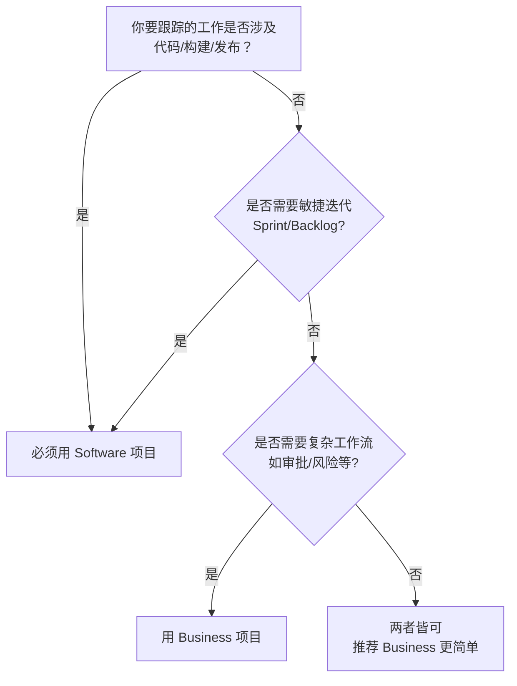

# 错题本 - 经验积累与优化记录

> 记录遇到的问题、解决方案和最佳实践，避免重复踩坑

---

## 📋 使用说明

**重要原则：只记录通用性问题！**

### 什么时候记录？
✅ **应该记录**（通用性问题）：
- 可复用：类似场景下可能再次遇到
- 有规律：不是偶然的、特定的问题
- 有价值：记录后能帮助快速定位和解决
- 可推广：解决方案可以应用到其他类似场景

### 什么时候不记录？
❌ **不应该记录**（非通用性问题）：
- 一次性问题：特定场景下只出现一次
- 偶发性问题：没有规律可循
- 特定问题：只针对某个具体文件或内容
- 简单问题：太简单，不值得记录

### 记录格式
- 每次遇到通用性问题解决后，记录到对应分类下
- 包含：问题描述、原因分析、解决方案、预防措施
- 按时间倒序排列，最新的在最前面

---

## 🏷️ 分类索引

- [Mermaid 图表](#mermaid-图表)
- [VS Code 使用](#vs-code-使用)
- [Markdown 写作](#markdown-写作)
- [测试用例生成](#测试用例生成)
- [其他](#其他)

---

## Mermaid 图表

### 2026-01-05 - Mermaid 流程图在 VS Code 中无法预览

**问题描述**
- Mermaid 流程图代码直接写在 .md 文件中，按 `Ctrl+Shift+V` 预览时无法显示
- 文字过长时显示不全

**原因分析**
1. Mermaid 图表需要用代码块包裹（```mermaid）
2. 节点文字过长时，Mermaid 默认不会自动换行，导致文字被截断

**解决方案**

1. **使用代码块包裹**
   ```markdown
   ```mermaid
   graph TD
   A[节点文字] --> B[节点文字]
   ```
   ```

2. **文字换行优化**
   - 使用 `<br/>` 标签手动换行
   - 示例：`A[你要跟踪的工作是否涉及<br/>代码/构建/发布？]`

**完整示例**

```

**预防措施**
- ✅ 编写 Mermaid 图表时，始终使用 ```mermaid 代码块
- ✅ 节点文字超过 10 个字时，考虑使用 `<br/>` 换行
- ✅ 使用 VS Code 插件 "Markdown Preview Enhanced" 或 "Mermaid Preview" 提升预览体验

**相关资源**
- Mermaid 官方文档：https://mermaid.js.org/intro/
- 在线预览工具：https://mermaid.live/

### 2026-01-05 - Mermaid 注释导致解析错误

**问题描述**
- Mermaid 图表中使用 `%%` 注释时，出现解析错误
- 错误信息：`Expecting 'SEMI', 'NEWLINE', 'EOF', 'AMP', 'START_LINK', 'LINK', 'LINK_ID', got 'NODE_STRING'`

**原因分析**
1. Mermaid 的注释语法在某些情况下会导致解析器混淆
2. 特别是当代码块中有多个注释或注释位置不当时

**解决方案**

1. **移除注释**（推荐）
   - 删除 Mermaid 代码块中的所有 `%%` 注释
   - 保持代码简洁

2. **使用节点文字替代注释**
   ```mermaid
   C --> E[Sprint 25<br/>被放入迭代]
   ```

3. **在外部文档记录说明**
   - 在 Markdown 文件的代码块外部添加说明文字

**示例对比**

❌ **错误写法：**
```mermaid
C --> E[Sprint 25]  %% 被放入迭代
C --> F[Version: v2.3.0]  %% 计划发布版本
```

✅ **正确写法：**
```mermaid
C --> E[Sprint 25]
C --> F[Version: v2.3.0]
```

**预防措施**
- ✅ 避免在 Mermaid 代码块中使用 `%%` 注释
- ✅ 如需说明，使用节点文字或外部文档
- ✅ 保持 Mermaid 代码简洁清晰

---

## VS Code 使用

### 2026-01-05 - PowerShell 终端显示中文乱码

**问题描述**
- 在 PowerShell 终端中使用 `Get-Content` 查看中文文件时出现乱码
- 显示为类似"鎵€鏈夊唴瀹瑰繀椤诲寘鍚湪"的乱码字符
- 文件本身编码正常，只是终端显示问题

**原因分析**
1. PowerShell 默认使用 GBK/GB2312 编码
2. 而 Markdown 文件通常使用 UTF-8 编码保存
3. 编码不匹配导致中文显示为乱码

**解决方案**

1. **临时设置终端编码（推荐）**
   ```powershell
   # 设置输出编码为 UTF-8
   [Console]::OutputEncoding = [System.Text.Encoding]::UTF8
   $env:LANG = "zh_CN.UTF-8"
   
   # 然后重新查看文件
   Get-Content project_rules.md
   ```

2. **使用 Out-File 指定编码**
   ```powershell
   Get-Content project_rules.md -Encoding UTF8
   ```

3. **永久设置 PowerShell 编码**
   在 PowerShell 配置文件中添加：
   ```powershell
   # 编辑配置文件
   notepad $PROFILE
   
   # 添加以下内容
   [Console]::OutputEncoding = [System.Text.Encoding]::UTF8
   $PSDefaultParameterValues['Out-File:Encoding'] = 'utf8'
   ```

4. **使用 VS Code 内置终端**
   - VS Code 的终端通常能正确识别 UTF-8 编码
   - 推荐使用 VS Code 的集成终端查看中文文件

**示例对比**

❌ **乱码显示：**
```
- 鎵€鏈夊唴瀹瑰繀椤诲寘鍚湪`<body>`鍏冪礌鍐?
```

✅ **正确显示：**
```
- 所有内容必须包含在`<body>`元素内
```

**预防措施**
- ✅ 在 PowerShell 中查看中文文件前，先设置编码为 UTF-8
- ✅ 使用 VS Code 的集成终端查看中文文件
- ✅ 在 PowerShell 配置文件中永久设置 UTF-8 编码
- ✅ 保存文件时统一使用 UTF-8 编码（带 BOM 或不带 BOM）

**相关资源**
- PowerShell 编码文档：https://docs.microsoft.com/zh-cn/powershell/module/microsoft.powershell.core/about/about_character_encoding
- VS Code 终端编码设置：https://code.visualstudio.com/docs/terminal/integrated

---

## Markdown 写作

*(暂无记录)*

---

## 测试用例生成

*(暂无记录)*

---

## 其他

*(暂无记录)*

---

## 📊 统计信息

- 总问题数：3
- 已解决：3
- 待解决：0
- 最后更新：2026-01-05
