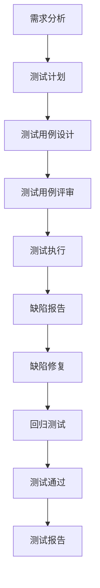

# 测试架构设计 - 情绪小精灵

## 1. 测试策略

### 1.1 测试类型选择

**主要测试类型**：
- **黑盒测试**：功能测试、用户体验测试
- **白盒测试**：单元测试、代码覆盖率测试
- **灰盒测试**：集成测试、API测试

**测试层次**：
- **单元测试**：针对单个函数、模块的测试（AI/ML算法、固件逻辑）
- **集成测试**：针对模块间交互的测试（语音识别+灯光控制）
- **系统测试**：针对完整系统的测试（端到端场景）
- **验收测试**：基于用户故事的验收标准测试

### 1.2 测试方法论

**AI/ML模块测试**：
- **模型准确性测试**：情绪识别准确率 >= 90%，语音识别准确率 >= 95%
- **模型鲁棒性测试**：不同环境噪音、不同用户语音
- **A/B测试**：对比不同算法版本的性能

**硬件/固件模块测试**：
- **硬件测试**：设备距离检测、IMU震动检测、电量管理
- **固件测试**：状态机测试、并发测试、边界测试
- **嵌入式测试**：内存泄漏、CPU占用、响应时间

**云端服务测试**：
- **API测试**：接口功能、性能、安全性
- **并发测试**：多用户同时访问
- **压力测试**：系统极限性能

**移动App测试**：
- **UI/UX测试**：界面交互、用户体验
- **兼容性测试**：不同iOS/Android版本
- **网络测试**：弱网、断网、网络切换

---

## 2. 测试范围

### 2.1 功能测试范围

| 模块 | 测试内容 | 优先级 |
|------|---------|--------|
| **小精灵人设系统** | 5种人格的情绪识别、语言回应、语音特征 | High |
| **语音系统** | 唤醒/待机、睡眠模式、音量调整、亮度调整 | High |
| **多精灵交互系统** | 距离检测、触发机制、防打扰、角色分配、音效组合 | High |
| **社交功能** | 好友添加、关系维护 | Medium |
| **物理按键系统** | 按键控制设备状态 | Medium |
| **灯光交互系统** | 灯光效果表达情绪和状态 | Medium |
| **电量管理系统** | 电量监控、电量不足提示 | Medium |
| **敏感词过滤系统** | 敏感词过滤策略 | Low |

### 2.2 非功能测试范围

| 测试类型 | 测试内容 | 验收标准 | 优先级 |
|---------|---------|---------|--------|
| **性能测试** | 语音识别响应时间 | < 2秒 | High |
| **性能测试** | 多精灵交互触发时间 | < 1秒 | High |
| **性能测试** | 音效播放延迟 | < 0.5秒 | High |
| **稳定性测试** | 长时间运行稳定性 | 24小时无崩溃 | High |
| **鲁棒性测试** | 异常输入处理 | 系统不崩溃 | High |
| **并发测试** | 多设备同时交互 | 正常工作 | Medium |
| **兼容性测试** | 2-6只设备同时交互 | 正常工作 | Medium |
| **兼容性测试** | 所有人格语言风格 | 正常工作 | Medium |
| **兼容性测试** | 所有固定语音指令 | 正常工作 | Medium |
| **安全性测试** | 敏感词过滤 | 过滤准确率 >= 95% | Medium |
| **操作体验性测试** | 用户交互流畅度 | 流畅无卡顿 | Medium |

---

## 3. 测试维度覆盖

### 3.1 测试维度定义

根据项目特性，定义以下测试维度：

| 维度 | 说明 | 适用场景 |
|------|------|---------|
| **正例** | 正常输入，验证功能正常工作 | 所有功能 |
| **反例** | 错误输入，验证系统容错能力 | 所有功能 |
| **边界** | 边界值测试，验证边界条件 | 数值范围、状态边界 |
| **异常** | 异常情况测试，验证系统稳定性 | 网络异常、硬件异常 |
| **并发** | 并发操作测试，验证系统并发能力 | 多设备交互、多用户访问 |
| **鲁棒性** | 压力测试，验证系统极限性能 | 长时间运行、高负载 |
| **稳定性** | 稳定性测试，验证系统长期稳定性 | 24小时运行、内存泄漏 |
| **操作体验性** | 用户体验测试，验证交互流畅度 | UI/UX、语音交互 |
| **兼容性** | 兼容性测试，验证系统兼容性 | 不同设备、不同版本 |
| **安全性** | 安全性测试，验证系统安全性 | 敏感词过滤、数据安全 |

### 3.2 测试维度精准匹配原则

**核心原则**：
- ✅ 根据功能特性精准匹配测试维度
- ✅ 避免一刀切，每个功能点只选择相关维度
- ✅ 为每个维度的选择提供明确依据
- ✅ 确保架构中定义的全部维度都被合理分配

**维度匹配矩阵**：

| 功能模块 | 功能点 | 匹配维度 | 匹配依据 |
|---------|-------|---------|---------|
| **小精灵人设系统** | 情绪识别 | 正例、反例、边界、异常、鲁棒性、稳定性 | AI/ML算法需要多维度验证准确率和鲁棒性 |
| **小精灵人设系统** | 语言回应 | 正例、反例、边界、异常、操作体验性 | 用户体验关键功能，需要验证交互体验 |
| **小精灵人设系统** | 语音特征 | 正例、边界、操作体验性 | 语音输出质量，主要验证正常场景 |
| **语音系统** | 唤醒/待机 | 正例、反例、边界、异常、鲁棒性、稳定性、操作体验性 | 核心交互功能，需要高可靠性和良好体验 |
| **语音系统** | 睡眠模式 | 正例、反例、边界、异常、稳定性 | 状态切换功能，需要验证状态正确性 |
| **语音系统** | 音量调整 | 正例、反例、边界、操作体验性 | 参数调整功能，需要验证边界和体验 |
| **语音系统** | 亮度调整 | 正例、反例、边界、操作体验性 | 参数调整功能，需要验证边界和体验 |
| **多精灵交互系统** | 距离检测 | 正例、反例、边界、异常、鲁棒性、稳定性 | 硬件检测功能，需要高准确率和稳定性 |
| **多精灵交互系统** | 触发机制 | 正例、反例、边界、异常、并发、稳定性 | 多设备交互核心，需要验证并发和稳定性 |
| **多精灵交互系统** | 防打扰逻辑 | 正例、反例、边界、异常、稳定性 | 状态管理功能，需要验证逻辑正确性 |
| **多精灵交互系统** | 角色分配 | 正例、反例、边界、异常 | 逻辑分配功能，需要验证分配正确性 |
| **多精灵交互系统** | 音效组合 | 正例、反例、边界、操作体验性 | 用户体验功能，需要验证音效质量 |
| **社交功能** | 好友添加 | 正例、反例、并发、安全性 | 涉及用户交互和数据安全 |
| **物理按键系统** | 按键控制 | 正例、反例、边界、异常、稳定性 | 硬件控制功能，需要验证稳定性 |
| **灯光交互系统** | 灯光效果 | 正例、反例、边界、操作体验性 | 用户体验功能，需要验证视觉效果 |
| **电量管理系统** | 电量监控 | 正例、反例、边界、异常、稳定性 | 硬件监控功能，需要验证准确性 |
| **敏感词过滤系统** | 敏感词过滤 | 正例、反例、边界、安全性 | 安全功能，需要验证过滤准确率 |

---

## 4. 测试工具建议

### 4.1 AI/ML模块测试工具

| 工具 | 用途 | 适用场景 |
|------|------|---------|
| **TensorFlow/PyTorch** | 模型单元测试 | 情绪识别算法、语音识别算法 |
| **MLflow** | 模型版本管理和A/B测试 | 模型性能对比 |
| **scikit-learn** | 模型准确率评估 | 情绪识别准确率、语音识别准确率 |
| **pytest** | 单元测试框架 | Python代码单元测试 |

### 4.2 硬件/固件测试工具

| 工具 | 用途 | 适用场景 |
|------|------|---------|
| **Unity Test** | 单元测试框架 | 固件逻辑测试 |
| **JMeter** | 性能测试 | 固件API性能测试 |
| **GDB** | 调试工具 | 固件调试 |
| **Valgrind** | 内存泄漏检测 | 固件内存管理测试 |
| **Wireshark** | 网络抓包 | 设备间通信测试 |

### 4.3 云端服务测试工具

| 工具 | 用途 | 适用场景 |
|------|------|---------|
| **Postman** | API测试 | 云端API功能测试 |
| **JMeter** | 性能测试 | 云端API性能测试 |
| **Locust** | 压力测试 | 云端服务压力测试 |
| **New Relic** | 性能监控 | 云端服务性能监控 |

### 4.4 移动App测试工具

| 工具 | 用途 | 适用场景 |
|------|------|---------|
| **XCTest** | iOS单元测试 | iOS App单元测试 |
| **Espresso** | Android UI测试 | Android App UI测试 |
| **Appium** | 跨平台UI测试 | iOS/Android App UI测试 |
| **Firebase Test Lab** | 设备云测试 | 不同设备兼容性测试 |

### 4.5 通用测试工具

| 工具 | 用途 | 适用场景 |
|------|------|---------|
| **pytest** | 单元测试框架 | Python代码单元测试 |
| **JUnit** | 单元测试框架 | Java代码单元测试 |
| **Selenium** | Web UI测试 | Web端UI测试 |
| **Jira** | 测试管理 | 测试用例管理、缺陷跟踪 |
| **XMind** | 脑图工具 | 测试用例脑图 |

---

## 5. 测试用例组织结构

### 5.1 测试用例层级结构

```
情绪小精灵测试用例
├── Epic 1: 小精灵人设和语言风格系统
│   ├── Story 1.1: 快乐人格
│   │   ├── 功能点 1.1.1: 情绪识别
│   │   ├── 功能点 1.1.2: 语言回应
│   │   └── 功能点 1.1.3: 语音特征
│   ├── Story 1.2: 愤怒人格
│   ├── Story 1.3: 悲伤人格
│   ├── Story 1.4: 焦虑人格
│   ├── Story 1.5: 宁静人格
│   └── Story 1.6: 情绪自动切换
├── Epic 2: 语音系统
│   ├── Story 2.1: 唤醒/待机
│   ├── Story 2.3: 睡眠模式
│   ├── Story 2.4: 音量调整
│   └── Story 2.5: 亮度调整
├── Epic 3: 多精灵交互系统
│   ├── Story 3.1: 距离检测和触发
│   ├── Story 3.2: 防打扰逻辑
│   ├── Story 3.3: 角色分配机制
│   ├── Story 3.4: 2只设备音效
│   ├── Story 3.5: 3只设备音效
│   ├── Story 3.6: 4只设备音效
│   ├── Story 3.7: 5只设备音效
│   └── Story 3.8: 6只设备音效
├── Epic 4: 社交功能
├── Epic 5: 物理按键系统
├── Epic 6: 灯光交互系统
├── Epic 7: 电量管理系统
└── Epic 8: 敏感词过滤系统
```

### 5.2 测试用例命名规范

**格式**：`[Epic编号].[Story编号].[功能点编号].[测试类型]_[测试编号]`

**示例**：
- `E1.S1.1.正例_001`：Epic 1, Story 1.1, 功能点 1.1.1, 正例测试, 编号001
- `E1.S1.1.反例_001`：Epic 1, Story 1.1, 功能点 1.1.1, 反例测试, 编号001
- `E2.S2.1.边界_001`：Epic 2, Story 2.1, 功能点 2.1.1, 边界测试, 编号001

### 5.3 测试用例属性

每个测试用例包含以下属性：

| 属性 | 说明 | 示例 |
|------|------|------|
| **测试用例ID** | 唯一标识 | E1.S1.1.正例_001 |
| **测试类型** | 正例/反例/边界/异常/并发/鲁棒性/稳定性/操作体验性/兼容性/安全性 | 正例 |
| **优先级** | P0/P1/P2/P3 | P0 |
| **用户输入** | 测试输入 | 用户说"今天天气真好" |
| **系统预期行为** | 预期结果 | 快乐人格回应"Pa-ka yo-yo sha-mi～ 好耶 yo～ha!" |
| **验证方式** | 如何验证 | 检查语音输出内容 |
| **前置条件** | 测试前需要满足的条件 | 设备处于聆听状态 |
| **后置条件** | 测试后需要满足的条件 | 设备保持聆听状态 |
| **依赖关系** | 依赖的其他测试用例 | 无 |

---

## 6. 测试环境规划

### 6.1 测试环境

| 环境类型 | 用途 | 配置 |
|---------|------|------|
| **开发环境** | 开发人员自测 | 单台设备、本地开发环境 |
| **测试环境** | 功能测试、集成测试 | 2-6台设备、云端测试环境 |
| **性能环境** | 性能测试、压力测试 | 多台设备、云端性能环境 |
| **预发布环境** | 验收测试 | 模拟生产环境 |
| **生产环境** | 真实用户使用 | 正式上线环境 |

### 6.2 测试数据

| 数据类型 | 说明 | 示例 |
|---------|------|------|
| **语音数据** | 不同情绪、不同用户的语音样本 | 开心、低落、沉默、生气、害怕、疲惫 |
| **设备数据** | 不同设备ID、不同电量状态 | 设备ID001-006、电量100%-15% |
| **用户数据** | 测试用户账号、好友关系 | 用户001-010、好友关系链 |
| **敏感词数据** | 敏感词库 | 政治、暴力、色情等敏感词 |

---

## 7. 测试流程

### 7.1 测试流程图



### 7.2 测试阶段

| 阶段 | 活动 | 产出物 |
|------|------|--------|
| **需求分析** | 分析需求、提取功能点 | 需求分析文档 |
| **测试计划** | 制定测试策略、测试范围 | 测试计划文档 |
| **测试用例设计** | 设计测试用例 | 测试用例文档、脑图 |
| **测试用例评审** | 评审测试用例完整性 | 评审报告 |
| **测试执行** | 执行测试用例 | 测试执行记录 |
| **缺陷报告** | 报告缺陷 | 缺陷报告 |
| **缺陷修复** | 开发修复缺陷 | 修复记录 |
| **回归测试** | 验证缺陷修复 | 回归测试报告 |
| **测试通过** | 验收测试通过 | 验收报告 |
| **测试报告** | 生成测试报告 | 测试报告 |

---

## 8. 测试交付物

### 8.1 测试文档

| 文档名称 | 说明 | 交付时间 |
|---------|------|---------|
| **需求分析文档** | 提取功能点、业务规则、验收标准 | 阶段1 |
| **测试架构文档** | 测试策略、测试范围、测试维度 | 阶段2 |
| **测试任务拆分文档** | 功能点与测试维度映射 | 阶段3 |
| **测试方案审批文档** | 测试方案审批 | 阶段4 |
| **测试用例文档** | 详细测试用例 | 阶段5 |
| **测试用例脑图** | OPML格式脑图 | 阶段5 |
| **测试用例评估报告** | 测试用例质量评估 | 阶段6 |
| **测试执行报告** | 测试执行结果 | 测试执行后 |
| **缺陷报告** | 缺陷清单 | 测试执行后 |
| **测试报告** | 最终测试报告 | 测试完成后 |

### 8.2 测试数据

| 数据类型 | 说明 | 交付时间 |
|---------|------|---------|
| **语音测试数据** | 不同情绪的语音样本 | 测试执行前 |
| **设备测试数据** | 不同设备ID、电量状态 | 测试执行前 |
| **用户测试数据** | 测试用户账号、好友关系 | 测试执行前 |
| **敏感词测试数据** | 敏感词库 | 测试执行前 |

---

## 9. 测试风险评估

### 9.1 测试风险

| 风险 | 影响 | 概率 | 应对措施 |
|------|------|------|---------|
| **AI/ML模型准确率不达标** | 高 | 中 | 提前进行模型训练和调优，准备多套模型方案 |
| **硬件设备不足** | 中 | 高 | 提前申请测试设备，准备模拟器 |
| **多设备交互测试复杂** | 高 | 中 | 设计自动化测试脚本，提高测试效率 |
| **语音识别受环境影响** | 中 | 中 | 准备多种测试环境（安静、嘈杂） |
| **云端服务不稳定** | 高 | 低 | 准备备用环境，加强监控 |
| **测试时间不足** | 高 | 中 | 合理规划测试时间，优先测试核心功能 |

### 9.2 测试依赖

| 依赖项 | 说明 | 依赖关系 |
|--------|------|---------|
| **硬件设备** | 需要足够的测试设备 | 测试执行前必须到位 |
| **云端服务** | 需要稳定的云端测试环境 | 测试执行前必须到位 |
| **AI/ML模型** | 需要训练好的模型 | 测试执行前必须到位 |
| **测试数据** | 需要准备测试数据 | 测试执行前必须到位 |
| **测试工具** | 需要安装和配置测试工具 | 测试执行前必须到位 |

---

## 10. 测试工作量评估

### 10.1 测试工作量估算方法

**估算方法**：基于Story Points和测试维度进行估算

**估算公式**：
- 测试用例数量 = 功能点数量 × 每个功能点的测试维度数量 × 每个维度的测试用例数量
- 测试工作量 = 测试用例数量 × 平均每个测试用例的执行时间

**假设**：
- 每个功能点平均覆盖 5 个测试维度
- 每个测试维度平均 5 个测试用例
- 每个测试用例平均执行时间 30 分钟

### 10.2 各模块测试工作量估算

| Epic | Story数量 | 功能点数量 | 测试维度覆盖 | 测试用例数量 | 测试工作量（人天） |
|------|----------|-----------|-------------|-------------|-------------------|
| **Epic 1: 小精灵人设系统** | 6 | 18 | 90 | 450 | 28 |
| **Epic 2: 语音系统** | 4 | 12 | 60 | 300 | 19 |
| **Epic 3: 多精灵交互系统** | 8 | 24 | 120 | 600 | 38 |
| **Epic 4: 社交功能** | 2 | 6 | 30 | 150 | 9 |
| **Epic 5: 物理按键系统** | 1 | 3 | 15 | 75 | 5 |
| **Epic 6: 灯光交互系统** | 1 | 3 | 15 | 75 | 5 |
| **Epic 7: 电量管理系统** | 1 | 3 | 15 | 75 | 5 |
| **Epic 8: 敏感词过滤系统** | 1 | 3 | 15 | 75 | 5 |
| **总计** | 24 | 72 | 360 | 1800 | 114 |

**说明**：
- 测试工作量 = 测试用例数量 × 0.0625 人天/用例（30分钟/用例 ÷ 8小时/天）
- 考虑到测试用例设计、评审、执行、缺陷修复、回归测试等环节，建议预留 30% 的缓冲时间
- 实际测试工作量 ≈ 114 × 1.3 = 148 人天

---

## 11. 测试里程碑

| 里程碑 | 时间 | 交付物 |
|--------|------|--------|
| **M1: 测试计划完成** | Sprint 1 | 测试计划文档 |
| **M2: 测试用例设计完成** | Sprint 2 | 测试用例文档、脑图 |
| **M3: 测试用例评审通过** | Sprint 2 | 评审报告 |
| **M4: Epic 1-2 测试完成** | Sprint 3 | 测试报告、缺陷报告 |
| **M5: Epic 3 测试完成** | Sprint 5 | 测试报告、缺陷报告 |
| **M6: Epic 4-8 测试完成** | Sprint 7 | 测试报告、缺陷报告 |
| **M7: 回归测试完成** | Sprint 8 | 回归测试报告 |
| **M8: 验收测试通过** | Sprint 9 | 验收报告 |
| **M9: 测试报告完成** | Sprint 10 | 最终测试报告 |

---

## 12. 测试质量标准

### 12.1 测试覆盖率标准

| 覆盖率类型 | 目标值 | 说明 |
|----------|--------|------|
| **需求覆盖率** | 100% | 所有需求都有对应的测试用例 |
| **功能覆盖率** | 100% | 所有功能都有对应的测试用例 |
| **代码覆盖率** | >= 80% | 单元测试代码覆盖率 |
| **测试用例通过率** | >= 95% | 测试用例执行通过率 |
| **缺陷修复率** | 100% | 所有缺陷都修复或确认 |

### 12.2 测试质量标准

| 质量指标 | 目标值 | 说明 |
|---------|--------|------|
| **测试用例设计质量** | 优秀 | 测试用例设计完整、准确、可执行 |
| **测试执行质量** | 优秀 | 测试执行完整、准确、可追溯 |
| **缺陷报告质量** | 优秀 | 缺陷报告完整、准确、可复现 |
| **测试报告质量** | 优秀 | 测试报告完整、准确、有价值 |

---

## 下一步

完成测试架构设计后，将进入**阶段3: Atomize（测试任务拆分）**，将系统拆分为可独立测试的模块，为每个功能点分配测试维度，建立功能点与测试维度的映射关系。
