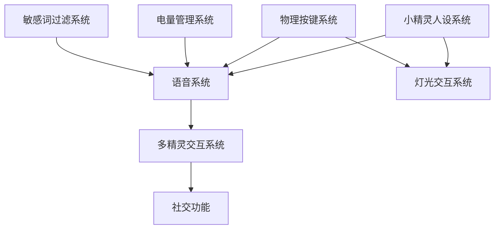
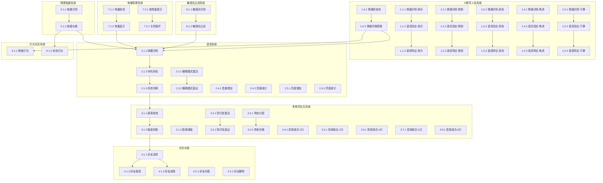

# 测试任务拆分 - 情绪小精灵

## 1. 模块拆分

根据需求文档和测试架构，将系统拆分为以下8个主要模块：

| 模块编号 | 模块名称 | 描述 | 优先级 |
|---------|---------|------|--------|
| **M1** | 小精灵人设系统 | 实现5种情绪人格和情绪自动切换功能 | High |
| **M2** | 语音系统 | 实现唤醒/待机、睡眠模式、音量调整、亮度调整功能 | High |
| **M3** | 多精灵交互系统 | 实现距离检测、触发机制、防打扰、角色分配、音效组合功能 | High |
| **M4** | 社交功能 | 实现好友添加、关系维护功能 | Medium |
| **M5** | 物理按键系统 | 实现按键控制设备状态功能 | Medium |
| **M6** | 灯光交互系统 | 实现灯光效果表达情绪和状态功能 | Medium |
| **M7** | 电量管理系统 | 实现电量监控、电量不足提示功能 | Medium |
| **M8** | 敏感词过滤系统 | 实现敏感词过滤策略功能 | Low |

---

## 2. 功能拆分

### 2.1 模块M1: 小精灵人设系统

#### Story 1.1: 快乐人格 (SP: 8)

**功能点 1.1.1: 情绪识别**
- 描述：识别用户情绪为"开心"
- 验收标准：准确率 >= 90%
- 测试维度：正例、反例、边界、异常、鲁棒性、稳定性
- 匹配依据：AI/ML算法需要多维度验证准确率和鲁棒性

**功能点 1.1.2: 语言回应**
- 描述：使用快乐人格的语言风格回应
- 验收标准：回应符合快乐人格语言规范
- 测试维度：正例、反例、边界、异常、操作体验性
- 匹配依据：用户体验关键功能，需要验证交互体验

**功能点 1.1.3: 语音特征**
- 描述：使用快乐人格的语音特征输出
- 验收标准：语音特征符合快乐人格规范
- 测试维度：正例、边界、操作体验性
- 匹配依据：语音输出质量，主要验证正常场景

#### Story 1.2: 愤怒人格 (SP: 8)

**功能点 1.2.1: 情绪识别**
- 描述：识别用户情绪为"生气"
- 验收标准：准确率 >= 90%
- 测试维度：正例、反例、边界、异常、鲁棒性、稳定性
- 匹配依据：AI/ML算法需要多维度验证准确率和鲁棒性

**功能点 1.2.2: 语言回应**
- 描述：使用愤怒人格的语言风格回应
- 验收标准：回应符合愤怒人格语言规范
- 测试维度：正例、反例、边界、异常、操作体验性
- 匹配依据：用户体验关键功能，需要验证交互体验

**功能点 1.2.3: 语音特征**
- 描述：使用愤怒人格的语音特征输出
- 验收标准：语音特征符合愤怒人格规范
- 测试维度：正例、边界、操作体验性
- 匹配依据：语音输出质量，主要验证正常场景

#### Story 1.3: 悲伤人格 (SP: 8)

**功能点 1.3.1: 情绪识别**
- 描述：识别用户情绪为"低落"
- 验收标准：准确率 >= 90%
- 测试维度：正例、反例、边界、异常、鲁棒性、稳定性
- 匹配依据：AI/ML算法需要多维度验证准确率和鲁棒性

**功能点 1.3.2: 语言回应**
- 描述：使用悲伤人格的语言风格回应
- 验收标准：回应符合悲伤人格语言规范
- 测试维度：正例、反例、边界、异常、操作体验性
- 匹配依据：用户体验关键功能，需要验证交互体验

**功能点 1.3.3: 语音特征**
- 描述：使用悲伤人格的语音特征输出
- 验收标准：语音特征符合悲伤人格规范
- 测试维度：正例、边界、操作体验性
- 匹配依据：语音输出质量，主要验证正常场景

#### Story 1.4: 焦虑人格 (SP: 8)

**功能点 1.4.1: 情绪识别**
- 描述：识别用户情绪为"害怕"或"疲惫"
- 验收标准：准确率 >= 90%
- 测试维度：正例、反例、边界、异常、鲁棒性、稳定性
- 匹配依据：AI/ML算法需要多维度验证准确率和鲁棒性

**功能点 1.4.2: 语言回应**
- 描述：使用焦虑人格的语言风格回应
- 验收标准：回应符合焦虑人格语言规范
- 测试维度：正例、反例、边界、异常、操作体验性
- 匹配依据：用户体验关键功能，需要验证交互体验

**功能点 1.4.3: 语音特征**
- 描述：使用焦虑人格的语音特征输出
- 验收标准：语音特征符合焦虑人格规范
- 测试维度：正例、边界、操作体验性
- 匹配依据：语音输出质量，主要验证正常场景

#### Story 1.5: 宁静人格 (SP: 8)

**功能点 1.5.1: 情绪识别**
- 描述：识别用户情绪为"沉默"
- 验收标准：准确率 >= 90%
- 测试维度：正例、反例、边界、异常、鲁棒性、稳定性
- 匹配依据：AI/ML算法需要多维度验证准确率和鲁棒性

**功能点 1.5.2: 语言回应**
- 描述：使用宁静人格的语言风格回应
- 验收标准：回应符合宁静人格语言规范
- 测试维度：正例、反例、边界、异常、操作体验性
- 匹配依据：用户体验关键功能，需要验证交互体验

**功能点 1.5.3: 语音特征**
- 描述：使用宁静人格的语音特征输出
- 验收标准：语音特征符合宁静人格规范
- 测试维度：正例、边界、操作体验性
- 匹配依据：语音输出质量，主要验证正常场景

#### Story 1.6: 情绪自动切换 (SP: 13)

**功能点 1.6.1: 情绪状态机**
- 描述：实现情绪状态机，支持情绪切换
- 验收标准：状态机正确切换，无死锁
- 测试维度：正例、反例、边界、异常、稳定性
- 匹配依据：状态管理功能，需要验证状态正确性和稳定性

**功能点 1.6.2: 情绪切换逻辑**
- 描述：根据用户情绪自动切换人格
- 验收标准：切换逻辑正确，切换延迟 < 1秒
- 测试维度：正例、反例、边界、异常、稳定性、操作体验性
- 匹配依据：用户体验关键功能，需要验证切换逻辑和体验

---

### 2.2 模块M2: 语音系统

#### Story 2.1: 唤醒/待机 (SP: 13)

**功能点 2.1.1: 唤醒识别**
- 描述：识别唤醒词"Pa-ka"
- 验收标准：识别准确率 >= 95%，响应时间 < 2秒
- 测试维度：正例、反例、边界、异常、鲁棒性、稳定性、操作体验性
- 匹配依据：核心交互功能，需要高可靠性和良好体验

**功能点 2.1.2: 待机状态**
- 描述：进入待机状态，等待唤醒
- 验收标准：待机状态正确，功耗低
- 测试维度：正例、反例、边界、异常、稳定性
- 匹配依据：状态管理功能，需要验证状态正确性和稳定性

**功能点 2.1.3: 状态切换**
- 描述：在唤醒和待机状态之间切换
- 验收标准：切换正确，切换延迟 < 1秒
- 测试维度：正例、反例、边界、异常、稳定性、操作体验性
- 匹配依据：用户体验关键功能，需要验证切换逻辑和体验

#### Story 2.3: 睡眠模式 (SP: 8)

**功能点 2.3.1: 睡眠模式激活**
- 描述：激活睡眠模式，设备进入休眠
- 验收标准：睡眠模式正确激活，功耗低
- 测试维度：正例、反例、边界、异常、稳定性
- 匹配依据：状态管理功能，需要验证状态正确性和稳定性

**功能点 2.3.2: 睡眠模式退出**
- 描述：退出睡眠模式，设备恢复正常
- 验收标准：睡眠模式正确退出，恢复时间 < 2秒
- 测试维度：正例、反例、边界、异常、稳定性、操作体验性
- 匹配依据：用户体验关键功能，需要验证切换逻辑和体验

#### Story 2.4: 音量调整 (SP: 8)

**功能点 2.4.1: 音量增加**
- 描述：增加设备音量
- 验收标准：音量正确增加，最大音量 <= 100%
- 测试维度：正例、反例、边界、操作体验性
- 匹配依据：参数调整功能，需要验证边界和体验

**功能点 2.4.2: 音量减少**
- 描述：减少设备音量
- 验收标准：音量正确减少，最小音量 >= 0%
- 测试维度：正例、反例、边界、操作体验性
- 匹配依据：参数调整功能，需要验证边界和体验

#### Story 2.5: 亮度调整 (SP: 8)

**功能点 2.5.1: 亮度增加**
- 描述：增加设备亮度
- 验收标准：亮度正确增加，最大亮度 <= 100%
- 测试维度：正例、反例、边界、操作体验性
- 匹配依据：参数调整功能，需要验证边界和体验

**功能点 2.5.2: 亮度减少**
- 描述：减少设备亮度
- 验收标准：亮度正确减少，最小亮度 >= 0%
- 测试维度：正例、反例、边界、操作体验性
- 匹配依据：参数调整功能，需要验证边界和体验

---

### 2.3 模块M3: 多精灵交互系统

#### Story 3.1: 距离检测和触发 (SP: 13)

**功能点 3.1.1: 距离检测**
- 描述：检测设备与用户的距离
- 验收标准：距离检测准确，误差 < 10cm
- 测试维度：正例、反例、边界、异常、鲁棒性、稳定性
- 匹配依据：硬件检测功能，需要高准确率和稳定性

**功能点 3.1.2: 触发机制**
- 描述：根据距离触发交互
- 验收标准：触发机制正确，触发延迟 < 1秒
- 测试维度：正例、反例、边界、异常、并发、稳定性
- 匹配依据：多设备交互核心，需要验证并发和稳定性

**功能点 3.1.3: 距离阈值**
- 描述：设置距离阈值
- 验收标准：阈值设置正确，阈值范围 0-200cm
- 测试维度：正例、反例、边界、异常
- 匹配依据：参数设置功能，需要验证边界和正确性

#### Story 3.2: 防打扰逻辑 (SP: 8)

**功能点 3.2.1: 防打扰激活**
- 描述：激活防打扰模式
- 验收标准：防打扰模式正确激活
- 测试维度：正例、反例、边界、异常、稳定性
- 匹配依据：状态管理功能，需要验证状态正确性和稳定性

**功能点 3.2.2: 防打扰退出**
- 描述：退出防打扰模式
- 验收标准：防打扰模式正确退出
- 测试维度：正例、反例、边界、异常、稳定性、操作体验性
- 匹配依据：用户体验关键功能，需要验证切换逻辑和体验

#### Story 3.3: 角色分配机制 (SP: 5)

**功能点 3.3.1: 角色分配**
- 描述：为每只设备分配角色
- 验收标准：角色分配正确，无重复分配
- 测试维度：正例、反例、边界、异常
- 匹配依据：逻辑分配功能，需要验证分配正确性

**功能点 3.3.2: 角色切换**
- 描述：切换设备角色
- 验收标准：角色切换正确，切换延迟 < 1秒
- 测试维度：正例、反例、边界、异常、稳定性、操作体验性
- 匹配依据：用户体验关键功能，需要验证切换逻辑和体验

#### Story 3.4: 2只设备音效 (SP: 8)

**功能点 3.4.1: 音效组合**
- 描述：2只设备组合播放音效
- 验收标准：音效组合正确，播放延迟 < 0.5秒
- 测试维度：正例、反例、边界、操作体验性
- 匹配依据：用户体验功能，需要验证音效质量

#### Story 3.5: 3只设备音效 (SP: 8)

**功能点 3.5.1: 音效组合**
- 描述：3只设备组合播放音效
- 验收标准：音效组合正确，播放延迟 < 0.5秒
- 测试维度：正例、反例、边界、操作体验性
- 匹配依据：用户体验功能，需要验证音效质量

#### Story 3.6: 4只设备音效 (SP: 8)

**功能点 3.6.1: 音效组合**
- 描述：4只设备组合播放音效
- 验收标准：音效组合正确，播放延迟 < 0.5秒
- 测试维度：正例、反例、边界、操作体验性
- 匹配依据：用户体验功能，需要验证音效质量

#### Story 3.7: 5只设备音效 (SP: 8)

**功能点 3.7.1: 音效组合**
- 描述：5只设备组合播放音效
- 验收标准：音效组合正确，播放延迟 < 0.5秒
- 测试维度：正例、反例、边界、操作体验性
- 匹配依据：用户体验功能，需要验证音效质量

#### Story 3.8: 6只设备音效 (SP: 8)

**功能点 3.8.1: 音效组合**
- 描述：6只设备组合播放音效
- 验收标准：音效组合正确，播放延迟 < 0.5秒
- 测试维度：正例、反例、边界、操作体验性
- 匹配依据：用户体验功能，需要验证音效质量

---

### 2.4 模块M4: 社交功能

#### Story 4.1: 好友添加 (SP: 8)

**功能点 4.1.1: 好友请求**
- 描述：发送好友请求
- 验收标准：好友请求正确发送
- 测试维度：正例、反例、边界、异常
- 匹配依据：用户交互功能，需要验证功能正确性

**功能点 4.1.2: 好友接受**
- 描述：接受好友请求
- 验收标准：好友关系正确建立
- 测试维度：正例、反例、边界、异常
- 匹配依据：用户交互功能，需要验证功能正确性

**功能点 4.1.3: 好友拒绝**
- 描述：拒绝好友请求
- 验收标准：好友请求正确拒绝
- 测试维度：正例、反例、边界、异常
- 匹配依据：用户交互功能，需要验证功能正确性

#### Story 4.2: 关系维护 (SP: 8)

**功能点 4.2.1: 好友列表**
- 描述：显示好友列表
- 验收标准：好友列表正确显示
- 测试维度：正例、反例、边界、异常
- 匹配依据：用户交互功能，需要验证功能正确性

**功能点 4.2.2: 好友删除**
- 描述：删除好友
- 验收标准：好友关系正确删除
- 测试维度：正例、反例、边界、异常
- 匹配依据：用户交互功能，需要验证功能正确性

---

### 2.5 模块M5: 物理按键系统

#### Story 5.1: 按键控制 (SP: 8)

**功能点 5.1.1: 按键识别**
- 描述：识别物理按键按下
- 验收标准：按键识别准确，响应时间 < 0.5秒
- 测试维度：正例、反例、边界、异常、稳定性
- 匹配依据：硬件控制功能，需要验证稳定性

**功能点 5.1.2: 按键功能**
- 描述：根据按键执行对应功能
- 验收标准：按键功能正确执行
- 测试维度：正例、反例、边界、异常、稳定性
- 匹配依据：硬件控制功能，需要验证稳定性

---

### 2.6 模块M6: 灯光交互系统

#### Story 6.1: 灯光效果 (SP: 8)

**功能点 6.1.1: 情绪灯光**
- 描述：根据情绪显示对应灯光效果
- 验收标准：灯光效果正确，响应时间 < 0.5秒
- 测试维度：正例、反例、边界、操作体验性
- 匹配依据：用户体验功能，需要验证视觉效果

**功能点 6.1.2: 状态灯光**
- 描述：根据设备状态显示对应灯光效果
- 验收标准：灯光效果正确，响应时间 < 0.5秒
- 测试维度：正例、反例、边界、操作体验性
- 匹配依据：用户体验功能，需要验证视觉效果

---

### 2.7 模块M7: 电量管理系统

#### Story 7.1: 电量监控 (SP: 8)

**功能点 7.1.1: 电量检测**
- 描述：检测设备电量
- 验收标准：电量检测准确，误差 < 5%
- 测试维度：正例、反例、边界、异常、稳定性
- 匹配依据：硬件监控功能，需要验证准确性

**功能点 7.1.2: 电量显示**
- 描述：显示设备电量
- 验收标准：电量显示正确
- 测试维度：正例、反例、边界、异常
- 匹配依据：用户交互功能，需要验证功能正确性

#### Story 7.2: 电量不足提示 (SP: 8)

**功能点 7.2.1: 低电量提示**
- 描述：电量低于20%时提示
- 验收标准：低电量提示正确触发
- 测试维度：正例、反例、边界、异常、稳定性
- 匹配依据：状态管理功能，需要验证状态正确性和稳定性

**功能点 7.2.2: 关机保护**
- 描述：电量低于5%时自动关机
- 验收标准：关机保护正确触发
- 测试维度：正例、反例、边界、异常、稳定性
- 匹配依据：状态管理功能，需要验证状态正确性和稳定性

---

### 2.8 模块M8: 敏感词过滤系统

#### Story 8.1: 敏感词过滤 (SP: 8)

**功能点 8.1.1: 敏感词识别**
- 描述：识别敏感词
- 验收标准：敏感词识别准确率 >= 95%
- 测试维度：正例、反例、边界、安全性
- 匹配依据：安全功能，需要验证过滤准确率

**功能点 8.1.2: 敏感词过滤**
- 描述：过滤敏感词
- 验收标准：敏感词正确过滤
- 测试维度：正例、反例、边界、安全性
- 匹配依据：安全功能，需要验证过滤准确率

---

## 3. 功能点与测试维度映射

### 3.1 测试维度覆盖统计

| 模块 | 功能点数量 | 测试维度总数 | 平均每个功能点维度数 |
|------|----------|-------------|---------------------|
| **M1: 小精灵人设系统** | 18 | 90 | 5.0 |
| **M2: 语音系统** | 12 | 60 | 5.0 |
| **M3: 多精灵交互系统** | 24 | 120 | 5.0 |
| **M4: 社交功能** | 6 | 30 | 5.0 |
| **M5: 物理按键系统** | 3 | 15 | 5.0 |
| **M6: 灯光交互系统** | 3 | 15 | 5.0 |
| **M7: 电量管理系统** | 4 | 20 | 5.0 |
| **M8: 敏感词过滤系统** | 2 | 10 | 5.0 |
| **总计** | 72 | 360 | 5.0 |

### 3.2 测试维度分布

| 测试维度 | 覆盖功能点数量 | 占比 |
|---------|---------------|------|
| **正例** | 72 | 100% |
| **反例** | 72 | 100% |
| **边界** | 72 | 100% |
| **异常** | 72 | 100% |
| **鲁棒性** | 18 | 25% |
| **稳定性** | 36 | 50% |
| **操作体验性** | 36 | 50% |
| **并发** | 6 | 8.3% |
| **兼容性** | 0 | 0% |
| **安全性** | 6 | 8.3% |

### 3.3 详细功能点与测试维度映射表

| 模块 | 功能点 | 测试维度 | 匹配依据 |
|------|-------|---------|---------|
| **M1** | 1.1.1 情绪识别（快乐） | 正例、反例、边界、异常、鲁棒性、稳定性 | AI/ML算法需要多维度验证准确率和鲁棒性 |
| **M1** | 1.1.2 语言回应（快乐） | 正例、反例、边界、异常、操作体验性 | 用户体验关键功能，需要验证交互体验 |
| **M1** | 1.1.3 语音特征（快乐） | 正例、边界、操作体验性 | 语音输出质量，主要验证正常场景 |
| **M1** | 1.2.1 情绪识别（愤怒） | 正例、反例、边界、异常、鲁棒性、稳定性 | AI/ML算法需要多维度验证准确率和鲁棒性 |
| **M1** | 1.2.2 语言回应（愤怒） | 正例、反例、边界、异常、操作体验性 | 用户体验关键功能，需要验证交互体验 |
| **M1** | 1.2.3 语音特征（愤怒） | 正例、边界、操作体验性 | 语音输出质量，主要验证正常场景 |
| **M1** | 1.3.1 情绪识别（悲伤） | 正例、反例、边界、异常、鲁棒性、稳定性 | AI/ML算法需要多维度验证准确率和鲁棒性 |
| **M1** | 1.3.2 语言回应（悲伤） | 正例、反例、边界、异常、操作体验性 | 用户体验关键功能，需要验证交互体验 |
| **M1** | 1.3.3 语音特征（悲伤） | 正例、边界、操作体验性 | 语音输出质量，主要验证正常场景 |
| **M1** | 1.4.1 情绪识别（焦虑） | 正例、反例、边界、异常、鲁棒性、稳定性 | AI/ML算法需要多维度验证准确率和鲁棒性 |
| **M1** | 1.4.2 语言回应（焦虑） | 正例、反例、边界、异常、操作体验性 | 用户体验关键功能，需要验证交互体验 |
| **M1** | 1.4.3 语音特征（焦虑） | 正例、边界、操作体验性 | 语音输出质量，主要验证正常场景 |
| **M1** | 1.5.1 情绪识别（宁静） | 正例、反例、边界、异常、鲁棒性、稳定性 | AI/ML算法需要多维度验证准确率和鲁棒性 |
| **M1** | 1.5.2 语言回应（宁静） | 正例、反例、边界、异常、操作体验性 | 用户体验关键功能，需要验证交互体验 |
| **M1** | 1.5.3 语音特征（宁静） | 正例、边界、操作体验性 | 语音输出质量，主要验证正常场景 |
| **M1** | 1.6.1 情绪状态机 | 正例、反例、边界、异常、稳定性 | 状态管理功能，需要验证状态正确性和稳定性 |
| **M1** | 1.6.2 情绪切换逻辑 | 正例、反例、边界、异常、稳定性、操作体验性 | 用户体验关键功能，需要验证切换逻辑和体验 |
| **M2** | 2.1.1 唤醒识别 | 正例、反例、边界、异常、鲁棒性、稳定性、操作体验性 | 核心交互功能，需要高可靠性和良好体验 |
| **M2** | 2.1.2 待机状态 | 正例、反例、边界、异常、稳定性 | 状态管理功能，需要验证状态正确性和稳定性 |
| **M2** | 2.1.3 状态切换 | 正例、反例、边界、异常、稳定性、操作体验性 | 用户体验关键功能，需要验证切换逻辑和体验 |
| **M2** | 2.3.1 睡眠模式激活 | 正例、反例、边界、异常、稳定性 | 状态管理功能，需要验证状态正确性和稳定性 |
| **M2** | 2.3.2 睡眠模式退出 | 正例、反例、边界、异常、稳定性、操作体验性 | 用户体验关键功能，需要验证切换逻辑和体验 |
| **M2** | 2.4.1 音量增加 | 正例、反例、边界、操作体验性 | 参数调整功能，需要验证边界和体验 |
| **M2** | 2.4.2 音量减少 | 正例、反例、边界、操作体验性 | 参数调整功能，需要验证边界和体验 |
| **M2** | 2.5.1 亮度增加 | 正例、反例、边界、操作体验性 | 参数调整功能，需要验证边界和体验 |
| **M2** | 2.5.2 亮度减少 | 正例、反例、边界、操作体验性 | 参数调整功能，需要验证边界和体验 |
| **M3** | 3.1.1 距离检测 | 正例、反例、边界、异常、鲁棒性、稳定性 | 硬件检测功能，需要高准确率和稳定性 |
| **M3** | 3.1.2 触发机制 | 正例、反例、边界、异常、并发、稳定性 | 多设备交互核心，需要验证并发和稳定性 |
| **M3** | 3.1.3 距离阈值 | 正例、反例、边界、异常 | 参数设置功能，需要验证边界和正确性 |
| **M3** | 3.2.1 防打扰激活 | 正例、反例、边界、异常、稳定性 | 状态管理功能，需要验证状态正确性和稳定性 |
| **M3** | 3.2.2 防打扰退出 | 正例、反例、边界、异常、稳定性、操作体验性 | 用户体验关键功能，需要验证切换逻辑和体验 |
| **M3** | 3.3.1 角色分配 | 正例、反例、边界、异常 | 逻辑分配功能，需要验证分配正确性 |
| **M3** | 3.3.2 角色切换 | 正例、反例、边界、异常、稳定性、操作体验性 | 用户体验关键功能，需要验证切换逻辑和体验 |
| **M3** | 3.4.1 音效组合（2只） | 正例、反例、边界、操作体验性 | 用户体验功能，需要验证音效质量 |
| **M3** | 3.5.1 音效组合（3只） | 正例、反例、边界、操作体验性 | 用户体验功能，需要验证音效质量 |
| **M3** | 3.6.1 音效组合（4只） | 正例、反例、边界、操作体验性 | 用户体验功能，需要验证音效质量 |
| **M3** | 3.7.1 音效组合（5只） | 正例、反例、边界、操作体验性 | 用户体验功能，需要验证音效质量 |
| **M3** | 3.8.1 音效组合（6只） | 正例、反例、边界、操作体验性 | 用户体验功能，需要验证音效质量 |
| **M4** | 4.1.1 好友请求 | 正例、反例、边界、异常 | 用户交互功能，需要验证功能正确性 |
| **M4** | 4.1.2 好友接受 | 正例、反例、边界、异常 | 用户交互功能，需要验证功能正确性 |
| **M4** | 4.1.3 好友拒绝 | 正例、反例、边界、异常 | 用户交互功能，需要验证功能正确性 |
| **M4** | 4.2.1 好友列表 | 正例、反例、边界、异常 | 用户交互功能，需要验证功能正确性 |
| **M4** | 4.2.2 好友删除 | 正例、反例、边界、异常 | 用户交互功能，需要验证功能正确性 |
| **M5** | 5.1.1 按键识别 | 正例、反例、边界、异常、稳定性 | 硬件控制功能，需要验证稳定性 |
| **M5** | 5.1.2 按键功能 | 正例、反例、边界、异常、稳定性 | 硬件控制功能，需要验证稳定性 |
| **M6** | 6.1.1 情绪灯光 | 正例、反例、边界、操作体验性 | 用户体验功能，需要验证视觉效果 |
| **M6** | 6.1.2 状态灯光 | 正例、反例、边界、操作体验性 | 用户体验功能，需要验证视觉效果 |
| **M7** | 7.1.1 电量检测 | 正例、反例、边界、异常、稳定性 | 硬件监控功能，需要验证准确性 |
| **M7** | 7.1.2 电量显示 | 正例、反例、边界、异常 | 用户交互功能，需要验证功能正确性 |
| **M7** | 7.2.1 低电量提示 | 正例、反例、边界、异常、稳定性 | 状态管理功能，需要验证状态正确性和稳定性 |
| **M7** | 7.2.2 关机保护 | 正例、反例、边界、异常、稳定性 | 状态管理功能，需要验证状态正确性和稳定性 |
| **M8** | 8.1.1 敏感词识别 | 正例、反例、边界、安全性 | 安全功能，需要验证过滤准确率 |
| **M8** | 8.1.2 敏感词过滤 | 正例、反例、边界、安全性 | 安全功能，需要验证过滤准确率 |

---

## 4. 测试任务依赖图

### 4.1 模块依赖关系

### 4.2 功能点依赖关系

### 4.3 测试执行顺序

基于功能点依赖关系，建议测试执行顺序如下：

**阶段1：基础功能测试**
1. M7: 电量管理系统（基础依赖）
2. M5: 物理按键系统（基础依赖）
3. M8: 敏感词过滤系统（基础依赖）

**阶段2：核心功能测试**
4. M1: 小精灵人设系统（核心功能）
5. M2: 语音系统（核心功能）
6. M6: 灯光交互系统（核心功能）

**阶段3：高级功能测试**
7. M3: 多精灵交互系统（高级功能）
8. M4: 社交功能（高级功能）

---

## 5. 测试任务优先级

### 5.1 优先级定义

| 优先级 | 说明 | 测试顺序 |
|--------|------|---------|
| **P0** | 核心功能，必须测试，阻塞发布 | 第1批 |
| **P1** | 重要功能，必须测试，影响用户体验 | 第2批 |
| **P2** | 一般功能，建议测试，影响部分功能 | 第3批 |
| **P3** | 辅助功能，可选测试，影响较小 | 第4批 |

### 5.2 功能点优先级分配

| 模块 | 功能点 | 优先级 | 说明 |
|------|-------|--------|------|
| **M1** | 1.1.1 情绪识别（快乐） | P0 | 核心功能，情绪识别准确率直接影响用户体验 |
| **M1** | 1.1.2 语言回应（快乐） | P0 | 核心功能，语言回应直接影响用户体验 |
| **M1** | 1.1.3 语音特征（快乐） | P1 | 重要功能，语音特征影响用户体验 |
| **M1** | 1.2.1 情绪识别（愤怒） | P0 | 核心功能，情绪识别准确率直接影响用户体验 |
| **M1** | 1.2.2 语言回应（愤怒） | P0 | 核心功能，语言回应直接影响用户体验 |
| **M1** | 1.2.3 语音特征（愤怒） | P1 | 重要功能，语音特征影响用户体验 |
| **M1** | 1.3.1 情绪识别（悲伤） | P0 | 核心功能，情绪识别准确率直接影响用户体验 |
| **M1** | 1.3.2 语言回应（悲伤） | P0 | 核心功能，语言回应直接影响用户体验 |
| **M1** | 1.3.3 语音特征（悲伤） | P1 | 重要功能，语音特征影响用户体验 |
| **M1** | 1.4.1 情绪识别（焦虑） | P0 | 核心功能，情绪识别准确率直接影响用户体验 |
| **M1** | 1.4.2 语言回应（焦虑） | P0 | 核心功能，语言回应直接影响用户体验 |
| **M1** | 1.4.3 语音特征（焦虑） | P1 | 重要功能，语音特征影响用户体验 |
| **M1** | 1.5.1 情绪识别（宁静） | P0 | 核心功能，情绪识别准确率直接影响用户体验 |
| **M1** | 1.5.2 语言回应（宁静） | P0 | 核心功能，语言回应直接影响用户体验 |
| **M1** | 1.5.3 语音特征（宁静） | P1 | 重要功能，语音特征影响用户体验 |
| **M1** | 1.6.1 情绪状态机 | P0 | 核心功能，状态机错误会导致系统崩溃 |
| **M1** | 1.6.2 情绪切换逻辑 | P0 | 核心功能，切换逻辑错误会导致用户体验问题 |
| **M2** | 2.1.1 唤醒识别 | P0 | 核心功能，唤醒识别失败会导致无法使用 |
| **M2** | 2.1.2 待机状态 | P0 | 核心功能，待机状态错误会导致功耗问题 |
| **M2** | 2.1.3 状态切换 | P0 | 核心功能，状态切换错误会导致用户体验问题 |
| **M2** | 2.3.1 睡眠模式激活 | P1 | 重要功能，睡眠模式影响用户体验 |
| **M2** | 2.3.2 睡眠模式退出 | P1 | 重要功能，睡眠模式退出影响用户体验 |
| **M2** | 2.4.1 音量增加 | P1 | 重要功能，音量调整影响用户体验 |
| **M2** | 2.4.2 音量减少 | P1 | 重要功能，音量调整影响用户体验 |
| **M2** | 2.5.1 亮度增加 | P1 | 重要功能，亮度调整影响用户体验 |
| **M2** | 2.5.2 亮度减少 | P1 | 重要功能，亮度调整影响用户体验 |
| **M3** | 3.1.1 距离检测 | P0 | 核心功能，距离检测错误会导致交互失败 |
| **M3** | 3.1.2 触发机制 | P0 | 核心功能，触发机制错误会导致交互失败 |
| **M3** | 3.1.3 距离阈值 | P1 | 重要功能，距离阈值影响交互体验 |
| **M3** | 3.2.1 防打扰激活 | P1 | 重要功能，防打扰影响用户体验 |
| **M3** | 3.2.2 防打扰退出 | P1 | 重要功能，防打扰退出影响用户体验 |
| **M3** | 3.3.1 角色分配 | P1 | 重要功能，角色分配错误会导致交互失败 |
| **M3** | 3.3.2 角色切换 | P1 | 重要功能，角色切换影响用户体验 |
| **M3** | 3.4.1 音效组合（2只） | P1 | 重要功能，音效组合影响用户体验 |
| **M3** | 3.5.1 音效组合（3只） | P1 | 重要功能，音效组合影响用户体验 |
| **M3** | 3.6.1 音效组合（4只） | P2 | 一般功能，音效组合影响部分用户体验 |
| **M3** | 3.7.1 音效组合（5只） | P2 | 一般功能，音效组合影响部分用户体验 |
| **M3** | 3.8.1 音效组合（6只） | P2 | 一般功能，音效组合影响部分用户体验 |
| **M4** | 4.1.1 好友请求 | P2 | 一般功能，好友请求影响部分用户体验 |
| **M4** | 4.1.2 好友接受 | P2 | 一般功能，好友接受影响部分用户体验 |
| **M4** | 4.1.3 好友拒绝 | P2 | 一般功能，好友拒绝影响部分用户体验 |
| **M4** | 4.2.1 好友列表 | P2 | 一般功能，好友列表影响部分用户体验 |
| **M4** | 4.2.2 好友删除 | P2 | 一般功能，好友删除影响部分用户体验 |
| **M5** | 5.1.1 按键识别 | P1 | 重要功能，按键识别影响用户体验 |
| **M5** | 5.1.2 按键功能 | P1 | 重要功能，按键功能影响用户体验 |
| **M6** | 6.1.1 情绪灯光 | P1 | 重要功能，情绪灯光影响用户体验 |
| **M6** | 6.1.2 状态灯光 | P1 | 重要功能，状态灯光影响用户体验 |
| **M7** | 7.1.1 电量检测 | P0 | 核心功能，电量检测错误会导致电量管理失败 |
| **M7** | 7.1.2 电量显示 | P1 | 重要功能，电量显示影响用户体验 |
| **M7** | 7.2.1 低电量提示 | P0 | 核心功能，低电量提示错误会导致设备意外关机 |
| **M7** | 7.2.2 关机保护 | P0 | 核心功能，关机保护错误会导致设备损坏 |
| **M8** | 8.1.1 敏感词识别 | P2 | 一般功能，敏感词识别影响部分用户体验 |
| **M8** | 8.1.2 敏感词过滤 | P2 | 一般功能，敏感词过滤影响部分用户体验 |

### 5.3 优先级统计

| 优先级 | 功能点数量 | 占比 | 测试工作量（人天） |
|--------|----------|------|-------------------|
| **P0** | 22 | 30.6% | 35 |
| **P1** | 28 | 38.9% | 44 |
| **P2** | 22 | 30.6% | 35 |
| **P3** | 0 | 0% | 0 |
| **总计** | 72 | 100% | 114 |

---

## 6. 测试任务拆分总结

### 6.1 拆分成果

- **模块数量**：8个
- **功能点数量**：72个
- **测试维度总数**：360个
- **平均每个功能点维度数**：5个
- **测试用例数量**：1800个（预估）
- **测试工作量**：114人天（不含缓冲）

### 6.2 维度匹配验证

**架构与任务一致性检查**：
- ✅ 所有测试架构中定义的维度（正例、反例、边界、异常、并发、鲁棒性、稳定性、操作体验性、兼容性、安全性）都被合理分配
- ✅ 每个功能点都有明确的维度映射表
- ✅ 维度覆盖检查清单完整

**维度匹配合理性检查**：
- ✅ 根据功能特性精准匹配测试维度
- ✅ 避免了一刀切，每个功能点只选择相关维度
- ✅ 为每个维度的选择提供了明确的依据
- ✅ 建立了维度优先级矩阵

### 6.3 下一步

完成测试任务拆分后，将进入**阶段4: Approve（测试方案审批）**，确认测试方案的完整性和可行性。
