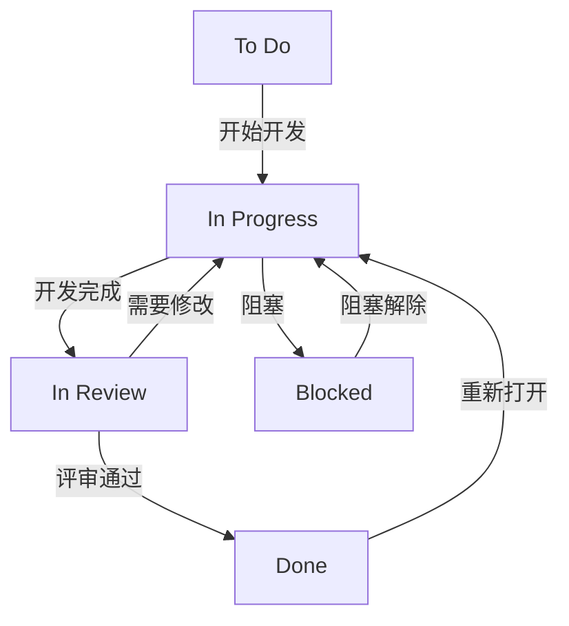

# Jira项目架构设计 - 情绪小精灵

## 项目概述

**项目名称**: 情绪小精灵（kikigo）
**项目类型**: Software项目
**项目目标**: 开发一款AI情绪伴侣设备，支持情感对话、多设备交互和社交功能
**项目特点**: 涉及硬件、固件、云端服务、移动App多端开发

---

## Jira项目类型选择

### 推荐方案：Software项目

**选择理由**:
1. ✅ 涉及代码/构建/发布（需要版本控制、CI/CD集成）
2. ✅ 需要敏捷迭代（Sprint/Backlog管理）
3. ✅ 需要复杂工作流（需求→开发→测试→发布）
4. ✅ 需要详细的Issue追踪（Epic、Story、Task、Bug）

**项目配置建议**:
- **项目模板**: Scrum Software Development（敏捷软件开发）
- **访问权限**: Team-managed project（团队管理项目，更灵活）
- **项目Key**: KIKIGO

---

## Issue类型定义

### 1. Epic（史诗）

**定义**: 大型功能模块，跨越多个Sprint，需要多个Story完成

**使用场景**:
- 小精灵人设和语言风格系统
- 语音系统
- 多精灵交互系统
- 社交功能
- 物理按键系统
- 灯光交互系统
- 电量管理系统
- 敏感词过滤系统

**字段要求**:
- Summary（必填）
- Description（必填，包含功能概述、验收标准）
- Priority（必填）
- Epic Name（必填）
- Assignee
- Labels（如"hardware"、"firmware"、"cloud"、"app"）

---

### 2. Story（用户故事）

**定义**: 从用户角度描述的功能需求，可在一个Sprint内完成

**使用场景**:
- 用户可以通过语音指令唤醒设备
- 用户可以通过语音调整音量
- 用户可以通过语音调整亮度
- 用户可以添加好友
- 多台设备靠近时可以触发互动

**字段要求**:
- Summary（必填，格式："作为[角色]，我想要[功能]，以便[价值]"）
- Description（必填，包含用户故事、验收标准、业务规则）
- Priority（必填）
- Epic Link（必填，关联到对应的Epic）
- Assignee
- Story Points（估算）
- Sprint（关联到Sprint）
- Labels
- Acceptance Criteria（验收标准）
- Test Cases（测试用例）

---

### 3. Task（任务）

**定义**: 具体的开发、测试、设计任务，可在一个Sprint内完成

**使用场景**:
- 实现快乐人格的语言风格库
- 实现语音识别功能
- 实现多精灵距离检测算法
- 设计数据库表结构
- 编写单元测试
- 编写API文档

**字段要求**:
- Summary（必填）
- Description（必填，包含任务描述、技术方案、验收标准）
- Priority（必填）
- Epic Link（可选）
- Parent Issue（可选，关联到Story）
- Assignee
- Story Points（估算）
- Sprint（关联到Sprint）
- Labels
- Technical Details（技术细节）
- Dependencies（依赖关系）

---

### 4. Bug（缺陷）

**定义**: 软件缺陷或问题，需要修复

**使用场景**:
- 语音识别失败
- 多精灵交互音效不正确
- 电量显示不准确
- App崩溃
- 灯光效果异常

**字段要求**:
- Summary（必填，格式："[模块] 问题描述"）
- Description（必填，包含复现步骤、实际结果、预期结果、环境信息）
- Priority（必填）
- Severity（严重程度：Critical、Major、Minor、Trivial）
- Epic Link（可选）
- Parent Issue（可选，关联到Story）
- Assignee
- Sprint（关联到Sprint）
- Labels
- Environment（环境信息）
- Reproduction Steps（复现步骤）
- Actual Result（实际结果）
- Expected Result（预期结果）
- Attachments（附件）

---

### 5. Sub-task（子任务）

**定义**: Story或Task的子任务，用于细化工作

**使用场景**:
- Story: "用户可以通过语音指令唤醒设备"
  - Sub-task: "实现语音唤醒词识别"
  - Sub-task: "实现唤醒音效播放"
  - Sub-task: "实现唤醒灯光效果"

**字段要求**:
- Summary（必填）
- Description（必填）
- Priority（必填）
- Parent Issue（必填，关联到Story或Task）
- Assignee
- Story Points（估算）
- Sprint（关联到Sprint）
- Labels

---

### 6. Improvement（改进）

**定义**: 对现有功能的优化或改进

**使用场景**:
- 优化语音识别准确率
- 优化多精灵交互响应时间
- 优化App启动速度
- 改进灯光效果流畅度

**字段要求**:
- Summary（必填）
- Description（必填，包含改进目标、当前问题、改进方案）
- Priority（必填）
- Epic Link（可选）
- Assignee
- Story Points（估算）
- Sprint（关联到Sprint）
- Labels
- Current Performance（当前性能）
- Target Performance（目标性能）

---

## 工作流设计

### 默认工作流：Scrum工作流

### 状态说明

| 状态 | 说明 | 适用Issue类型 |
| --- | --- | --- |
| To Do | 待办，未开始 | Epic、Story、Task、Bug、Improvement |
| In Progress | 进行中 | Story、Task、Bug、Improvement、Sub-task |
| In Review | 评审中，等待Code Review或测试 | Story、Task、Bug、Improvement、Sub-task |
| Blocked | 阻塞，等待依赖或外部资源 | Story、Task、Bug、Improvement、Sub-task |
| Done | 已完成 | Epic、Story、Task、Bug、Improvement、Sub-task |

### 转换规则

**To Do → In Progress**:
- 开发人员开始处理Issue
- 前置条件：依赖的Issue已完成

**In Progress → In Review**:
- 开发完成，提交代码
- 前置条件：代码已提交到版本控制系统

**In Review → Done**:
- Code Review通过
- 测试通过
- 前置条件：所有测试用例通过

**In Review → In Progress**:
- Code Review不通过
- 测试不通过
- 需要修改

**In Progress → Blocked**:
- 遇到阻塞问题
- 等待依赖或外部资源

**Blocked → In Progress**:
- 阻塞问题解决
- 依赖完成

**Done → In Progress**:
- 发现新的问题
- 需要重新开发

---

## 字段配置

### 系统字段

| 字段名称 | 字段类型 | 必填 | 说明 |
| --- | --- | --- | --- |
| Summary | Text | 是 | Issue标题 |
| Description | Text Area | 是 | Issue描述 |
| Priority | Single Select | 是 | 优先级 |
| Status | Status | - | 状态 |
| Assignee | User | - | 指派给 |
| Reporter | User | - | 报告人 |
| Created | Date | - | 创建时间 |
| Updated | Date | - | 更新时间 |
| Due Date | Date | - | 截止日期 |

### 自定义字段

| 字段名称 | 字段类型 | 必填 | 适用Issue类型 | 说明 |
| --- | --- | --- | --- | --- |
| Epic Name | Text | 是 | Epic | Epic名称 |
| Epic Link | Epic Link | 是 | Story、Task、Bug、Improvement | 关联Epic |
| Parent Issue | Parent Issue | - | Sub-task | 父Issue |
| Story Points | Number | - | Story、Task、Improvement、Sub-task | 故事点数 |
| Sprint | Sprint | - | Story、Task、Bug、Improvement、Sub-task | 关联Sprint |
| Labels | Labels | - | 所有Issue类型 | 标签 |
| Acceptance Criteria | Text Area | - | Story | 验收标准 |
| Test Cases | Text Area | - | Story | 测试用例 |
| Severity | Single Select | - | Bug | 严重程度 |
| Environment | Text Area | - | Bug | 环境信息 |
| Reproduction Steps | Text Area | - | Bug | 复现步骤 |
| Actual Result | Text Area | - | Bug | 实际结果 |
| Expected Result | Text Area | - | Bug | 预期结果 |
| Technical Details | Text Area | - | Task | 技术细节 |
| Dependencies | Text Area | - | Task | 依赖关系 |
| Current Performance | Text Area | - | Improvement | 当前性能 |
| Target Performance | Text Area | - | Improvement | 目标性能 |
| Component | Multi Select | - | 所有Issue类型 | 组件（硬件、固件、云端、App） |
| Fix Version | Version | - | Bug | 修复版本 |
| Affects Version | Version | - | Bug | 影响版本 |

### 优先级定义

| 优先级 | 说明 | 使用场景 |
| --- | --- | --- |
| Highest | 最高优先级，立即处理 | 阻塞性问题、严重Bug、关键功能 |
| High | 高优先级，尽快处理 | 重要功能、严重Bug |
| Medium | 中等优先级，按计划处理 | 常规功能、一般Bug |
| Low | 低优先级，有空处理 | 优化功能、轻微Bug |
| Lowest | 最低优先级，暂不处理 | 锦上添花的功能、微小Bug |

### 严重程度定义（Bug专用）

| 严重程度 | 说明 | 使用场景 |
| --- | --- | --- |
| Critical | 严重，系统崩溃或核心功能不可用 | App崩溃、设备无法启动、核心功能完全失效 |
| Major | 严重，主要功能受影响 | 语音识别失败、多精灵交互不工作、好友添加失败 |
| Minor | 轻微，次要功能受影响 | 灯光效果异常、音效播放延迟、UI显示错误 |
| Trivial | 微小，不影响功能 | 文案错误、图标显示不正确、提示信息不准确 |

---

## 版本规划

### 版本定义

基于PRD版本历史，建议创建以下Jira版本：

| 版本号 | 版本名称 | 发布日期 | 主要内容 |
| --- | --- | --- | --- |
| v1.0.0 | 初始版本 | 待定 | 基础功能：人设系统、语音系统、多精灵交互、社交功能 |
| v1.1.0 | 功能增强 | 待定 | 完善灯光交互状态定义、优化语言系统逻辑、补充物理按键定义 |
| v1.2.0 | 灯效优化 | 待定 | 补充灯效表情语音编号表 |
| v1.3.0 | 状态优化 | 待定 | 合并收音中状态、优化电量不足状态优先级 |
| v1.4.0 | 多精灵增强 | 待定 | 完善多精灵交互功能、修改底座光效 |
| v1.5.0 | 功能精简 | 待定 | 删除外星语系统、删除WiFi联网功能、第一版本删除底座光 |
| v1.6.0 | 安全增强 | 待定 | 增加敏感词过滤策略 |

### 版本管理规则

- **Fix Version**: Bug修复的目标版本
- **Affects Version**: Bug影响的版本
- **版本状态**: Unreleased（未发布）、Released（已发布）、Archived（已归档）
- **版本发布**: 所有关联的Story、Task、Bug都为Done状态后才能发布

---

## 迭代规划

### Sprint规划建议

**Sprint周期**: 2周（推荐）

**Sprint规划**:
- **Sprint 1**: 需求分析、技术方案设计
- **Sprint 2-3**: 核心功能开发（人设系统、语音系统）
- **Sprint 4-5**: 多精灵交互系统开发
- **Sprint 6-7**: 社交功能开发
- **Sprint 8**: 测试和Bug修复
- **Sprint 9**: 优化和改进
- **Sprint 10**: 发布准备

### Sprint管理规则

- **Sprint Planning**: 每个Sprint开始前进行规划会议
- **Daily Standup**: 每日站会，同步进度
- **Sprint Review**: 每个Sprint结束时进行评审会议
- **Sprint Retrospective**: 每个Sprint结束时进行回顾会议

---

## 组件管理

### 组件定义

| 组件名称 | 组件负责人 | 说明 |
| --- | --- | --- |
| Hardware | 待定 | 硬件设计、PCB设计、元器件选型 |
| Firmware | 待定 | 固件开发、嵌入式系统开发 |
| Cloud | 待定 | 云端服务开发、API开发 |
| App | 待定 | 移动App开发（iOS/Android） |
| AI/ML | 待定 | AI模型开发、语音识别、自然语言处理 |
| Testing | 待定 | 测试、QA |
| Design | 待定 | UI/UX设计、产品设计 |

### 组件使用规则

- 每个Issue必须关联到至少一个组件
- 组件负责人负责审核和分配相关Issue
- 组件负责人负责组件内Issue的进度跟踪

---

## 标签管理

### 推荐标签

| 标签 | 说明 | 使用场景 |
| --- | --- | --- |
| hardware | 硬件相关 | 硬件设计、PCB设计、元器件选型 |
| firmware | 固件相关 | 固件开发、嵌入式系统开发 |
| cloud | 云端相关 | 云端服务开发、API开发 |
| app | App相关 | 移动App开发 |
| ai | AI相关 | AI模型开发、语音识别、自然语言处理 |
| testing | 测试相关 | 测试、QA |
| design | 设计相关 | UI/UX设计、产品设计 |
| urgent | 紧急 | 需要紧急处理 |
| feature | 新功能 | 新功能开发 |
| bugfix | Bug修复 | Bug修复 |
| optimization | 优化 | 性能优化、代码优化 |
| documentation | 文档 | 文档编写 |
| research | 研究 | 技术调研、可行性研究 |

### 标签使用规则

- 标签用于快速筛选和分类Issue
- 每个Issue可以关联多个标签
- 标签命名使用小写字母和连字符

---

## 权限管理

### 角色定义

| 角色 | 权限 | 说明 |
| --- | --- | --- |
| Project Lead | 项目管理员权限 | 项目负责人，拥有所有权限 |
| Developer | 开发人员权限 | 开发人员，可以创建和修改Issue |
| Designer | 设计人员权限 | 设计人员，可以创建和修改设计相关Issue |
| Tester | 测试人员权限 | 测试人员，可以创建和修改Bug |
| Product Owner | 产品负责人权限 | 产品负责人，可以创建和修改需求相关Issue |
| Viewer | 只读权限 | 观察者，只能查看Issue |

### 权限分配规则

- Epic: 只能由Project Lead和Product Owner创建
- Story: 可以由Project Lead、Product Owner、Developer创建
- Task: 可以由Project Lead、Developer创建
- Bug: 可以由所有角色创建
- Sub-task: 可以由Project Lead、Developer创建

---

## 工具集成

### 推荐集成

1. **版本控制系统**: Git（GitHub、GitLab、Bitbucket）
2. **CI/CD**: Jenkins、GitLab CI、GitHub Actions
3. **代码审查**: GitHub PR、GitLab MR、Bitbucket PR
4. **测试管理**: TestRail、Zephyr、Xray
5. **文档管理**: Confluence、Notion
6. **沟通工具**: Slack、Microsoft Teams、钉钉
7. **监控告警**: Prometheus、Grafana、Datadog

### 集成规则

- 代码提交自动关联Jira Issue
- CI/CD构建失败自动创建Bug
- 测试结果自动更新Bug状态
- 发布通知自动更新版本状态

---

## 最佳实践建议

### Issue创建规范

1. **Summary**: 简洁明了，包含关键信息
   - Story: "作为[角色]，我想要[功能]，以便[价值]"
   - Task: "实现[功能]"
   - Bug: "[模块] 问题描述"

2. **Description**: 详细描述，包含所有必要信息
   - Story: 用户故事、验收标准、业务规则
   - Task: 任务描述、技术方案、验收标准
   - Bug: 复现步骤、实际结果、预期结果、环境信息

3. **Priority**: 合理设置优先级
   - 根据业务价值和紧急程度设置
   - 避免所有Issue都设置为Highest

4. **Assignee**: 及时指派负责人
   - 创建Issue后立即指派
   - 避免Issue无人负责

5. **Labels**: 合理使用标签
   - 用于快速筛选和分类
   - 避免过度使用标签

### 工作流管理规范

1. **及时更新状态**: 每天更新Issue状态
2. **及时关闭Issue**: 完成后及时关闭
3. **及时处理阻塞**: 遇到阻塞及时标记
4. **及时沟通**: 遇到问题及时沟通

### 版本管理规范

1. **合理规划版本**: 根据业务需求规划版本
2. **及时发布版本**: 完成后及时发布
3. **及时归档版本**: 历史版本及时归档

### Sprint管理规范

1. **合理规划Sprint**: 根据团队能力规划Sprint
2. **及时召开会议**: 按时召开Sprint相关会议
3. **及时回顾总结**: 每个Sprint结束后及时回顾总结

---

## 下一步

确认Jira项目架构设计后，将进入**阶段3: Atomize（测试任务拆分）**，将PRD拆分为具体的Jira Issue（Epic、Story、Task、Bug）。
