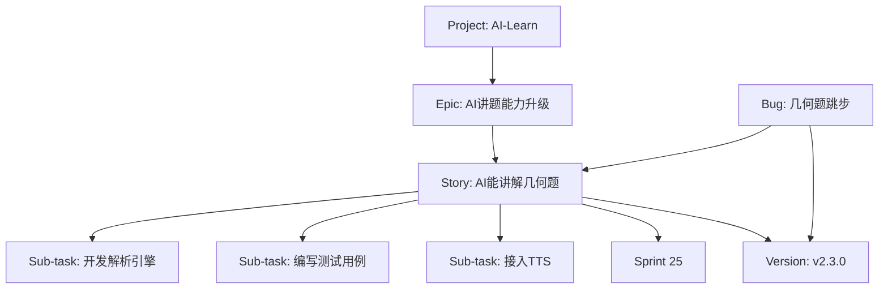

```mermaid
graph TD
A[Project: AI-Learn] --> B[Epic: AI讲题能力升级]
B --> C[Story: AI能讲解几何题]
C --> D1[Sub-task: 开发解析引擎]
C --> D2[Sub-task: 编写测试用例]
C --> D3[Sub-task: 接入TTS]
C --> E[Sprint 25]
C --> F[Version: v2.3.0]
G[Bug: 几何题跳步] --> C
G --> F
```
