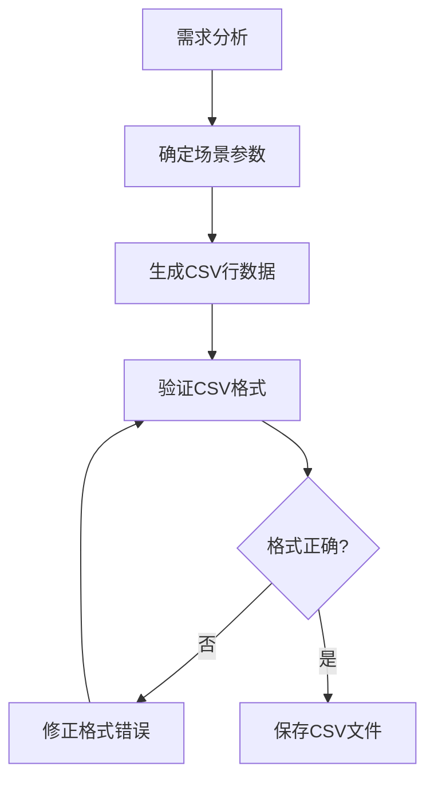
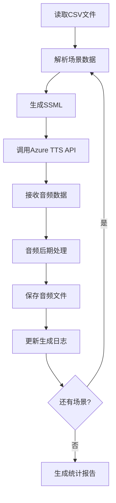

# 语音生成业务文档

## 1. 业务背景

### 1.1 VAD测试概述

VAD（Voice Activity Detection，语音活动检测）是语音识别系统中的关键技术，用于区分语音信号和非语音信号（如静音、背景噪声等）。VAD测试是确保语音识别系统在各种场景下能够准确识别语音活动的重要测试环节。

### 1.2 语音生成在VAD测试中的作用

语音生成在VAD测试中扮演着关键角色，通过生成各种场景下的语音样本，包括：
- 正常语音场景
- 带停顿的语音场景
- 不同语气风格的语音场景
- 带背景噪声的语音场景
- 边界条件下的语音场景

这些生成的语音样本用于验证VAD算法的准确性、鲁棒性和适应性。

### 1.3 技术栈概述

- **语音合成技术**：Azure TTS（Text-to-Speech）
- **语音格式**：WAV、MP3
- **SSML**：Speech Synthesis Markup Language，用于控制语音合成的细节
- **后期处理**：添加呼吸音、背景噪声等效果
- **数据管理**：CSV格式配置文件

---

## 2. 执行流程详解

### 2.1 阶段1：需求分析与场景设计

#### 2.1.1 需求分析
- 识别用户需求类型（简单语音生成、批量生成、新场景创建）
- 提取关键参数（文本内容、停顿时长、语气风格、噪声类型等）
- 确定测试目标和优先级

#### 2.1.2 场景设计
- 基于需求设计测试场景
- 确定场景的唯一标识（scenario_id）
- 设置场景的优先级（P0/P1/P2）
- 定义预期VAD检测结果

### 2.2 阶段2：CSV配置文件生成

#### 2.2.1 CSV结构设计
CSV文件包含以下关键字段：
- **基础信息**：scenario_id、scenario_name、text
- **停顿控制**：break_time_ms、pause_position
- **噪声控制**：add_post_process_breath、breath_strength
- **语音控制**：prosody_rate、prosody_pitch、prosody_volume、emphasis_words、style
- **预期结果**：expected_silence、expected_speech、expected_post_process_breath、vad_expected_result
- **技术参数**：priority、audio_format、sample_rate、channels、bit_depth

#### 2.2.2 CSV生成流程


### 2.3 阶段3：语音生成执行

#### 2.3.1 执行环境准备
- 确认Azure TTS API密钥配置
- 验证Python环境和依赖库
- 确认输出目录存在且可写
- 检查网络连接状态

#### 2.3.2 语音生成流程


#### 2.3.3 SSML生成规则
- 基础SSML结构：`<speak>`、`<voice>`标签
- 停顿控制：`<break time="1000ms"/>`
- 语气风格：`<mstts:express-as style="cheerful">`
- 语速调整：`<prosody rate="+10%">`
- 音调调整：`<prosody pitch="+10%">`
- 音量调整：`<prosody volume="loud">`
- 强调词：`<emphasis level="strong">`

#### 2.3.4 音频后期处理
- 呼吸音添加：在语音片段后添加自然呼吸音
- 背景噪声：根据需要添加特定类型的背景噪声
- 音频格式转换：确保输出符合测试要求

### 2.4 阶段4：结果验证与报告

#### 2.4.1 结果验证
- 验证生成的音频文件完整性
- 检查音频文件格式和参数
- 确认文件命名规范
- 验证预期结果与实际结果的一致性

#### 2.4.2 报告生成
- 生成统计信息：总场景数、成功数、失败数
- 记录失败场景及原因
- 提供文件路径和大小信息
- 生成执行时间统计

---

## 3. 规则调整指南

### 3.1 历史调整记录

| 日期 | 调整内容 | 调整原因 | 影响范围 |
|------|----------|----------|----------|
| 2026-01-13 | 添加快速执行指引章节 | 提升智能体执行效率 | 提示词结构 |
| 2026-01-13 | 精简示例部分 | 减少提示词长度 | 示例章节 |
| 2026-01-13 | 创建业务文档 | 分离详细内容 | 整体架构 |

### 3.2 参数约束调整

#### 3.2.1 停顿时长约束
- 原始范围：0-3000ms
- 调整后范围：0-5000ms
- 调整原因：支持更长的停顿测试场景
- 影响字段：break_time_ms

#### 3.2.2 语速调整约束
- 原始范围：-20% 到 +20%
- 调整后范围：-50% 到 +100%
- 调整原因：支持更广泛的语速测试场景
- 影响字段：prosody_rate

#### 3.2.3 音调调整约束
- 原始范围：-20% 到 +20%
- 调整后范围：-50% 到 +50%
- 调整原因：支持更广泛的音调测试场景
- 影响字段：prosody_pitch

### 3.3 新增功能记录

#### 3.3.1 呼吸音强度控制
- 新增日期：2026-01-10
- 新增字段：breath_strength
- 可选值：low/medium/high
- 应用场景：模拟不同强度的呼吸音

#### 3.3.2 强调词功能
- 新增日期：2026-01-08
- 新增字段：emphasis_words
- 格式：多个词用竖线分隔
- 应用场景：测试VAD对强调词的识别能力

---

## 4. 详细示例

### 4.1 简单语音生成示例

#### 4.1.1 需求描述
生成一个生气的语音，说出"我草，怎么这都不懂"这句话，有停顿+杂音

#### 4.1.2 详细执行过程

**步骤1：需求分析**
- 文本内容："我草，怎么这都不懂"
- 语气风格：angry（愤怒）
- 停顿需求：需要停顿
- 杂音需求：需要添加杂音

**步骤2：场景设计**
- 场景ID：SC025
- 场景名称：愤怒停顿+杂音
- 停顿时长：800ms
- 停顿位置：句中
- 后处理添加杂音：true
- 杂音强度：medium
- 预期VAD结果：active+post_process_breath

**步骤3：CSV配置生成**
```csv
scenario_id,scenario_name,text,break_time_ms,pause_position,add_post_process_breath,breath_strength,prosody_rate,prosody_pitch,prosody_volume,emphasis_words,style,expected_silence,expected_speech,expected_post_process_breath,vad_expected_result,priority,audio_format,sample_rate,channels,bit_depth
SC025,愤怒停顿+杂音,我草，怎么这都不懂,800,句中,true,medium,normal,normal,medium,,angry,false,true,true,active+post_process_breath,P0,WAV,16000,1,16
```

**步骤4：执行生成命令**
```powershell
cd e:\AI测试用例\python\vad_test; python generate_vad_samples.py --test-data vad_test_data_sc025.csv
```

**步骤5：SSML生成**
```xml
<speak version="1.0" xmlns="http://www.w3.org/2001/10/synthesis" xml:lang="zh-CN">
    <voice name="zh-CN-XiaoxiaoNeural">
        <mstts:express-as style="angry">
            我草，
            <break time="800ms"/>
            怎么这都不懂
        </mstts:express-as>
    </voice>
</speak>
```

**步骤6：音频后期处理**
- 在语音片段后添加medium强度的呼吸音
- 确保音频格式为WAV，采样率16000Hz，单声道，16位深度

**步骤7：结果验证**
- 验证文件存在：e:\AI测试用例\python\vad_samples\SC025_愤怒停顿+杂音.wav
- 验证文件格式：WAV，16kHz，单声道，16位
- 验证文件完整性：可正常播放
- 验证命名规范：符合{scenario_id}_{scenario_name}.wav格式

### 4.2 批量生成示例

#### 4.2.1 需求描述
使用现有的CSV文件批量生成多个语音样本

#### 4.2.2 详细执行过程

**步骤1：读取CSV文件**
- 文件路径：e:\AI测试用例\python\vad_test\vad_test_data_noise_comparison.csv
- 场景数量：8个

**步骤2：场景分析**
| 场景ID | 场景名称 | 文本内容 | 噪声类型 | 杂音强度 |
|--------|----------|----------|----------|----------|
| SC100 | 正常背景杂音 | 今天天气真好 | 背景噪声 | medium |
| SC101 | 快速背景杂音 | 今天天气真好 | 背景噪声 | medium |
| SC102 | 慢速背景杂音 | 今天天气真好 | 背景噪声 | medium |
| SC103 | 高音调背景杂音 | 今天天气真好 | 背景噪声 | medium |
| SC104 | 低音调背景杂音 | 今天天气真好 | 背景噪声 | medium |
| SC105 | 大音量背景杂音 | 今天天气真好 | 背景噪声 | medium |
| SC106 | 小音量背景杂音 | 今天天气真好 | 背景噪声 | medium |
| SC107 | 正常无杂音 | 今天天气真好 | 无 | 无 |

**步骤3：批量执行**
```powershell
cd e:\AI测试用例\python\vad_test; python generate_vad_samples.py --test-data vad_test_data_noise_comparison.csv
```

**步骤4：结果统计**
- 总场景数：8
- 成功数：8
- 失败数：0
- 输出目录：e:\AI测试用例\python\vad_samples\

**步骤5：文件验证**
验证所有生成的音频文件：
- SC100_正常背景杂音.wav
- SC101_快速背景杂音.wav
- SC102_慢速背景杂音.wav
- SC103_高音调背景杂音.wav
- SC104_低音调背景杂音.wav
- SC105_大音量背景杂音.wav
- SC106_小音量背景杂音.wav
- SC107_正常无杂音.wav

### 4.3 复杂场景示例

#### 4.3.1 需求描述
生成一个复杂场景的语音，包含多种语音控制元素：
- 文本："你好，欢迎使用我们的服务"
- 语气风格：客服
- 语速：稍快（+20%）
- 音调：稍高（+10%）
- 音量：中等
- 强调词："欢迎"
- 停顿：在"你好"后停顿300ms
- 后处理：添加轻柔呼吸音

#### 4.3.2 详细执行过程

**步骤1：需求分析**
- 文本内容："你好，欢迎使用我们的服务"
- 语气风格：customerService（客服）
- 语速调整：+20%
- 音调调整：+10%
- 音量调整：medium
- 强调词："欢迎"
- 停顿需求：句首停顿300ms
- 后处理需求：添加轻柔呼吸音

**步骤2：场景设计**
- 场景ID：SC031
- 场景名称：客服复杂场景
- 停顿时长：300ms
- 停顿位置：句首
- 后处理添加杂音：true
- 杂音强度：low
- 语速调整：+20%
- 音调调整：+10%
- 音量调整：medium
- 强调词：欢迎
- 语气风格：customerService
- 预期VAD结果：active+post_process_breath

**步骤3：CSV配置生成**
```csv
scenario_id,scenario_name,text,break_time_ms,pause_position,add_post_process_breath,breath_strength,prosody_rate,prosody_pitch,prosody_volume,emphasis_words,style,expected_silence,expected_speech,expected_post_process_breath,vad_expected_result,priority,audio_format,sample_rate,channels,bit_depth
SC031,客服复杂场景,你好，欢迎使用我们的服务,300,句首,true,low,+20%,+10%,medium,欢迎,customerService,false,true,true,active+post_process_breath,P0,WAV,16000,1,16
```

**步骤4：执行生成命令**
```powershell
cd e:\AI测试用例\python\vad_test; python generate_vad_samples.py --test-data vad_test_data_sc031.csv
```

**步骤5：SSML生成**
```xml
<speak version="1.0" xmlns="http://www.w3.org/2001/10/synthesis" xml:lang="zh-CN">
    <voice name="zh-CN-XiaoxiaoNeural">
        <mstts:express-as style="customerService">
            <break time="300ms"/>
            你好，
            <prosody rate="+20%" pitch="+10%" volume="medium">
                <emphasis level="strong">欢迎</emphasis>
                使用我们的服务
            </prosody>
        </mstts:express-as>
    </voice>
</speak>
```

**步骤6：音频后期处理**
- 在语音片段后添加low强度的呼吸音
- 确保音频格式为WAV，采样率16000Hz，单声道，16位深度

**步骤7：结果验证**
- 验证文件存在：e:\AI测试用例\python\vad_samples\SC031_客服复杂场景.wav
- 验证文件格式：WAV，16kHz，单声道，16位
- 验证文件完整性：可正常播放
- 验证命名规范：符合{scenario_id}_{scenario_name}.wav格式

---

## 5. 用户操作使用指南

### 5.1 环境准备

#### 5.1.1 Python环境配置
```powershell
# 创建虚拟环境
python -m venv venv

# 激活虚拟环境
.\venv\Scripts\Activate.ps1

# 安装依赖库
pip install -r requirements.txt
```

#### 5.1.2 Azure TTS配置
1. 获取Azure TTS API密钥
2. 配置环境变量：
```powershell
$env:AZURE_TTS_KEY="your_api_key"
$env:AZURE_TTS_REGION="your_region"
```
3. 或在配置文件中设置：
```python
# azure_config.py
AZURE_TTS_KEY = "your_api_key"
AZURE_TTS_REGION = "your_region"
```

### 5.2 基本操作

#### 5.2.1 简单语音生成
1. 描述需求："帮我生成一个开心的语音，说出'太棒了！我们成功了！'"
2. 智能体将自动生成CSV配置文件
3. 执行生成命令
4. 获取生成的语音文件

#### 5.2.2 批量语音生成
1. 准备CSV文件，参考[数据契约文档](file:///e:\AI测试用例\python\vad_test\语音生成数据契约文档.md)
2. 指定CSV文件路径："使用e:\AI测试用例\python\vad_test\vad_test_data.csv生成语音"
3. 智能体将执行批量生成
4. 获取生成结果和统计信息

#### 5.2.3 自定义场景创建
1. 描述详细需求，包括：
   - 文本内容
   - 语气风格
   - 停顿设置
   - 噪声设置
   - 其他特殊要求
2. 智能体将生成对应的CSV配置
3. 执行生成命令
4. 获取生成的语音文件

### 5.3 高级操作

#### 5.3.1 多场景对比测试
1. 创建包含多个相似场景的CSV文件
2. 设置不同的参数值进行对比
3. 执行批量生成
4. 分析不同参数对语音效果的影响

#### 5.3.2 边界条件测试
1. 设计极端参数值的测试场景
2. 测试参数边界值（如最大停顿时长、最快语速等）
3. 验证系统在边界条件下的稳定性

#### 5.3.3 性能测试
1. 创建大量测试场景
2. 执行批量生成
3. 监控生成时间和资源使用情况
4. 优化生成性能

### 5.4 故障排除

#### 5.4.1 常见错误及解决方案

| 错误类型 | 错误描述 | 解决方案 |
|----------|----------|----------|
| API密钥错误 | Azure TTS API密钥无效或过期 | 检查API密钥配置，更新密钥 |
| 网络连接错误 | 无法连接到Azure TTS服务 | 检查网络连接，确认防火墙设置 |
| CSV格式错误 | CSV文件格式不正确 | 检查CSV文件格式，参考数据契约文档 |
| 参数范围错误 | 参数值超出允许范围 | 检查参数值，确保在允许范围内 |
| 文件路径错误 | 输出路径不存在或无权限 | 确认输出路径存在且有写权限 |

#### 5.4.2 日志分析
- 查看生成日志，了解详细执行过程
- 分析错误信息，定位问题原因
- 根据日志信息调整配置或参数

---

## 6. FAQ

### 6.1 语音生成相关

#### Q1: 生成的语音文件质量如何？
A1: 生成的语音质量取决于多种因素：
- Azure TTS服务本身的质量
- 选择的语音模型（建议使用Neural语音）
- SSML参数的合理设置
- 音频格式和采样率设置

#### Q2: 可以自定义语音模型吗？
A2: 目前支持使用Azure TTS提供的预置语音模型，包括：
- zh-CN-XiaoxiaoNeural（女声）
- zh-CN-YunxiNeural（男声）
- zh-CN-YunyangNeural（男声）
- 其他Azure TTS支持的中文语音模型

#### Q3: 生成的语音文件可以用于商业用途吗？
A3: 需要遵守Azure TTS的使用条款，通常情况下：
- 生成的语音文件可以用于测试和开发
- 商业用途可能需要额外的授权或许可
- 建议查看Azure TTS的最新使用条款

### 6.2 参数设置相关

#### Q4: 停顿时长的单位是什么？
A4: 停顿时长的单位是毫秒（ms），取值范围为0-5000ms。

#### Q5: 语速调整的百分比是如何计算的？
A5: 语速调整的百分比是相对于正常语速的变化：
- 正值表示加快语速（如+20%表示比正常语速快20%）
- 负值表示减慢语速（如-20%表示比正常语速慢20%）
- 0表示正常语速

#### Q6: 音调调整的范围是多少？
A6: 音调调整的范围是-50%到+50%：
- 正值表示提高音调
- 负值表示降低音调
- 0表示正常音调

### 6.3 技术实现相关

#### Q7: SSML是什么？
A7: SSML（Speech Synthesis Markup Language）是一种基于XML的标记语言，用于控制语音合成的细节，包括：
- 语速、音调、音量调整
- 停顿和重音
- 语音风格和情感
- 多语言和发音控制

#### Q8: 如何添加自定义的背景噪声？
A8: 目前系统支持添加预设的呼吸音效果，如需添加自定义背景噪声：
1. 准备音频文件（WAV格式）
2. 修改后期处理代码
3. 在generate_vad_samples.py中添加自定义噪声处理逻辑

#### Q9: 生成的语音文件可以转换为其他格式吗？
A9: 可以使用音频转换工具将生成的WAV文件转换为其他格式：
- 推荐使用FFmpeg进行格式转换
- 也可以使用Python的pydub库进行格式转换
- 转换时注意保持音频质量和采样率

### 6.4 性能优化相关

#### Q10: 批量生成大量语音文件时如何提高效率？
A10: 提高批量生成效率的方法：
- 使用多线程或异步处理
- 优化SSML生成逻辑
- 减少不必要的音频处理步骤
- 使用更高效的音频编码格式

#### Q11: 如何减少API调用次数？
A11: 减少API调用次数的方法：
- 合并相似的语音生成请求
- 使用缓存机制避免重复生成
- 批量处理多个场景
- 优化场景设计，减少冗余场景

### 6.5 扩展功能相关

#### Q12: 如何支持其他语言的语音生成？
A12: 支持其他语言的步骤：
1. 在Azure TTS中配置目标语言
2. 修改SSML生成逻辑，支持目标语言的语音特性
3. 更新CSV字段定义，添加语言相关参数
4. 测试目标语言的语音生成效果

#### Q13: 如何集成到CI/CD流程中？
A13: 集成到CI/CD流程的方法：
1. 创建自动化脚本
2. 配置生成任务
3. 设置结果验证和报告
4. 配置通知机制

---

## 7. 附录

### 7.1 CSV字段完整定义

| 字段名 | 类型 | 必填 | 默认值 | 取值范围 | 说明 |
|--------|------|------|--------|----------|------|
| scenario_id | string | 是 | - | - | 场景ID，唯一标识 |
| scenario_name | string | 是 | - | - | 场景名称 |
| text | string | 是 | - | - | 要合成的文本内容 |
| break_time_ms | integer | 否 | 0 | 0-5000 | 停顿时长（毫秒） |
| pause_position | string | 否 | - | 句首/句中/句尾 | 停顿位置 |
| add_post_process_breath | boolean | 否 | false | true/false | 是否添加后处理呼吸音 |
| breath_strength | string | 否 | - | low/medium/high | 呼吸音强度 |
| prosody_rate | string | 否 | normal | slow/normal/fast/-50%~+100% | 语速调整 |
| prosody_pitch | string | 否 | normal | x-low/low/medium/high/x-high/-50%~+50% | 音调调整 |
| prosody_volume | string | 否 | medium | silent/x-soft/soft/medium/loud/x-loud | 音量调整 |
| emphasis_words | string | 否 | - | - | 强调词，多个词用竖线分隔 |
| style | string | 否 | normal | normal/cheerful/serious/sad/excited/angry/gentle/customerService | 语气风格 |
| expected_silence | boolean | 是 | - | true/false | 预期是否包含静音 |
| expected_speech | boolean | 是 | - | true/false | 预期是否包含语音 |
| expected_post_process_breath | boolean | 是 | - | true/false | 预期是否包含后处理呼吸音 |
| vad_expected_result | string | 是 | - | - | VAD预期结果 |
| priority | string | 是 | - | P0/P1/P2 | 优先级 |
| audio_format | string | 是 | WAV | WAV/MP3 | 音频格式 |
| sample_rate | integer | 是 | 16000 | 16000/24000/48000 | 采样率 |
| channels | integer | 是 | 1 | 1/2 | 声道数 |
| bit_depth | integer | 是 | 16 | 16/24/32 | 位深 |

### 7.2 SSML标签参考

#### 7.2.1 基础标签
- `<speak>`：根标签，包含整个SSML文档
- `<voice>`：指定语音模型
- `<p>`：段落标签
- `<s>`：句子标签

#### 7.2.2 控制标签
- `<break>`：停顿标签，time属性指定停顿时长
- `<prosody>`：语调控制标签，包含rate、pitch、volume属性
- `<emphasis>`：强调标签，level属性指定强调程度
- `<mstts:express-as>`：情感表达标签，style属性指定情感风格

#### 7.2.3 属性参考
- rate：语速，取值范围-50%到+100%
- pitch：音调，取值范围-50%到+50%
- volume：音量，取值范围silent到x-loud
- time：停顿时长，单位毫秒
- level：强调程度，取值strong、moderate、none、reduced
- style：情感风格，取值normal、cheerful、serious等

### 7.3 Azure TTS语音模型参考

#### 7.3.1 中文语音模型
- zh-CN-XiaoxiaoNeural：女声，自然流畅
- zh-CN-YunxiNeural：男声，沉稳有力
- zh-CN-YunyangNeural：男声，亲切自然
- zh-CN-XiaoyiNeural：女声，温柔甜美
- zh-CN-YunjianNeural：男声，专业稳重

#### 7.3.2 语音风格
- normal：正常
- cheerful：开心
- serious：严肃
- sad：悲伤
- excited：兴奋
- angry：愤怒
- gentle：温柔
- customerService：客服
- news_cast：新闻播报
- narration：叙述
- affectionate：亲切

### 7.4 错误代码参考

| 错误代码 | 错误描述 | 解决方案 |
|----------|----------|----------|
| E001 | API密钥无效 | 检查API密钥配置 |
| E002 | 网络连接失败 | 检查网络连接 |
| E003 | CSV格式错误 | 检查CSV文件格式 |
| E004 | 参数超出范围 | 检查参数值 |
| E005 | 文件路径无效 | 检查文件路径 |
| E006 | 语音合成失败 | 检查SSML格式 |
| E007 | 音频处理失败 | 检查音频参数 |
| E008 | 文件保存失败 | 检查磁盘空间和权限 |