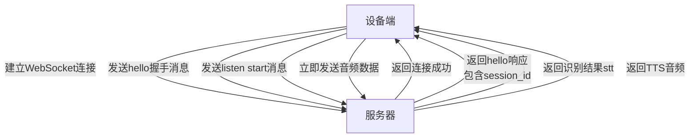
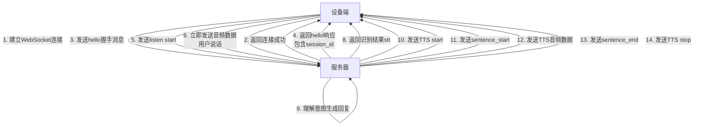
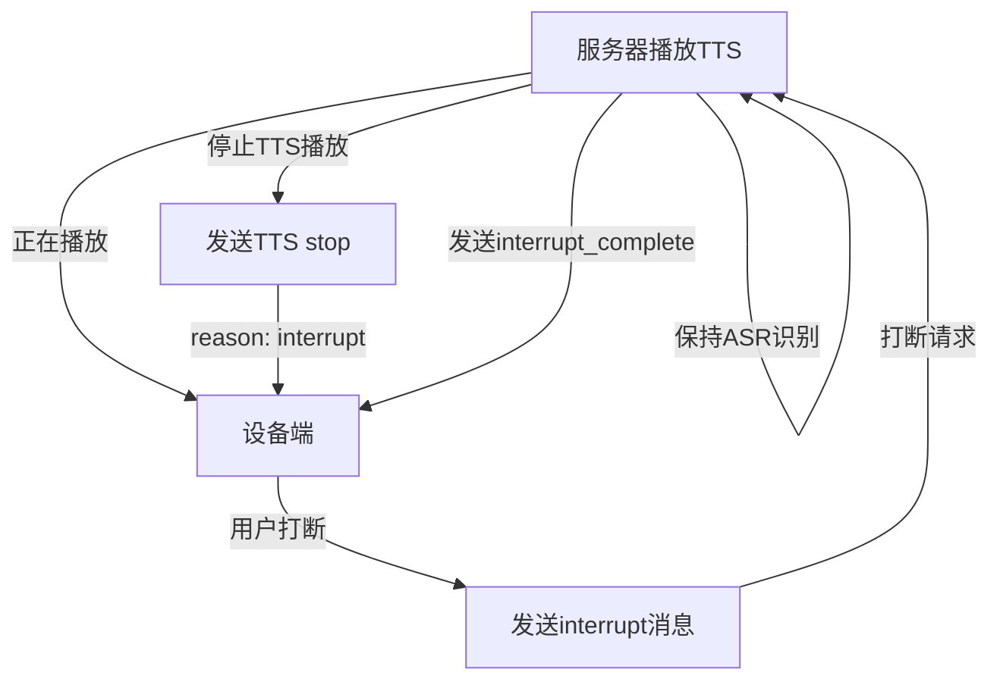

# 湃启 WebSocket 通信协议文档 v1.0

---

## 目录

1. [连接流程](#1-连接流程)
2. [连接地址](#2-连接地址)
3. [消息格式](#3-消息格式)
4. [设备端消息](#4-设备端-服务器消息)
5. [服务器消息](#5-服务器-设备端消息)
6. [二进制音频协议](#6-二进制音频协议)
7. [完整对话流程](#7-完整对话流程)
8. [错误处理](#8-错误处理)
9. [附录](#9-附录)

---

## 1. 连接流程

### 1.1 WebSocket 连接流程图



### 1.2 连接步骤说明

**步骤1：建立 WebSocket 连接**

设备端连接服务器，URL 格式如下：

```
ws://<host>:<port>/?device_id=<device_id>&user_id=<user_id>
```

**示例：**

```
ws://118.196.28.154:8460/?device_id=设备唯一标识&user_id=用户唯一标识
```

**URL 参数说明：**

| 参数 | 说明 | 必填 |
|------|------|------|
| device_id | 设备唯一标识 | 是 |
| user_id | 用户唯一标识 | 是 |

> **提示**：在 URL 中提前传递 device_id 和 user_id 可以让服务器在 WebSocket 握手阶段就开始预热设备专属配置，显著降低首次对话的响应延迟。

**步骤2：发送握手消息（hello）**

连接成功后，设备端必须立即发送第一条握手消息：

```json
{
  "type": "hello",
  "version": 1,
  "features": {
    "mcp": true
  },
  "transport": "websocket",
  "audio_params": {
    "format": "opus",
    "sample_rate": 16000,
    "channels": 1,
    "frame_duration": 60
  },
  "device_id": "设备唯一标识",
  "device_name": "设备名称",
  "user_id": "用户唯一标识",
  "trace_id": "日志追踪ID",
  "device_mac": "设备MAC地址",
  "client_id": "客户端ID",
  "client_ip": "客户端IP地址",
  "client_info": {
    "os_type": "Android",
    "os_version": "14",
    "app_version": "1.2.3",
    "network_type": "wifi",
    "network_provider": "CMCC",
    "timezone": "Asia/Shanghai",
    "country_code": "CN",
    "battery_level": 76,
    "is_charging": true
  }
}
```

**client_info 字段说明：**

| 字段 | 说明 | 示例 |
|------|------|------|
| os_type | 操作系统类型 | Android/iOS |
| os_version | 操作系统版本 | 14 |
| app_version | 应用版本 | 1.2.3 |
| network_type | 网络类型 | wifi/4g/5g |
| network_provider | 网络运营商 | CMCC/CTCC |
| timezone | 时区 | Asia/Shanghai |
| country_code | 国家代码 | CN |
| battery_level | 电池电量百分比 | 76 |
| is_charging | 是否充电中 | true/false |

**步骤3：接收握手响应**

服务器返回 hello 响应：

```json
{
  "type": "hello",
  "version": 1,
  "transport": "websocket",
  "session_id": "会话标识",
  "user_id": "用户标识",
  "trace_id": "追踪标识",
  "audio_params": {
    "format": "opus",
    "sample_rate": 24000,
    "channels": 1,
    "frame_duration": 60
  }
}
```

> **注意**：服务器下行的音频采样率可能为 24000Hz，以获得更好的音质。设备端需注意处理采样率差异。

**步骤4：开始监听**

握手完成后，发送开始监听消息：

```json
{
  "session_id": "xxx",
  "type": "listen",
  "state": "start",
  "mode": "auto"
}
```

**步骤5：发送音频数据**

发送 listen start 消息后，**无需等待响应，立即开始发送二进制音频数据**。

音频参数：
- 格式：Opus 编码
- 采样率：16000Hz
- 声道：单声道
- 帧时长：60ms

---

## 2. 连接地址

### 2.1 WebSocket URL 格式

设备端连接服务器时，需要使用以下 URL 格式：

```
ws://<host>:<port>/?device_id=<device_id>&user_id=<user_id>
```

**示例：**

```
ws://118.196.28.154:8460/?device_id=设备唯一标识&user_id=用户唯一标识
```

### 2.2 URL 参数说明

| 参数 | 说明 | 必填 |
|------|------|------|
| device_id | 设备唯一标识 | 是 |
| user_id | 用户唯一标识 | 是 |

> **提示**：在 URL 中提前传递 device_id 和 user_id 可以让服务器在 WebSocket 握手阶段就开始预热设备专属配置，显著降低首次对话的响应延迟。

---

## 3. 消息格式

WebSocket 传输两种类型的数据：
- JSON 消息
- 二进制音频数据

### 3.1 JSON 消息通用结构

所有 JSON 消息都包含以下基础字段：

```json
{
  "type": "消息类型",
  "session_id": "会话标识",
  "user_id": "用户标识",
  "trace_id": "追踪标识"
}
```

---

## 4. 设备端 → 服务器消息

### 4.1 hello - 握手消息

连接成功后设备端发送的第一条消息，用于交换参数和建立会话。

```json
{
  "type": "hello",
  "version": 1,
  "features": {
    "mcp": true
  },
  "transport": "websocket",
  "audio_params": {
    "format": "opus",
    "sample_rate": 16000,
    "channels": 1,
    "frame_duration": 60
  },
  "device_id": "设备唯一标识",
  "device_name": "设备名称",
  "user_id": "用户唯一标识",
  "trace_id": "日志追踪ID",
  "device_mac": "设备MAC地址",
  "client_id": "客户端ID",
  "client_ip": "客户端IP地址",
  "client_info": {
    "os_type": "Android",
    "os_version": "14",
    "app_version": "1.2.3",
    "network_type": "wifi",
    "network_provider": "CMCC",
    "timezone": "Asia/Shanghai",
    "country_code": "CN",
    "battery_level": 76,
    "is_charging": true
  }
}
```

### 4.2 listen - 语音监听控制

控制语音识别的开始、停止和检测状态。

#### 开始监听

```json
{
  "session_id": "xxx",
  "type": "listen",
  "state": "start",
  "mode": "auto"
}
```

#### 停止监听

```json
{
  "session_id": "xxx",
  "type": "listen",
  "state": "stop"
}
```

#### 检测到语音/文本

```json
{
  "session_id": "xxx",
  "type": "listen",
  "state": "detect",
  "text": "用户说的话或唤醒词"
}
```

### 4.3 interrupt - 打断当前播放

> **重要**：这是客户端主动打断服务器 TTS 播放的推荐方式。服务器会停止当前 TTS 播放，但保持 ASR 继续识别。

```json
{
  "session_id": "xxx",
  "type": "interrupt"
}
```

服务器处理后会返回 `interrupt_complete` 消息确认打断完成。

---

## 5. 服务器 → 设备端消息

### 5.1 hello - 握手响应

服务器对设备端 hello 消息的响应。

```json
{
  "type": "hello",
  "version": 1,
  "transport": "websocket",
  "session_id": "会话标识",
  "user_id": "用户标识",
  "trace_id": "追踪标识",
  "audio_params": {
    "format": "opus",
    "sample_rate": 24000,
    "channels": 1,
    "frame_duration": 60
  }
}
```

> **注意**：服务器下行的音频采样率可能为 24000Hz，以获得更好的音质。设备端需注意处理采样率差异。

### 5.2 stt - 语音识别结果

服务器返回的语音识别结果（ASR）。

```json
{
  "session_id": "xxx",
  "type": "stt",
  "text": "识别到的文本",
  "user_id": "xxx",
  "trace_id": "xxx",
  "emotion_fusion_analysis": "情绪分析结果",
  "emotion_code": 1,
  "label": "情绪标签"
}
```

### 5.3 tts - TTS 状态消息

控制 TTS 音频播放的生命周期。

#### 开始播放

```json
{
  "session_id": "xxx",
  "type": "tts",
  "state": "start",
  "reason": "init",
  "tts_type": "text",
  "audio_codec": "opus"
}
```

#### 句子开始

```json
{
  "session_id": "xxx",
  "type": "tts",
  "state": "sentence_start",
  "text": "要播放的文本内容",
  "index": 1,
  "tts_type": "text",
  "emotion_tag": "情绪标签"
}
```

#### 句子结束

```json
{
  "session_id": "xxx",
  "type": "tts",
  "state": "sentence_end",
  "text": "播放完成的文本",
  "index": 1,
  "tts_type": "text"
}
```

#### 停止播放

```json
{
  "session_id": "xxx",
  "type": "tts",
  "state": "stop",
  "index": 1,
  "reason": "complete",
  "tts_type": "text"
}
```

**state 状态值：**

| 值 | 说明 |
|----|------|
| start | 开始播放 |
| sentence_start | 句子开始 |
| sentence_end | 句子结束 |
| stop | 停止播放 |

**reason 原因值：**

| 值 | 说明 |
|----|------|
| init | 初始化 |
| complete | 正常完成 |
| interrupt | 被打断 |

**tts_type 类型值：**

| 值 | 说明 |
|----|------|
| text | 文本转语音 |

### 5.4 interrupt_complete - 打断完成

服务器确认打断处理完成。

```json
{
  "session_id": "xxx",
  "type": "interrupt_complete",
  "user_id": "xxx",
  "trace_id": "xxx",
  "reason": "client_interrupt_processed"
}
```

### 5.5 goodbye - 告别消息

服务器发送的连接关闭消息。

```json
{
  "session_id": "xxx",
  "type": "goodbye",
  "version": 1,
  "transport": "websocket",
  "talk_rounds": 5,
  "reason": "connection_closed"
}
```

### 5.6 emoji - 表情消息

发送表情/动作指令，用于控制设备表情显示。

```json
{
  "session_id": "xxx",
  "type": "emoji",
  "version": 1,
  "transport": "websocket",
  "talk_rounds": 1,
  "emoji_map": "3"
}
```

### 5.7 error - 错误消息

服务器返回的错误信息。

```json
{
  "session_id": "xxx",
  "type": "error",
  "message": "错误描述"
}
```

### 5.8 mcp - MCP 工具调用

服务器下发的 MCP 工具调用请求。

```json
{
  "type": "mcp",
  "session_id": "<会话ID>",
  "payload": {
    "jsonrpc": "2.0",
    "method": "<方法名>",
    "params": {
      "<参数名>": "<参数值>"
    }
  }
}
```

#### 服务器下发 MCP 控制消息示例

**exit - 退出对话**

服务器指示设备端结束当前对话会话。

```json
{
  "type": "mcp",
  "session_id": "2cc0a361-af5a-42d2-9d78-f83e7aa32ea9",
  "payload": {
    "jsonrpc": "2.0",
    "method": "exit",
    "params": {
      "say_goodbye": "回帕奇星系啦〜"
    }
  }
}
```

**play_music - 播放音乐**

服务器指示设备端播放本地音乐。

```json
{
  "type": "mcp",
  "session_id": "2cc0a361-af5a-42d2-9d78-f83e7aa32ea9",
  "payload": {
    "jsonrpc": "2.0",
    "method": "play_music",
    "params": {
      "song_name": "两只老虎"
    }
  }
}
```

**play_white_noise - 播放白噪声**

服务器指示设备端播放助眠/放松类白噪声。

```json
{
  "type": "mcp",
  "session_id": "2cc0a361-af5a-42d2-9d78-f83e7aa32ea9",
  "payload": {
    "jsonrpc": "2.0",
    "method": "play_white_noise",
    "params": {
      "noise_name": "雨声"
    }
  }
}
```

**set_volume - 设置绝对音量**

服务器指示设备端将音量设置为指定的绝对值。

```json
{
  "type": "mcp",
  "session_id": "2cc0a361-af5a-42d2-9d78-f83e7aa32ea9",
  "payload": {
    "jsonrpc": "2.0",
    "method": "set_volume",
    "params": {
      "volume": 50
    }
  }
}
```

> **提示**：当用户明确指定具体音量数值时（如"音量调到80%"、"静音"），使用 set_volume。

**adjust_volume - 相对调节音量**

服务器指示设备端相对当前音量进行增减调节。

```json
{
  "type": "mcp",
  "session_id": "2cc0a361-af5a-42d2-9d78-f83e7aa32ea9",
  "payload": {
    "jsonrpc": "2.0",
    "method": "adjust_volume",
    "params": {
      "adjustment": 20
    }
  }
}
```

> **提示**：当用户表达音量不合适但没有指定具体值时（如"声音大一点"、"太吵了"），使用 adjust_volume。

**set_brightness - 设置绝对亮度**

服务器指示设备端将屏幕亮度设置为指定的绝对值。

```json
{
  "type": "mcp",
  "session_id": "2cc0a361-af5a-42d2-9d78-f83e7aa32ea9",
  "payload": {
    "jsonrpc": "2.0",
    "method": "set_brightness",
    "params": {
      "brightness": 50
    }
  }
}
```

> **提示**：当用户明确指定具体亮度级别时（如"亮度调到50%"、"调到最亮"），使用 set_brightness。

**adjust_brightness - 相对调节亮度**

服务器指示设备端相对当前亮度进行增减调节。

```json
{
  "type": "mcp",
  "session_id": "2cc0a361-af5a-42d2-9d78-f83e7aa32ea9",
  "payload": {
    "jsonrpc": "2.0",
    "method": "adjust_brightness",
    "params": {
      "adjustment": 20
    }
  }
}
```

> **提示**：当用户表达亮度不合适但没有指定具体值时（如"太暗了"、"太刺眼"），使用 adjust_brightness。

---

## 6. 二进制音频协议

### 6.1 音频格式

| 方向 | 音频内容 | 采样率 | 编码 | 用途 |
|------|---------|--------|------|------|
| 设备端 → 服务器 | 用户说话的语音 | 16000Hz | Opus | 语音识别（ASR） |
| 服务器 → 设备端 | TTS合成的语音 | 24000Hz | Opus | 语音播放（TTS） |

### 6.2 协议版本

通过 version 字段配置二进制协议版本：

#### 版本 1（默认）

直接发送 Opus 音频数据，无额外元数据。

#### 版本 2

带时间戳的二进制协议，适用于服务器端 AEC（回声消除）：

```c
struct BinaryProtocol2 {
  uint16_t version;        // 协议版本
  uint16_t type;           // 消息类型 (0: OPUS, 1: JSON)
  uint32_t reserved;       // 保留字段
  uint32_t timestamp;      // 时间戳（毫秒）
  uint32_t payload_size;   // 负载大小（字节）
  uint8_t payload[];       // 负载数据
} __attribute__((packed));
```

#### 版本 3

简化的二进制协议：

```c
struct BinaryProtocol3 {
  uint8_t type;            // 消息类型
  uint8_t reserved;        // 保留字段
  uint16_t payload_size;   // 负载大小
  uint8_t payload[];       // 负载数据
} __attribute__((packed));
```

---

## 7. 完整对话流程

### 7.1 完整对话流程图



### 7.2 完整对话示例

```json
// 1. 设备端→服务器：握手
{
  "type": "hello",
  "version": 1,
  "transport": "websocket",
  "audio_params": {
    "format": "opus",
    "sample_rate": 16000,
    "channels": 1,
    "frame_duration": 60
  },
  "device_id": "device_001",
  "user_id": "user_001"
}

// 2. 服务器→设备端：握手响应
{
  "type": "hello",
  "transport": "websocket",
  "session_id": "sess_abc123",
  "audio_params": {
    "format": "opus",
    "sample_rate": 24000
  }
}

// 3. 设备端→服务器：开始监听
{
  "session_id": "sess_abc123",
  "type": "listen",
  "state": "start",
  "mode": "auto"
}

// 4. 设备端→服务器：发送二进制音频数据...

// 5. 服务器→设备端：语音识别结果
{
  "session_id": "sess_abc123",
  "type": "stt",
  "text": "今天天气怎么样"
}

// 6. 服务器→设备端：TTS 开始
{
  "session_id": "sess_abc123",
  "type": "tts",
  "state": "start"
}

// 7. 服务器→设备端：句子开始
{
  "session_id": "sess_abc123",
  "type": "tts",
  "state": "sentence_start",
  "text": "今天北京晴，气温15到25度",
  "index": 1
}

// 8. 服务器→设备端：发送二进制音频数据...

// 9. 服务器→设备端：句子结束
{
  "session_id": "sess_abc123",
  "type": "tts",
  "state": "sentence_end",
  "text": "今天北京晴，气温15到25度",
  "index": 1
}

// 10. 服务器→设备端：TTS 结束
{
  "session_id": "sess_abc123",
  "type": "tts",
  "state": "stop",
  "reason": "complete"
}
```

### 7.3 打断流程图



### 7.4 打断流程示例

```json
// 1. 设备端→服务器：打断请求
{
  "session_id": "sess_abc123",
  "type": "interrupt"
}

// 2. 服务器→设备端：TTS 停止
{
  "session_id": "sess_abc123",
  "type": "tts",
  "state": "stop",
  "reason": "interrupt"
}

// 3. 服务器→设备端：打断完成
{
  "session_id": "sess_abc123",
  "type": "interrupt_complete",
  "reason": "client_interrupt_processed"
}
```

---

## 8. 错误处理

### 8.1 连接错误

| 错误类型 | 说明 | 处理方式 |
|---------|------|---------|
| 握手超时 | 设备端在 10 秒内未收到服务器 hello 响应 | 断开重连 |
| 服务器断开 | 服务器主动断开连接 | 触发 OnDisconnected 回调，设备回到空闲状态 |

### 8.2 消息错误

| 错误类型 | 说明 | 处理方式 |
|---------|------|---------|
| 格式错误 | 服务器返回 type: "error" 消息 | 根据错误信息进行处理 |
| 缺少必要字段 | 消息缺少必要字段 | 服务器记录错误日志，不执行业务逻辑 |

---

## 9. 附录

### 9.1 消息类型速查表

#### 设备端 → 服务器

| 消息类型 | 说明 |
|---------|------|
| hello | 握手消息 |
| listen | 语音监听控制 |
| interrupt | 打断当前播放 |

#### 服务器 → 设备端

| 消息类型 | 说明 |
|---------|------|
| hello | 握手响应 |
| stt | 语音识别结果 |
| tts | TTS 状态消息 |
| interrupt_complete | 打断完成 |
| goodbye | 告别消息 |
| emoji | 表情消息 |
| error | 错误消息 |
| mcp | MCP 工具调用 |

### 9.2 表情编码速查表

| 编码 | 表情 |
|------|------|
| 1 | 开心 |
| 2 | 悲伤 |
| 3 | 思考 |
| 4 | 惊讶 |
| 5 | 愤怒 |

---

**文档版本**：v1.0
**最后更新**：2026-01-06
