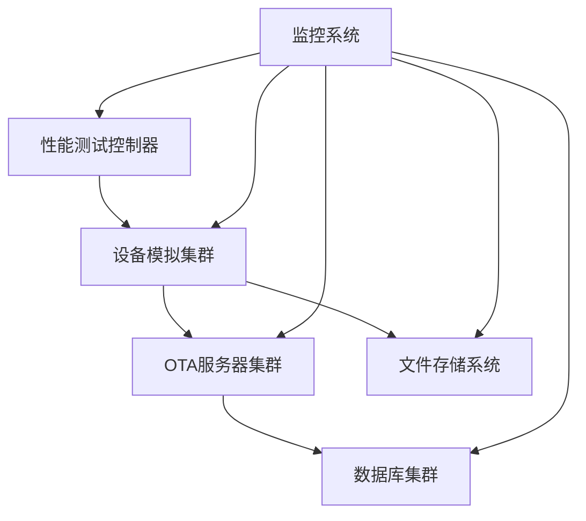

# A2 阶段：测试架构设计（Scenario-Level Design）

**文档版本**：2.0.0  
**最后更新**：2026-01-15  
**设计类型**：Scenario-Level Design（业务场景设计）

---

## 1. 业务场景分析

### 1.1 OTA升级业务场景
基于[OTA测试业务规则约定.md](./OTA测试业务规则约定.md)，分析出以下核心业务场景：

#### 场景1：完整OTA升级流程
- **业务目标**：验证设备从登录到升级完成的完整流程
- **场景路径**：登录 → 文件上传 → 创建升级包 → 测试升级
- **关键业务指标**：
  - 流程成功率 ≥ 99%
  - 单设备升级时间 ≤ 5分钟
  - 并发升级设备数 ≥ 1000台

#### 场景2：高并发设备升级
- **业务目标**：验证系统在高并发下的稳定性
- **场景特点**：
  - 多设备同时升级
  - 网络带宽竞争
  - 服务器资源竞争

#### 场景3：异常场景处理
- **业务目标**：验证系统在异常情况下的容错能力
- **异常类型**：
  - 网络中断
  - 文件损坏
  - 版本冲突

---

## 2. 性能测试架构设计

### 2.1 测试架构概览



### 2.2 测试组件设计

#### 2.2.1 设备模拟器
- **组件类型**：JMeter Thread Group
- **业务角色**：模拟真实设备行为
- **并发策略**：
  - 阶梯式增长：100 → 500 → 1000 用户
  - 持续时间：每个阶梯30分钟
  - 思考时间：随机5-10秒

#### 2.2.2 数据生成器
- **组件类型**：JSR223 PreProcessor
- **业务功能**：动态生成设备参数
- **生成规则**：
  - 设备SN：随机12位字母数字组合
  - 版本号：基于时间戳的唯一版本
  - 设备类型：随机选择（kikigo/smart_device/iot_device）

#### 2.2.3 链路控制器
- **组件类型**：Transaction Controller
- **业务功能**：控制接口调用顺序
- **控制逻辑**：
  - 登录成功 → 文件上传 → 创建包 → 测试升级
  - 任一环节失败 → 记录错误 → 继续下一设备

---

## 3. 数据策略设计

### 3.1 数据来源决策
基于[数据来源决策模型.md](../.trae/rules/agents/jmeter/数据来源决策模型.md)，制定数据策略：

```yaml
data_strategy:
  use_csv: false
  csv_reason: "性能测试场景下，设备参数可动态生成，无需CSV维护"
  csv_scope: control
  concurrency_safe: true
  fallback_strategy: dynamic
```

### 3.2 动态参数设计

#### 3.2.1 设备参数动态生成
```groovy
// 性能测试专用参数生成器
import java.util.Random

def timestamp = System.currentTimeMillis()

// 生成唯一设备SN
def chars = "ABCDEFGHIJKLMNOPQRSTUVWXYZ0123456789"
def random = new Random()
def sn = ""
for (int i = 0; i < 12; i++) {
    sn += chars.charAt(random.nextInt(chars.length()))
}

// 生成唯一版本号
def version = "2.3." + String.format("%06d", (timestamp % 1000000))

// 随机设备类型
def deviceTypes = ['kikigo', 'smart_device', 'iot_device']
def deviceType = deviceTypes[random.nextInt(deviceTypes.size())]

// 设置变量
vars.put("sn", sn)
vars.put("version", version)
vars.put("device_type", deviceType)
```

#### 3.2.2 控制参数设计
- **登录账号**：固定测试账号（避免账号锁定）
- **文件路径**：固定测试文件（确保文件存在）
- **验证码**：固定测试验证码（避免验证码校验）

---

## 4. 测试环境设计

### 4.1 环境配置策略

#### 4.1.1 多环境支持
```properties
# 开发环境
dev.base_url=http://dev-ota.example.com
dev.username=perf_test
dev.password=perf_test123

# 测试环境
test.base_url=http://test-ota.example.com
test.username=perf_test
test.password=perf_test123

# 生产环境
prod.base_url=http://ota.example.com
prod.username=perf_test
prod.password=perf_test123
```

#### 4.1.2 环境切换机制
- **命令行参数**：`-Jenv=dev|test|prod`
- **默认环境**：test（保护生产环境）
- **环境验证**：执行前验证环境可达性

### 4.2 监控指标设计

#### 4.2.1 性能指标
- **响应时间**：TP50 ≤ 200ms, TP95 ≤ 500ms, TP99 ≤ 1000ms
- **吞吐量**：≥ 1000 TPS
- **错误率**：≤ 0.1%

#### 4.2.2 业务指标
- **升级成功率**：≥ 99.5%
- **并发设备数**：≥ 1000台
- **资源利用率**：CPU ≤ 80%, 内存 ≤ 85%

---

## 5. 场景执行策略

### 5.1 负载模式设计

#### 5.1.1 阶梯式负载
```
阶段1：100用户 × 30分钟（预热阶段）
阶段2：500用户 × 30分钟（稳定阶段）
阶段3：1000用户 × 30分钟（压力阶段）
阶段4：200用户 × 10分钟（恢复阶段）
```

#### 5.1.2 峰值负载
- **突发流量**：短时间内从100用户增加到2000用户
- **持续时间**：5分钟峰值，观察系统恢复能力
- **恢复验证**：峰值后恢复到正常负载的稳定性

### 5.2 异常处理策略

#### 5.2.1 网络异常模拟
- **网络延迟**：随机增加100-500ms延迟
- **网络丢包**：模拟1-5%的丢包率
- **连接超时**：模拟连接超时场景

#### 5.2.2 服务异常模拟
- **服务降级**：模拟部分服务不可用
- **资源竞争**：模拟数据库连接池耗尽
- **内存泄漏**：长时间运行观察内存变化

---

## 6. 风险评估与应对

### 6.1 技术风险
- **风险**：高并发下数据库连接池耗尽
- **应对**：预先调整连接池配置，监控连接数

### 6.2 业务风险
- **风险**：测试数据影响真实业务
- **应对**：使用隔离的测试环境，避免生产数据

### 6.3 环境风险
- **风险**：网络环境不稳定影响测试结果
- **应对**：选择稳定的测试时间段，准备备用网络

---

## 7. 验收标准

### 7.1 性能验收标准
- ✅ 响应时间满足业务要求
- ✅ 系统稳定运行4小时无异常
- ✅ 资源利用率在安全范围内
- ✅ 错误率低于阈值

### 7.2 业务验收标准
- ✅ OTA升级流程完整执行
- ✅ 设备升级成功率达标
- ✅ 异常场景正确处理
- ✅ 监控指标全面覆盖

---

**设计完成时间**：2026-01-15  
**设计负责人**：性能测试团队  
**下一阶段**：[A3_任务拆分.md](./A3_任务拆分.md)