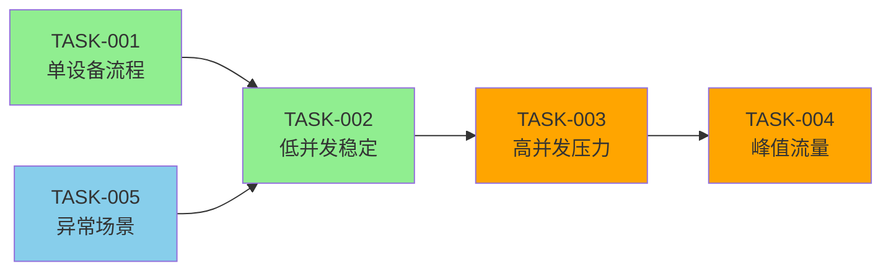

# A3 阶段：任务拆分与场景设计（Scenario-Level Design）

**文档版本**：2.0.0  
**最后更新**：2026-01-15  
**设计类型**：Scenario-Level Design（业务场景设计）

---

## 1. 任务拆分概述

基于[A2_架构设计.md](./A2_架构设计.md)的业务场景分析，将性能测试任务拆分为可执行的场景模块。

### 1.1 拆分原则
- **场景驱动**：每个任务对应一个具体的业务场景
- **独立可执行**：每个任务可以独立运行和验证
- **数据隔离**：不同场景使用不同的测试数据策略
- **结果可追溯**：每个任务的执行结果可以单独分析

---

## 2. 核心场景任务拆分

### 2.1 场景任务1：完整OTA升级流程测试

#### 任务ID：TASK-001
**业务场景**：单设备完整OTA升级流程  
**场景目标**：验证单个设备从登录到升级完成的完整业务流程  
**优先级**：高（核心业务验证）

#### 任务详情
- **测试类型**：功能验证 + 性能基准
- **并发用户数**：1用户（单设备）
- **执行时长**：30分钟
- **数据策略**：动态参数生成
- **验证指标**：
  - 流程成功率：100%
  - 单次升级时间：≤ 5分钟
  - 接口响应时间：TP95 ≤ 500ms

#### 执行步骤
1. **设备登录**：调用登录接口获取access_token
2. **文件上传**：上传升级文件获取file_id
3. **创建升级包**：基于file_id创建升级包
4. **测试升级**：执行升级测试验证流程完整性

#### 数据设计
```groovy
// 动态参数生成（单设备场景）
def timestamp = System.currentTimeMillis()
def version = "2.3." + String.format("%06d", (timestamp % 1000000))
def sn = "DEV" + String.format("%09d", (timestamp % 1000000000))
vars.put("version", version)
vars.put("sn", sn)
```

---

### 2.2 场景任务2：低并发稳定性测试

#### 任务ID：TASK-002
**业务场景**：低并发设备升级稳定性  
**场景目标**：验证系统在低并发下的稳定性和资源使用情况  
**优先级**：高（系统稳定性验证）

#### 任务详情
- **测试类型**：稳定性测试
- **并发用户数**：100用户
- **执行时长**：2小时
- **数据策略**：动态参数生成 + 设备池管理
- **验证指标**：
  - 系统稳定性：100%正常运行
  - 错误率：≤ 0.1%
  - 资源使用：CPU ≤ 60%, 内存 ≤ 70%

#### 负载模式
```
预热阶段：0 → 100用户（10分钟）
稳定阶段：100用户（100分钟）
恢复阶段：100 → 0用户（10分钟）
```

#### 监控重点
- 数据库连接池使用情况
- 内存泄漏检测
- 网络带宽使用
- 磁盘I/O性能

---

### 2.3 场景任务3：高并发压力测试

#### 任务ID：TASK-003
**业务场景**：高并发设备升级压力测试  
**场景目标**：验证系统在高并发下的极限性能和瓶颈点  
**优先级**：中（性能极限验证）

#### 任务详情
- **测试类型**：压力测试
- **并发用户数**：1000用户
- **执行时长**：1小时
- **数据策略**：大规模动态参数生成
- **验证指标**：
  - 吞吐量：≥ 500 TPS
  - 响应时间：TP99 ≤ 2000ms
  - 系统瓶颈：识别性能瓶颈点

#### 负载模式
```
阶梯1：100用户 × 15分钟
阶梯2：500用户 × 15分钟  
阶梯3：1000用户 × 15分钟
阶梯4：200用户 × 15分钟（恢复验证）
```

#### 瓶颈识别策略
- **数据库瓶颈**：监控SQL执行时间和连接数
- **应用服务器瓶颈**：监控线程池和GC情况
- **网络瓶颈**：监控带宽使用和延迟
- **文件系统瓶颈**：监控磁盘I/O和文件操作

---

### 2.4 场景任务4：峰值流量测试

#### 任务ID：TASK-004
**业务场景**：突发峰值流量测试  
**场景目标**：验证系统在突发流量下的响应能力和恢复能力  
**优先级**：中（容灾能力验证）

#### 任务详情
- **测试类型**：峰值测试
- **并发用户数**：2000用户（峰值）
- **执行时长**：30分钟
- **数据策略**：突发流量参数生成
- **验证指标**：
  - 系统响应：不出现服务不可用
  - 恢复时间：峰值后5分钟内恢复正常
  - 数据一致性：无数据丢失或错乱

#### 峰值模式
```
正常阶段：100用户 × 10分钟
峰值阶段：100 → 2000用户 × 5分钟（突发）
恢复阶段：2000 → 100用户 × 15分钟
```

#### 容灾验证
- 服务降级机制验证
- 限流策略有效性
- 自动恢复能力
- 数据一致性保障

---

### 2.5 场景任务5：异常场景测试

#### 任务ID：TASK-005
**业务场景**：异常情况处理测试  
**场景目标**：验证系统在异常情况下的容错能力和错误处理机制  
**优先级**：低（健壮性验证）

#### 任务详情
- **测试类型**：异常测试
- **并发用户数**：50用户
- **执行时长**：1小时
- **数据策略**：异常参数注入
- **验证指标**：
  - 错误处理：正确处理各类异常
  - 系统稳定性：不因异常而崩溃
  - 日志记录：完整记录异常信息

#### 异常类型
- **网络异常**：延迟、丢包、超时
- **数据异常**：错误格式、缺失字段、超长数据
- **服务异常**：服务不可用、响应超时
- **资源异常**：内存不足、磁盘满、连接池耗尽

---

## 3. 任务执行顺序与依赖关系

### 3.1 执行顺序规划



### 3.2 依赖关系说明

#### 3.2.1 强依赖关系
- **TASK-002依赖TASK-001**：必须先验证单设备流程正常
- **TASK-003依赖TASK-002**：低并发稳定后再进行高并发测试

#### 3.2.2 弱依赖关系
- **TASK-004可并行执行**：峰值测试可与压力测试并行
- **TASK-005可随时执行**：异常测试不受其他任务影响

---

## 4. 数据策略设计

### 4.1 统一数据策略
基于[数据来源决策模型.md](../.trae/rules/agents/jmeter/数据来源决策模型.md)：

```yaml
data_strategy:
  use_csv: false
  csv_reason: "性能测试场景下，所有设备参数可动态生成"
  csv_scope: control
  concurrency_safe: true
  fallback_strategy: dynamic
```

### 4.2 场景特定数据设计

#### 4.2.1 单设备场景（TASK-001）
- **参数生成**：简单随机生成，确保唯一性
- **数据量**：单套参数，重复使用
- **验证重点**：业务流程正确性

#### 4.2.2 并发场景（TASK-002/003/004）
- **参数生成**：大规模随机生成，避免冲突
- **数据量**：按并发用户数动态生成
- **验证重点**：数据一致性和并发安全

#### 4.2.3 异常场景（TASK-005）
- **参数生成**：注入异常数据的特殊生成器
- **数据量**：小规模测试数据
- **验证重点**：错误处理机制

---

## 5. 风险评估与应对

### 5.1 技术风险评估

| 风险类型 | 影响程度 | 发生概率 | 应对措施 |
|---------|---------|---------|---------|
| 数据库连接池耗尽 | 高 | 中 | 预先调整配置，监控连接数 |
| 内存泄漏 | 高 | 低 | 长时间运行监控，定期GC分析 |
| 网络带宽不足 | 中 | 中 | 选择合适时间段，准备备用网络 |
| 测试环境影响业务 | 高 | 低 | 使用隔离环境，避免生产数据 |

### 5.2 执行风险评估

| 风险类型 | 影响程度 | 发生概率 | 应对措施 |
|---------|---------|---------|---------|
| 测试数据冲突 | 中 | 中 | 使用唯一标识，避免数据重复 |
| 环境配置错误 | 高 | 低 | 执行前环境验证，配置检查 |
| 监控数据丢失 | 中 | 低 | 多维度监控，数据备份 |
| 测试中断 | 高 | 低 | 准备应急预案，分段执行 |

---

## 6. 验收标准

### 6.1 任务级别验收标准

#### TASK-001验收标准
- ✅ 单设备升级流程100%成功
- ✅ 升级时间 ≤ 5分钟
- ✅ 接口响应时间达标

#### TASK-002验收标准
- ✅ 系统稳定运行2小时
- ✅ 错误率 ≤ 0.1%
- ✅ 资源使用在安全范围内

#### TASK-003验收标准
- ✅ 识别系统性能瓶颈点
- ✅ 吞吐量 ≥ 500 TPS
- ✅ 响应时间TP99 ≤ 2000ms

#### TASK-004验收标准
- ✅ 系统在峰值下不崩溃
- ✅ 峰值后5分钟内恢复正常
- ✅ 数据一致性无问题

#### TASK-005验收标准
- ✅ 异常情况正确处理
- ✅ 系统健壮性验证通过
- ✅ 错误日志记录完整

### 6.2 整体验收标准
- ✅ 所有核心场景测试通过
- ✅ 性能指标满足业务要求
- ✅ 风险评估得到有效控制
- ✅ 测试报告完整可追溯

---

**设计完成时间**：2026-01-15  
**设计负责人**：性能测试团队  
**下一阶段**：[A4_脚本编写.md](./A4_脚本编写.md)