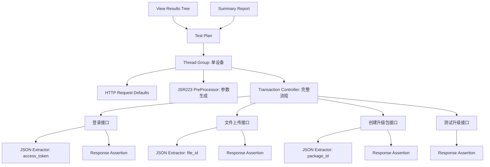
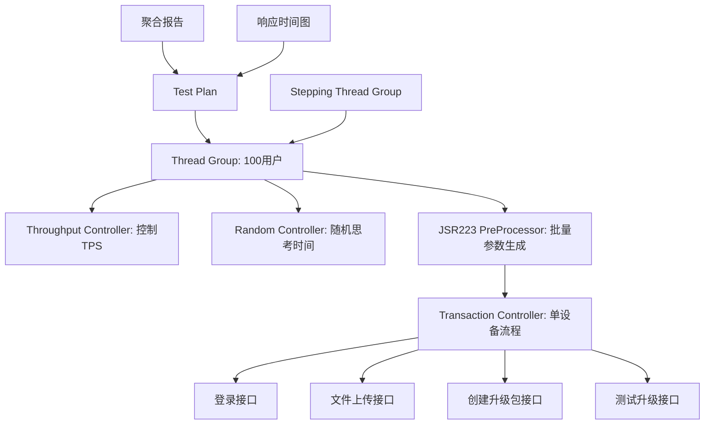
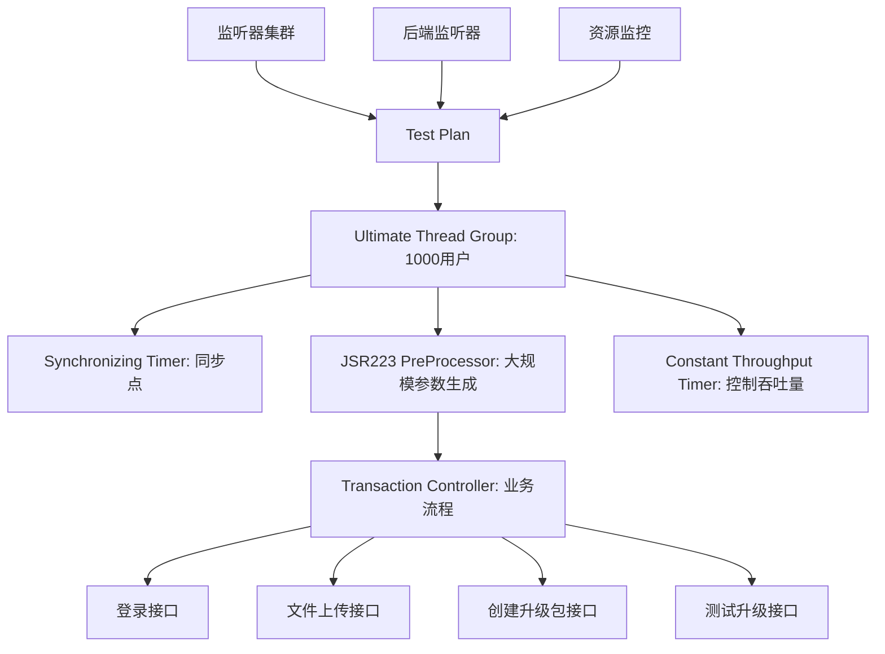

# A4 阶段：脚本编写与数据构造（Scenario-Level Design）

**文档版本**：2.0.0  
**最后更新**：2026-01-15  
**设计类型**：Scenario-Level Design（业务场景设计）

---

## 1. 脚本设计概述

基于[A3_任务拆分.md](./A3_任务拆分.md)的场景任务设计，为每个业务场景编写对应的JMeter测试脚本。

### 1.1 设计原则
- **场景驱动**：每个脚本对应一个具体的业务场景
- **数据动态生成**：基于数据策略，所有设备参数动态生成
- **组件模块化**：可复用的组件设计，便于维护和扩展
- **环境适配**：支持多环境配置和切换

---

## 2. 核心脚本设计

### 2.1 脚本1：单设备完整流程测试脚本

#### 脚本文件：`ota_perf_single_device.jmx`
**对应任务**：TASK-001（单设备完整OTA升级流程）  
**业务场景**：验证单个设备从登录到升级完成的完整业务流程

#### 脚本结构设计


#### 关键组件配置

##### 2.1.1 动态参数生成器（JSR223 PreProcessor）
```groovy
// 单设备场景参数生成器
import java.util.Random

def timestamp = System.currentTimeMillis()

// 生成唯一设备参数
def chars = "ABCDEFGHIJKLMNOPQRSTUVWXYZ0123456789"
def random = new Random()

def sn = "DEV" + String.format("%09d", (timestamp % 1000000000))
def version = "2.3." + String.format("%06d", (timestamp % 1000000))

def deviceTypes = ['kikigo', 'smart_device', 'iot_device']
def deviceType = deviceTypes[random.nextInt(deviceTypes.size())]

// 设置固定控制参数（避免账号锁定）
vars.put("username", "perf_test")
vars.put("password", "perf_test123")
vars.put("captcha_id", "72")
vars.put("captcha_code", "25")
vars.put("file_path", "e:\\AI测试用例\\接口测试\\data\\upgrade.pdf")

// 设置动态设备参数
vars.put("sn", sn)
vars.put("version", version)
vars.put("device_type", deviceType)
vars.put("remark", "性能测试_单设备_" + timestamp)

log.info("单设备参数生成完成: sn=" + sn + ", version=" + version)
```

##### 2.1.2 接口请求配置
```xml
<!-- 登录接口配置 -->
<HTTPSamplerProxy guiclass="HttpTestSampleGui" testclass="HTTPSamplerProxy" testname="登录接口">
  <elementProp name="HTTPsampler.Arguments" elementType="Arguments">
    <collectionProp name="Arguments.arguments">
      <elementProp name="username" elementType="HTTPArgument">
        <stringProp name="Argument.name">username</stringProp>
        <stringProp name="Argument.value">${username}</stringProp>
        <stringProp name="Argument.metadata">=</stringProp>
      </elementProp>
      <elementProp name="password" elementType="HTTPArgument">
        <stringProp name="Argument.name">password</stringProp>
        <stringProp name="Argument.value">${password}</stringProp>
        <stringProp name="Argument.metadata">=</stringProp>
      </elementProp>
    </collectionProp>
  </elementProp>
  <stringProp name="HTTPSampler.domain">${base_url}</stringProp>
  <stringProp name="HTTPSampler.port"></stringProp>
  <stringProp name="HTTPSampler.protocol">http</stringProp>
  <stringProp name="HTTPSampler.path">/api/v1/user/login</stringProp>
  <stringProp name="HTTPSampler.method">POST</stringProp>
</HTTPSamplerProxy>
```

---

### 2.2 脚本2：低并发稳定性测试脚本

#### 脚本文件：`ota_perf_stability.jmx`
**对应任务**：TASK-002（低并发设备升级稳定性）  
**业务场景**：验证系统在低并发下的稳定性和资源使用情况

#### 脚本结构设计


#### 关键组件配置

##### 2.2.1 批量参数生成器
```groovy
// 低并发场景参数生成器
import java.util.Random

def timestamp = System.currentTimeMillis()
def threadNum = ctx.getThreadNum()

def chars = "ABCDEFGHIJKLMNOPQRSTUVWXYZ0123456789"
def random = new Random()

// 为每个线程生成唯一设备参数
def sn = "STB" + String.format("%09d", (timestamp % 1000000000) + threadNum)
def version = "2.3." + String.format("%06d", (timestamp % 1000000) + threadNum)

def deviceTypes = ['kikigo', 'smart_device', 'iot_device']
def deviceType = deviceTypes[random.nextInt(deviceTypes.size())]

// 设置参数
vars.put("username", "perf_test_" + threadNum)
vars.put("password", "perf_test123")
vars.put("sn", sn)
vars.put("version", version)
vars.put("device_type", deviceType)

// 随机思考时间（5-10秒）
def thinkTime = 5000 + random.nextInt(5000)
vars.put("think_time", thinkTime.toString())

log.info("线程" + threadNum + "参数生成: sn=" + sn)
```

##### 2.2.2 负载控制配置
```xml
<!-- Stepping Thread Group配置 -->
<kg.apc.jmeter.threads.SteppingThreadGroup guiclass="kg.apc.jmeter.threads.SteppingThreadGroupGui" testclass="kg.apc.jmeter.threads.SteppingThreadGroup" testname="阶梯式线程组">
  <stringProp name="ThreadGroup.on_sample_error">continue</stringProp>
  <stringProp name="ThreadGroup.num_threads">100</stringProp>
  <stringProp name="Threads initial delay">0</stringProp>
  <stringProp name="Start users count">10</stringProp>
  <stringProp name="Start users count burst">100</stringProp>
  <stringProp name="Start users period">600</stringProp>
  <stringProp name="Stop users count">0</stringProp>
  <stringProp name="Stop users period">60</stringProp>
  <stringProp name="flighttime">7200</stringProp>
  <stringProp name="rampUp">600</stringProp>
</kg.apc.jmeter.threads.SteppingThreadGroup>
```

---

### 2.3 脚本3：高并发压力测试脚本

#### 脚本文件：`ota_perf_pressure.jmx`
**对应任务**：TASK-003（高并发设备升级压力测试）  
**业务场景**：验证系统在高并发下的极限性能和瓶颈点

#### 脚本结构设计


#### 关键组件配置

##### 2.3.1 大规模参数生成器
```groovy
// 高并发场景参数生成器
import java.util.Random

def timestamp = System.currentTimeMillis()
def threadNum = ctx.getThreadNum()

def chars = "ABCDEFGHIJKLMNOPQRSTUVWXYZ0123456789"
def random = new Random()

// 大规模唯一参数生成
def sn = "PRS" + String.format("%012d", (timestamp % 1000000000000L) + threadNum)
def version = "2.3." + String.format("%08d", (timestamp % 100000000) + threadNum)

// 确保参数唯一性
def deviceTypes = ['kikigo', 'smart_device', 'iot_device']
def deviceType = deviceTypes[(threadNum % deviceTypes.size())]

vars.put("username", "pressure_test_" + threadNum)
vars.put("password", "pressure_test123")
vars.put("sn", sn)
vars.put("version", version)
vars.put("device_type", deviceType)

log.info("压力测试参数: thread=" + threadNum + ", sn=" + sn)
```

##### 2.3.2 吞吐量控制配置
```xml
<!-- Constant Throughput Timer配置 -->
<ConstantThroughputTimer guiclass="TestBeanGUI" testclass="ConstantThroughputTimer" testname="恒定吞吐量定时器">
  <intProp name="calcMode">1</intProp>
  <stringProp name="throughput">500</stringProp>
</ConstantThroughputTimer>
```

---

## 3. 数据策略实现

### 3.1 统一数据策略执行
基于[数据来源决策模型.md](../.trae/rules/agents/jmeter/数据来源决策模型.md)的数据策略：

```yaml
data_strategy:
  use_csv: false
  csv_reason: "性能测试场景下，所有设备参数可动态生成"
  csv_scope: control
  concurrency_safe: true
  fallback_strategy: dynamic
```

### 3.2 动态参数生成规则

#### 3.2.1 设备SN生成规则
- **格式**：前缀(3位) + 时间戳(9位) + 线程号
- **示例**：`DEV123456789001`, `STB123456789002`
- **唯一性保证**：时间戳 + 线程号组合

#### 3.2.2 版本号生成规则
- **格式**：`2.3.` + 时间戳(6-8位)
- **示例**：`2.3.123456`, `2.3.12345678`
- **业务意义**：模拟真实设备版本号

#### 3.2.3 设备类型分配规则
- **分配策略**：按线程号模运算分配
- **类型列表**：['kikigo', 'smart_device', 'iot_device']
- **均衡性**：确保各类型设备分布均匀

---

## 4. 环境配置设计

### 4.1 多环境支持配置

#### 4.1.1 用户定义变量（Test Plan级别）
```properties
# 环境配置（通过命令行参数-Jenv=dev|test|prod指定）
base_url=${__P(env,test)}.example.com
username=perf_test
password=perf_test123
file_path=e:\\AI测试用例\\接口测试\\data\\upgrade.pdf

# 性能配置
think_time_min=5000
think_time_max=10000
throughput_target=500
```

#### 4.1.2 环境验证脚本
```groovy
// 环境验证脚本（JSR223 Sampler）
def env = vars.get("env") ?: "test"
def baseUrl = "http://" + env + ".example.com"

try {
    def connection = new URL(baseUrl).openConnection()
    connection.setConnectTimeout(5000)
    connection.setReadTimeout(5000)
    connection.connect()
    
    log.info("环境验证成功: " + baseUrl)
    vars.put("env_status", "available")
} catch (Exception e) {
    log.error("环境验证失败: " + baseUrl + ", 错误: " + e.getMessage())
    vars.put("env_status", "unavailable")
    SampleResult.setSuccessful(false)
}
```

---

## 5. 监控与报告设计

### 5.1 监控组件配置

#### 5.1.1 后端监听器（InfluxDB）
```xml
<BackendListener guiclass="BackendListenerGui" testclass="BackendListener" testname="InfluxDB后端监听器">
  <elementProp name="arguments" elementType="Arguments">
    <collectionProp name="Arguments.arguments">
      <elementProp name="influxdbMetricsSender" elementType="Argument">
        <stringProp name="Argument.name">influxdbMetricsSender</stringProp>
        <stringProp name="Argument.value">org.apache.jmeter.visualizers.backend.influxdb.HttpMetricsSender</stringProp>
        <stringProp name="Argument.metadata">=</stringProp>
      </elementProp>
      <elementProp name="influxdbUrl" elementType="Argument">
        <stringProp name="Argument.name">influxdbUrl</stringProp>
        <stringProp name="Argument.value">http://localhost:8086/write?db=jmeter</stringProp>
        <stringProp name="Argument.metadata">=</stringProp>
      </elementProp>
    </collectionProp>
  </elementProp>
  <stringProp name="classname">org.apache.jmeter.visualizers.backend.influxdb.InfluxdbBackendListenerClient</stringProp>
</BackendListener>
```

#### 5.1.2 聚合报告配置
```xml
<ResultCollector guiclass="StatVisualizer" testclass="ResultCollector" testname="聚合报告">
  <stringProp name="filename">${report_dir}/aggregate_report.csv</stringProp>
  <objProp>
    <name>saveConfig</name>
    <value class="SampleSaveConfiguration">
      <time>true</time>
      <latency>true</latency>
      <timestamp>true</timestamp>
      <success>true</success>
      <label>true</label>
      <code>true</code>
      <message>true</message>
      <threadName>true</threadName>
      <dataType>true</dataType>
      <encoding>false</encoding>
      <assertions>true</assertions>
      <subresults>true</subresults>
      <responseData>false</responseData>
      <samplerData>false</samplerData>
      <xml>false</xml>
      <fieldNames>true</fieldNames>
      <responseHeaders>false</responseHeaders>
      <requestHeaders>false</requestHeaders>
      <responseDataOnError>false</responseDataOnError>
      <saveAssertionResultsFailureMessage>true</saveAssertionResultsFailureMessage>
      <assertionsResultsToSave>0</assertionsResultsToSave>
      <bytes>true</bytes>
      <sentBytes>true</sentBytes>
      <url>true</url>
      <threadCounts>true</threadCounts>
      <idleTime>true</idleTime>
    </value>
  </objProp>
</ResultCollector>
```

---

## 6. 脚本验证与优化

### 6.1 脚本验证策略

#### 6.1.1 语法验证
- 使用JMeter GUI模式验证脚本结构
- 检查所有变量引用是否正确
- 验证组件配置完整性

#### 6.1.2 功能验证
- 单接口测试验证接口可达性
- 业务流程验证接口依赖关系
- 数据生成验证参数唯一性

#### 6.1.3 性能验证
- 小规模并发测试脚本稳定性
- 监控资源使用情况
- 验证监控数据准确性

### 6.2 优化建议

#### 6.2.1 性能优化
- 禁用不必要的监听器
- 优化正则表达式和JSON路径
- 合理设置超时时间

#### 6.2.2 可维护性优化
- 使用有意义的变量命名
- 添加必要的注释说明
- 模块化组件设计

---

**设计完成时间**：2026-01-15  
**设计负责人**：性能测试团队  
**下一阶段**：[A5_测试执行.md](./A5_测试执行.md)