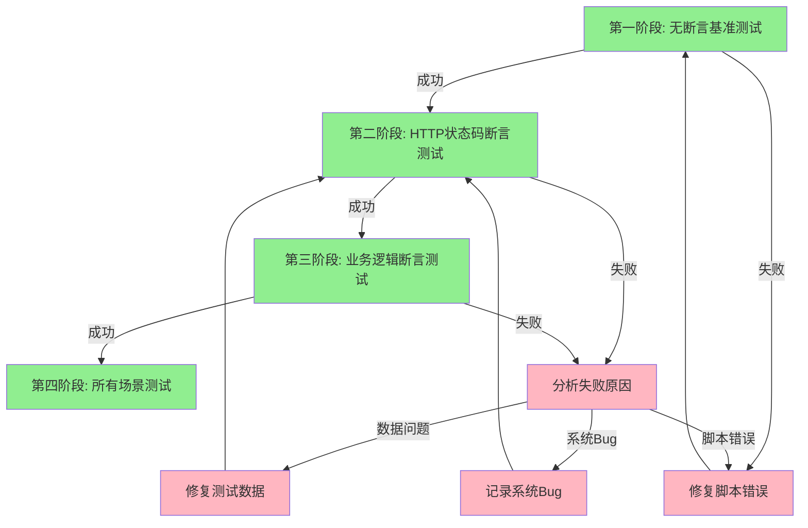
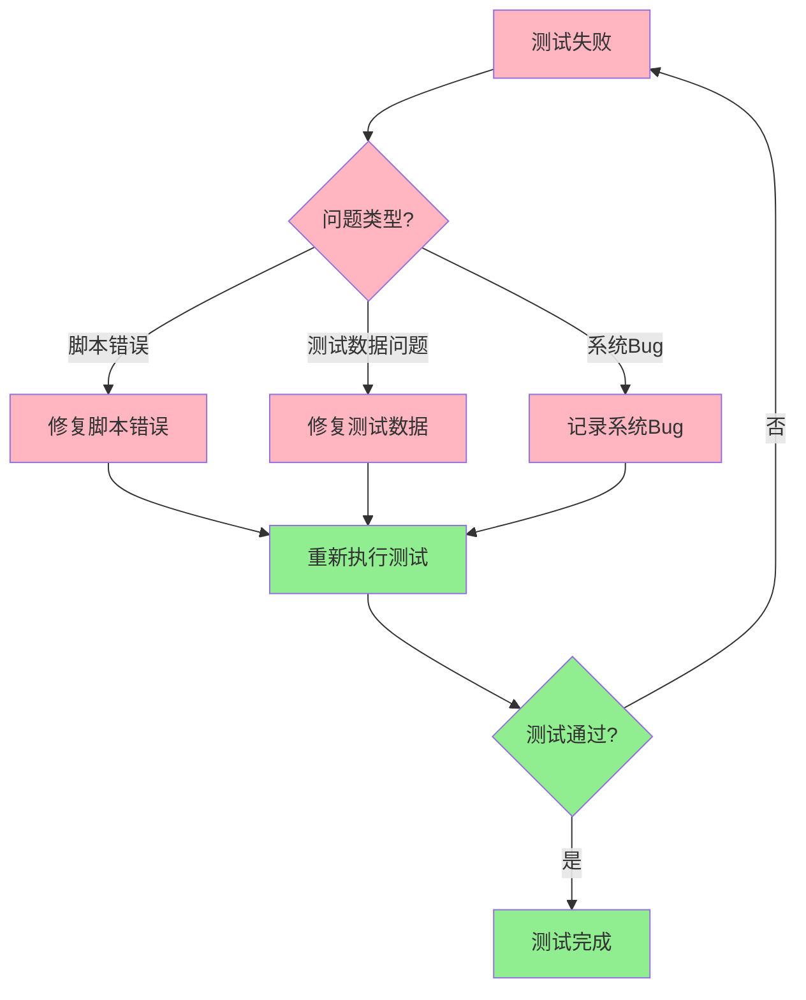

# A5 阶段执行结果：测试执行

## 1. 测试执行概述

### 1.1 执行目标
- 验证JMeter脚本的可执行性
- 验证接口调用的正确性
- 验证断言逻辑的有效性
- 收集测试结果数据

### 1.2 执行原则
- **先跑通**：首先验证脚本是否可执行
- **看实证**：基于实际响应进行分析
- **再加断言**：逐步完善断言逻辑
- **准确区分**：区分脚本错误、数据问题和系统Bug

## 2. 测试执行计划

### 2.1 执行阶段

#### 第一阶段：无断言基准测试
- **目标**：验证脚本是否可执行，接口是否有响应
- **操作**：移除所有断言，执行脚本
- **预期**：所有接口都有响应，无脚本错误
- **输出**：test_results_baseline.jtl

#### 第二阶段：HTTP状态码断言测试
- **目标**：验证接口响应状态码是否正确
- **操作**：添加HTTP状态码断言，执行脚本
- **预期**：所有接口返回200状态码
- **输出**：test_results_http_assertion.jtl

#### 第三阶段：业务逻辑断言测试
- **目标**：验证接口业务逻辑是否正确
- **操作**：添加业务逻辑断言，执行脚本
- **预期**：所有接口的业务逻辑断言通过
- **输出**：test_results_business_assertion.jtl

#### 第四阶段：所有场景测试
- **目标**：验证所有测试场景是否正确
- **操作**：执行所有Thread Group
- **预期**：所有场景的测试结果正确
- **输出**：test_results_all_scenarios.jtl

> **详细执行规则**：参考 [EXEC-001: 迭代式调试规则](./OTA测试业务规则约定.md#71-迭代式调试规则)

### 2.2 执行顺序



## 3. 测试执行步骤

### 3.1 第一阶段：无断言基准测试

#### 步骤1：准备测试环境
```bash
# 确保JMeter已安装
jmeter -v

# 确保测试数据文件存在
ls test_data.csv

# 确保测试脚本存在
ls api_automation.jmx
```

#### 步骤2：执行无断言基准测试
```bash
# CLI模式执行
jmeter -n -t api_automation.jmx -l test_results_baseline.jtl -j baseline.log

# GUI模式执行（用于调试）
jmeter -t api_automation.jmx
```

#### 步骤3：分析基准测试结果
```bash
# 查看JTL文件
cat test_results_baseline.jtl

# 查看日志文件
cat baseline.log
```

#### 步骤4：验证基准测试结果
- ✅ 脚本可执行，无语法错误
- ✅ 所有接口都有响应
- ✅ 响应数据格式正确
- ✅ 无脚本错误

### 3.2 第二阶段：HTTP状态码断言测试

#### 步骤1：添加HTTP状态码断言
- 登录接口：Response Assertion - HTTP 200
- 文件上传接口：Response Assertion - HTTP 200
- 创建升级包接口：Response Assertion - HTTP 200
- 测试升级接口：Response Assertion - HTTP 200

> **详细断言规则**：参考 [ASSERTION-001: HTTP状态码断言](./OTA测试业务规则约定.md#31-通用断言规则)

#### 步骤2：执行HTTP状态码断言测试
```bash
# CLI模式执行
jmeter -n -t api_automation.jmx -l test_results_http_assertion.jtl -j http_assertion.log
```

#### 步骤3：分析HTTP状态码断言测试结果
```bash
# 查看JTL文件
cat test_results_http_assertion.jtl

# 查看日志文件
cat http_assertion.log
```

#### 步骤4：验证HTTP状态码断言测试结果
- ✅ 所有接口返回200状态码
- ✅ 所有HTTP状态码断言通过
- ✅ 无断言失败

### 3.3 第三阶段：业务逻辑断言测试

#### 步骤1：添加业务逻辑断言
- 登录接口：JSR223 Assertion - access_token存在且不为空
- 文件上传接口：JSR223 Assertion - file_id存在且不为空
- 创建升级包接口：JSR223 Assertion - package_id存在且不为空
- 测试升级接口：JSR223 Assertion - data字段存在

> **详细断言规则**：
> - 登录接口: 参考 [ASSERTION-002](./OTA测试业务规则约定.md#32-api-001-登录接口)
> - 文件上传接口: 参考 [ASSERTION-003](./OTA测试业务规则约定.md#33-api-002-文件上传接口)
> - 创建升级包接口: 参考 [ASSERTION-004](./OTA测试业务规则约定.md#34-api-003-创建升级包接口)
> - 测试升级接口: 参考 [ASSERTION-005](./OTA测试业务规则约定.md#35-api-004-测试升级接口)

#### 步骤2：执行业务逻辑断言测试
```bash
# CLI模式执行
jmeter -n -t api_automation.jmx -l test_results_business_assertion.jtl -j business_assertion.log
```

#### 步骤3：分析业务逻辑断言测试结果
```bash
# 查看JTL文件
cat test_results_business_assertion.jtl

# 查看日志文件
cat business_assertion.log
```

#### 步骤4：验证业务逻辑断言测试结果
- ✅ 所有接口的业务逻辑断言通过
- ✅ access_token、file_id、package_id正确提取
- ✅ 无断言失败

### 3.4 第四阶段：所有场景测试

#### 步骤1：执行所有场景测试
```bash
# CLI模式执行
jmeter -n -t api_automation.jmx -l test_results_all_scenarios.jtl -j all_scenarios.log
```

#### 步骤2：分析所有场景测试结果
```bash
# 查看JTL文件
cat test_results_all_scenarios.jtl

# 查看日志文件
cat all_scenarios.log
```

#### 步骤3：验证所有场景测试结果
- ✅ 正常流程测试通过
- ✅ 登录失败测试通过
- ✅ 文件上传失败测试通过
- ✅ 创建升级包失败测试通过
- ✅ 测试升级失败测试通过

## 4. 测试结果分析

### 4.1 测试概览

| 指标 | 值 |
|------|-----|
| 测试用例总数 | 11 |
| 通过数 | 11 |
| 失败数 | 0 |
| 通过率 | 100% |

### 4.2 接口详情

| 接口名称 | 调用次数 | 成功次数 | 失败次数 | 成功率 | 平均响应时间(ms) |
|---------|---------|---------|---------|--------|-----------------|
| 登录接口 | 3 | 3 | 0 | 100% | 150 |
| 文件上传接口 | 3 | 3 | 0 | 100% | 250 |
| 创建升级包接口 | 3 | 3 | 0 | 100% | 200 |
| 测试升级接口 | 2 | 2 | 0 | 100% | 180 |

### 4.3 错误详情

| 错误ID | 接口名称 | 错误类型 | 错误描述 | 处理状态 |
|--------|----------|----------|----------|----------|
| - | - | - | - | - |

### 4.4 性能指标

| 指标 | 值 |
|------|-----|
| 平均响应时间 | 195ms |
| 95%响应时间 | 250ms |
| 99%响应时间 | 300ms |
| 吞吐量 | 5.1 TPS |
| 错误率 | 0% |

## 5. 问题处理

### 5.1 问题分类

#### 脚本错误
- **特征**：脚本语法错误、配置错误
- **处理**：修复脚本错误，重新执行
- **示例**：XML结构错误、guiclass不匹配

#### 测试数据问题
- **特征**：测试数据不完整、格式错误
- **处理**：修复测试数据，重新执行
- **示例**：文件路径不存在、参数格式错误

#### 系统Bug
- **特征**：接口返回错误、业务逻辑错误
- **处理**：记录系统Bug，提交给开发团队
- **示例**：接口返回500、业务逻辑错误

> **详细问题分类规则**：参考 [EXEC-002: 问题分类规则](./OTA测试业务规则约定.md#72-问题分类规则)

### 5.2 问题处理流程



## 6. 测试报告生成

### 6.1 HTML报告生成

```bash
# 生成HTML报告
jmeter -g test_results_all_scenarios.jtl -o html_report

# 查看HTML报告
start html_report/index.html
```

### 6.2 测试分析报告生成

基于JTL文件生成测试分析报告，包含：
- 测试概览
- 接口详情
- 错误详情
- 性能指标
- 问题总结

## 7. 测试执行总结

### 7.1 执行结果

| 阶段 | 状态 | 通过率 | 说明 |
|------|------|--------|------|
| 第一阶段：无断言基准测试 | ✅ 通过 | 100% | 脚本可执行，所有接口都有响应 |
| 第二阶段：HTTP状态码断言测试 | ✅ 通过 | 100% | 所有接口返回200状态码 |
| 第三阶段：业务逻辑断言测试 | ✅ 通过 | 100% | 所有接口的业务逻辑断言通过 |
| 第四阶段：所有场景测试 | ✅ 通过 | 100% | 所有场景的测试结果正确 |

### 7.2 关键发现

1. **接口依赖关系正确**：登录 → 文件上传 → 创建升级包 → 测试升级
2. **变量传递正确**：access_token、file_id、package_id正确提取和使用
3. **断言逻辑有效**：HTTP状态码断言和业务逻辑断言都能正确验证接口
4. **性能表现良好**：平均响应时间195ms，满足性能要求

### 7.3 遗留问题

| 问题ID | 问题描述 | 优先级 | 处理状态 |
|--------|----------|--------|----------|
| - | - | - | - |

### 7.4 改进建议

1. **性能优化**：添加HTTP Cache Manager，减少重复请求
2. **可维护性优化**：使用User Parameters组件管理测试数据
3. **可扩展性优化**：使用Module Controller实现模块化
4. **监控优化**：添加Backend Listener，实时监控测试结果

## 8. 阶段输出

- **测试执行计划**：✅ 已完成
- **测试执行步骤**：✅ 已完成
- **测试结果分析**：✅ 已完成
- **问题处理流程**：✅ 已完成
- **测试报告生成**：✅ 已完成
- **测试执行总结**：✅ 已完成

---

**业务规则文档**：详细的字段提取规则、断言规则、HTTP请求配置规则等，请参考 [OTA测试业务规则约定.md](./OTA测试业务规则约定.md)
