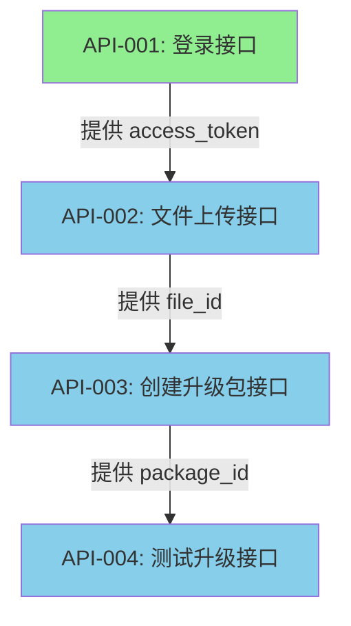
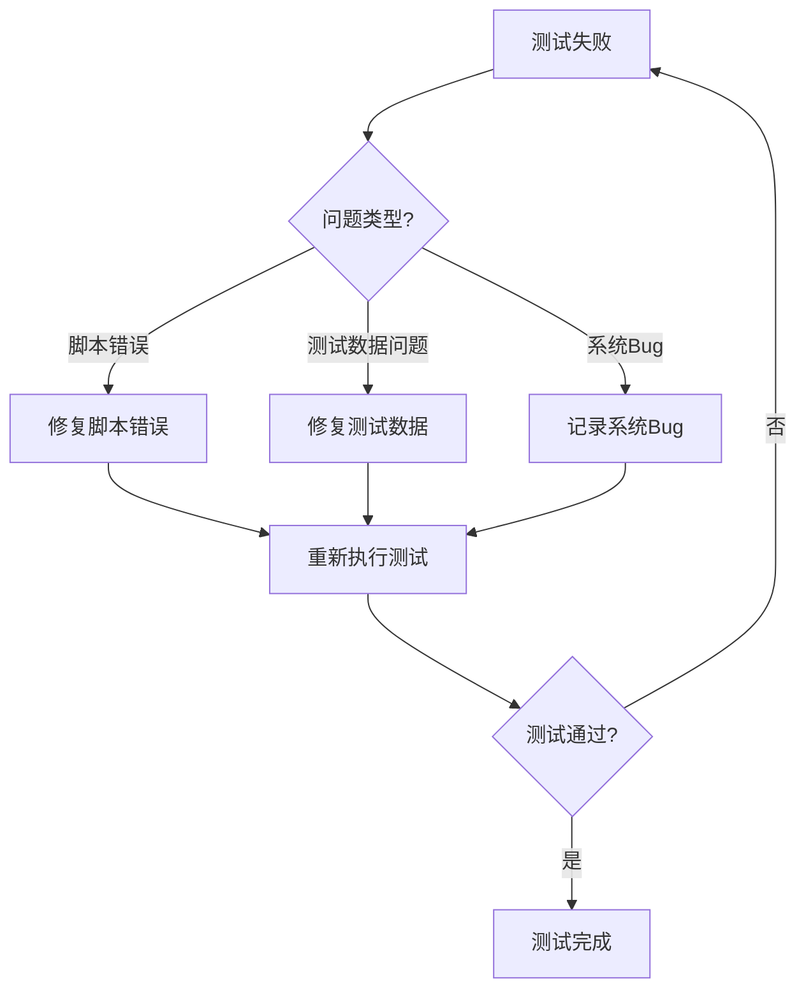

# OTA测试业务规则约定

## 文档说明

本文档记录OTA测试的所有业务规则约定，包括字段提取规则、断言规则、组合接口场景规则、依赖关系等。

**文档定位**：
- 统一的业务规则库
- 各阶段（A2-A6）的规则引用源
- Agent执行时的规则查询文档

**使用原则**：
- 各阶段文档只记录执行步骤和设计逻辑
- 具体业务规则统一记录在本文档
- 各阶段通过引用本文档中的规则ID来使用规则

---

## 1. 接口模块分类

### 1.1 接口列表

| 接口ID | 接口名称 | 接口路径 | HTTP方法 | 适用阶段 |
|--------|----------|----------|----------|----------|
| API-001 | 登录接口 | /api/v1/user/login | POST | A2, A3, A4, A5 |
| API-002 | 文件上传接口 | /api/v1/file/upload | POST | A2, A3, A4, A5 |
| API-003 | 创建升级包接口 | /api/v1/ota/package | POST | A2, A3, A4, A5 |
| API-004 | 测试升级接口 | /api/v1/ota/test | POST | A2, A3, A4, A5 |

### 1.2 接口依赖关系



**依赖规则**：
- API-002 必须使用 API-001 返回的 access_token
- API-003 必须使用 API-001 返回的 access_token 和 API-002 返回的 file_id
- API-004 必须使用 API-001 返回的 access_token 和 API-003 返回的 package_id

---

## 2. 字段提取规则

### 2.1 API-001 登录接口

#### 规则ID: EXTRACT-001
**提取字段**: access_token

**提取规则**:
```groovy
JSON Path: $.data.access_token
```

**提取时机**: 登录接口响应成功（code=200）后

**变量作用域**: 跨线程组共享（使用 __setProperty）

**适用阶段**: A4（脚本编写）、A5（测试执行）

**约束条件**:
- 必须在登录接口的 HTTP 请求子节点中配置
- 必须在断言通过后才能使用该变量
- 如果提取失败，默认值为 "NOT_FOUND"

**JMeter组件配置**:
```xml
<JSONPostProcessor guiclass="JSONPostProcessorGui" testclass="JSONPostProcessor" testname="提取access_token">
  <stringProp name="JSONPostProcessor.referenceNames">access_token</stringProp>
  <stringProp name="JSONPostProcessor.jsonPathExprs$.data.access_token</stringProp>
  <stringProp name="JSONPostProcessor.match_numbers"></stringProp>
  <stringProp name="JSONPostProcessor.defaultValues">NOT_FOUND</stringProp>
</JSONPostProcessor>
```

---

### 2.2 API-002 文件上传接口

#### 规则ID: EXTRACT-002
**提取字段**: file_id

**提取规则**:
```groovy
JSON Path: $.data.id
```

**提取时机**: 文件上传接口响应成功（code=200）后

**变量作用域**: 跨线程组共享（使用 __setProperty）

**适用阶段**: A4（脚本编写）、A5（测试执行）

**约束条件**:
- 必须在文件上传接口的 HTTP 请求子节点中配置
- 必须在断言通过后才能使用该变量
- 如果提取失败，默认值为 "NOT_FOUND"

**JMeter组件配置**:
```xml
<JSONPostProcessor guiclass="JSONPostProcessorGui" testclass="JSONPostProcessor" testname="提取file_id">
  <stringProp name="JSONPostProcessor.referenceNames">file_id</stringProp>
  <stringProp name="JSONPostProcessor.jsonPathExprs$.data.id</stringProp>
  <stringProp name="JSONPostProcessor.match_numbers"></stringProp>
  <stringProp name="JSONPostProcessor.defaultValues">NOT_FOUND</stringProp>
</JSONPostProcessor>
```

---

### 2.3 API-003 创建升级包接口

#### 规则ID: EXTRACT-003
**提取字段**: package_id

**提取规则**:
```groovy
JSON Path: $.data.id
```

**提取时机**: 创建升级包接口响应成功（code=200）后

**变量作用域**: 跨线程组共享（使用 __setProperty）

**适用阶段**: A4（脚本编写）、A5（测试执行）

**约束条件**:
- 必须在创建升级包接口的 HTTP 请求子节点中配置
- 必须在断言通过后才能使用该变量
- 如果提取失败，默认值为 "NOT_FOUND"

**JMeter组件配置**:
```xml
<JSONPostProcessor guiclass="JSONPostProcessorGui" testclass="JSONPostProcessor" testname="提取package_id">
  <stringProp name="JSONPostProcessor.referenceNames">package_id</stringProp>
  <stringProp name="JSONPostProcessor.jsonPathExprs$.data.id</stringProp>
  <stringProp name="JSONPostProcessor.match_numbers"></stringProp>
  <stringProp name="JSONPostProcessor.defaultValues">NOT_FOUND</stringProp>
</JSONPostProcessor>
```

---

## 3. 断言规则

### 3.1 通用断言规则

#### 规则ID: ASSERTION-001
**断言类型**: HTTP状态码断言

**断言规则**:
```xml
<ResponseAssertion guiclass="AssertionGui" testclass="ResponseAssertion" testname="响应断言">
  <collectionProp name="Asserion.test_strings">
    <stringProp name="49586">200</stringProp>
  </collectionProp>
  <stringProp name="Assertion.custom_message"></stringProp>
  <stringProp name="Assertion.test_field">Assertion.response_code</stringProp>
  <boolProp name="Assertion.assume_success">false</boolProp>
  <intProp name="Assertion.test_type">8</intProp>
</ResponseAssertion>
```

**适用接口**: 所有接口（API-001, API-002, API-003, API-004）

**适用阶段**: A4（脚本编写）、A5（测试执行）

**约束条件**:
- 必须在每个 HTTP 请求的子节点中配置
- 断言失败时，后续请求不执行
- 失败场景测试时，预期状态码可能不是200

---

### 3.2 API-001 登录接口

#### 规则ID: ASSERTION-002
**断言类型**: 业务逻辑断言（JSR223 Assertion）

**断言规则**:
```groovy
import groovy.json.JsonSlurper

def response = prev.getResponseDataAsString()
def json = new JsonSlurper().parseText(response)

if (json.code != 200) {
    AssertionResult.setFailure(true)
    AssertionResult.setFailureMessage("Expected code=200, but got code=${json.code}")
}

if (!json.data || !json.data.access_token || json.data.access_token.isEmpty()) {
    AssertionResult.setFailure(true)
    AssertionResult.setFailureMessage("access_token is missing or empty")
}
```

**适用阶段**: A4（脚本编写）、A5（测试执行）

**约束条件**:
- 必须在 HTTP 状态码断言之后配置
- 必须在 JSON Path Extractor 之后配置
- 断言失败时，记录为系统Bug（如果脚本正确）

**JMeter组件配置**:
```xml
<JSR223Assertion guiclass="JSR223AssertionGui" testclass="JSR223Assertion" testname="业务逻辑断言">
  <stringProp name="cacheKey">true</stringProp>
  <stringProp name="filename"></stringProp>
  <stringProp name="parameters"></stringProp>
  <stringProp name="script">import groovy.json.JsonSlurper

def response = prev.getResponseDataAsString()
def json = new JsonSlurper().parseText(response)

if (json.code != 200) {
    AssertionResult.setFailure(true)
    AssertionResult.setFailureMessage("Expected code=200, but got code=${json.code}")
}

if (!json.data || !json.data.access_token || json.data.access_token.isEmpty()) {
    AssertionResult.setFailure(true)
    AssertionResult.setFailureMessage("access_token is missing or empty")
}</stringProp>
  <stringProp name="scriptLanguage">groovy</stringProp>
</JSR223Assertion>
```

---

### 3.3 API-002 文件上传接口

#### 规则ID: ASSERTION-003
**断言类型**: 业务逻辑断言（JSR223 Assertion）

**断言规则**:
```groovy
import groovy.json.JsonSlurper

def response = prev.getResponseDataAsString()
def json = new JsonSlurper().parseText(response)

if (json.code != 200) {
    AssertionResult.setFailure(true)
    AssertionResult.setFailureMessage("Expected code=200, but got code=${json.code}")
}

if (!json.data || !json.data.id || json.data.id.isEmpty()) {
    AssertionResult.setFailure(true)
    AssertionResult.setFailureMessage("file_id is missing or empty")
}
```

**适用阶段**: A4（脚本编写）、A5（测试执行）

**约束条件**:
- 必须在 HTTP 状态码断言之后配置
- 必须在 JSON Path Extractor 之后配置
- 断言失败时，记录为系统Bug（如果脚本正确）

**JMeter组件配置**:
```xml
<JSR223Assertion guiclass="JSR223AssertionGui" testclass="JSR223Assertion" testname="业务逻辑断言">
  <stringProp name="cacheKey">true</stringProp>
  <stringProp name="filename"></stringProp>
  <stringProp name="parameters"></stringProp>
  <stringProp name="script">import groovy.json.JsonSlurper

def response = prev.getResponseDataAsString()
def json = new JsonSlurper().parseText(response)

if (json.code != 200) {
    AssertionResult.setFailure(true)
    AssertionResult.setFailureMessage("Expected code=200, but got code=${json.code}")
}

if (!json.data || !json.data.id || json.data.id.isEmpty()) {
    AssertionResult.setFailure(true)
    AssertionResult.setFailureMessage("file_id is missing or empty")
}</stringProp>
  <stringProp name="scriptLanguage">groovy</stringProp>
</JSR223Assertion>
```

---

### 3.4 API-003 创建升级包接口

#### 规则ID: ASSERTION-004
**断言类型**: 业务逻辑断言（JSR223 Assertion）

**断言规则**:
```groovy
import groovy.json.JsonSlurper

def response = prev.getResponseDataAsString()
def json = new JsonSlurper().parseText(response)

if (json.code != 200) {
    AssertionResult.setFailure(true)
    AssertionResult.setFailureMessage("Expected code=200, but got code=${json.code}")
}

if (!json.data || !json.data.id || json.data.id.isEmpty()) {
    AssertionResult.setFailure(true)
    AssertionResult.setFailureMessage("package_id is missing or empty")
}
```

**适用阶段**: A4（脚本编写）、A5（测试执行）

**约束条件**:
- 必须在 HTTP 状态码断言之后配置
- 必须在 JSON Path Extractor 之后配置
- 断言失败时，记录为系统Bug（如果脚本正确）

**JMeter组件配置**:
```xml
<JSR223Assertion guiclass="JSR223AssertionGui" testclass="JSR223Assertion" testname="业务逻辑断言">
  <stringProp name="cacheKey">true</stringProp>
  <stringProp name="filename"></stringProp>
  <stringProp name="parameters"></stringProp>
  <stringProp name="script">import groovy.json.JsonSlurper

def response = prev.getResponseDataAsString()
def json = new JsonSlurper().parseText(response)

if (json.code != 200) {
    AssertionResult.setFailure(true)
    AssertionResult.setFailureMessage("Expected code=200, but got code=${json.code}")
}

if (!json.data || !json.data.id || json.data.id.isEmpty()) {
    AssertionResult.setFailure(true)
    AssertionResult.setFailureMessage("package_id is missing or empty")
}</stringProp>
  <stringProp name="scriptLanguage">groovy</stringProp>
</JSR223Assertion>
```

---

### 3.5 API-004 测试升级接口

#### 规则ID: ASSERTION-005
**断言类型**: 业务逻辑断言（JSR223 Assertion）

**断言规则**:
```groovy
import groovy.json.JsonSlurper

def response = prev.getResponseDataAsString()
def json = new JsonSlurper().parseText(response)

if (json.code != 200) {
    AssertionResult.setFailure(true)
    AssertionResult.setFailureMessage("Expected code=200, but got code=${json.code}")
}

if (!json.data) {
    AssertionResult.setFailure(true)
    AssertionResult.setFailureMessage("data field is missing")
}
```

**适用阶段**: A4（脚本编写）、A5（测试执行）

**约束条件**:
- 必须在 HTTP 状态码断言之后配置
- 断言失败时，记录为系统Bug（如果脚本正确）

**JMeter组件配置**:
```xml
<JSR223Assertion guiclass="JSR223AssertionGui" testclass="JSR223Assertion" testname="业务逻辑断言">
  <stringProp name="cacheKey">true</stringProp>
  <stringProp name="filename"></stringProp>
  <stringProp name="parameters"></stringProp>
  <stringProp name="script">import groovy.json.JsonSlurper

def response = prev.getResponseDataAsString()
def json = new JsonSlurper().parseText(response)

if (json.code != 200) {
    AssertionResult.setFailure(true)
    AssertionResult.setFailureMessage("Expected code=200, but got code=${json.code}")
}

if (!json.data) {
    AssertionResult.setFailure(true)
    AssertionResult.setFailureMessage("data field is missing")
}</stringProp>
  <stringProp name="scriptLanguage">groovy</stringProp>
</JSR223Assertion>
```

---

## 4. 组合接口场景规则

### 4.1 场景1：正常流程测试

#### 规则ID: SCENARIO-001
**场景描述**: 按照接口依赖顺序正常调用所有接口

**接口调用顺序**:
1. API-001 登录接口
2. API-002 文件上传接口
3. API-003 创建升级包接口
4. API-004 测试升级接口

**变量传递关系**:
```
API-001 → 提取 access_token → API-002 使用
API-002 → 提取 file_id → API-003 使用
API-003 → 提取 package_id → API-004 使用
```

**前置条件**:
- 所有测试数据有效（username, password, captcha_id, captcha_code, file_path, device_type, version, remark, packageType, sn）
- 测试环境可访问

**预期结果**:
- 所有接口返回200状态码
- 所有业务逻辑断言通过
- 变量正确传递

**适用阶段**: A2（架构设计）、A3（任务拆分）、A4（脚本编写）、A5（测试执行）

**约束条件**:
- 必须在同一个 Thread Group 中执行
- 必须按照接口依赖顺序执行
- 必须使用 CSV Data Set Config 读取测试数据

**JMeter组件配置**:
```xml
<ThreadGroup guiclass="ThreadGroupGui" testclass="ThreadGroup" testname="正常流程测试">
  <stringProp name="ThreadGroup.num_threads">1</stringProp>
  <stringProp name="ThreadGroup.ramp_time">1</stringProp>
  <boolProp name="ThreadGroup.scheduler">false</boolProp>
  <stringProp name="ThreadGroup.duration"></stringProp>
  <stringProp name="ThreadGroup.delay"></stringProp>
  <boolProp name="ThreadGroup.same_user_on_next_iteration">true</boolProp>
</ThreadGroup>
```

---

### 4.2 场景2：登录失败测试

#### 规则ID: SCENARIO-002
**场景描述**: 测试登录接口的各种失败场景

**失败场景**:
1. 无效用户名
2. 无效密码
3. 无效验证码

**预期结果**:
- 登录接口返回非200状态码
- HTTP状态码断言失败（预期失败）

**适用阶段**: A2（架构设计）、A3（任务拆分）、A4（脚本编写）、A5（测试执行）

**约束条件**:
- 必须在独立的 Thread Group 中执行
- 必须使用 CSV Data Set Config 读取测试数据
- 每个失败场景对应一个测试数据行

**JMeter组件配置**:
```xml
<ThreadGroup guiclass="ThreadGroupGui" testclass="ThreadGroup" testname="登录失败测试">
  <stringProp name="ThreadGroup.num_threads">1</stringProp>
  <stringProp name="ThreadGroup.ramp_time">1</stringProp>
  <boolProp name="ThreadGroup.scheduler">false</boolProp>
  <stringProp name="ThreadGroup.duration"></stringProp>
  <stringProp name="ThreadGroup.delay"></stringProp>
  <boolProp name="ThreadGroup.same_user_on_next_iteration">true</boolProp>
</ThreadGroup>
```

---

### 4.3 场景3：文件上传失败测试

#### 规则ID: SCENARIO-003
**场景描述**: 测试文件上传接口的各种失败场景

**失败场景**:
1. 无效token
2. 文件不存在

**预期结果**:
- 文件上传接口返回非200状态码
- HTTP状态码断言失败（预期失败）

**适用阶段**: A2（架构设计）、A3（任务拆分）、A4（脚本编写）、A5（测试执行）

**约束条件**:
- 必须在独立的 Thread Group 中执行
- 必须使用 CSV Data Set Config 读取测试数据
- 每个失败场景对应一个测试数据行

**JMeter组件配置**:
```xml
<ThreadGroup guiclass="ThreadGroupGui" testclass="ThreadGroup" testname="文件上传失败测试">
  <stringProp name="ThreadGroup.num_threads">1</stringProp>
  <stringProp name="ThreadGroup.ramp_time">1</stringProp>
  <boolProp name="ThreadGroup.scheduler">false</boolProp>
  <stringProp name="ThreadGroup.duration"></stringProp>
  <stringProp name="ThreadGroup.delay"></stringProp>
  <boolProp name="ThreadGroup.same_user_on_next_iteration">true</boolProp>
</ThreadGroup>
```

---

### 4.4 场景4：创建升级包失败测试

#### 规则ID: SCENARIO-004
**场景描述**: 测试创建升级包接口的各种失败场景

**失败场景**:
1. 无效token
2. 无效file_id
3. 参数格式错误
4. **version版本号冲突**：重复使用已存在的version值

**version唯一性约束**:
- **业务规则**：创建升级包接口的version字段必须唯一，重复使用相同version值会导致冲突
- **测试策略**：
  - **冲突测试用例**：专门设计version冲突场景，验证系统对重复version的正确处理
  - **正常测试用例**：除冲突测试用例外，其他所有用例的version值必须各不相同，确保测试能够正常执行
  - **version命名规范**：建议使用时间戳或递增序号确保唯一性（如：2.3.4.001, 2.3.4.002）

**预期结果**:
- 创建升级包接口返回非200状态码
- HTTP状态码断言失败（预期失败）
- version冲突时，系统应返回明确的错误信息

**适用阶段**: A2（架构设计）、A3（任务拆分）、A4（脚本编写）、A5（测试执行）

**约束条件**:
- 必须在独立的 Thread Group 中执行
- 必须使用 CSV Data Set Config 读取测试数据
- 每个失败场景对应一个测试数据行
- **version冲突测试**：至少包含2条version相同的测试数据
- **version唯一性验证**：正常流程测试中的version值必须各不相同

**JMeter组件配置**:
```xml
<ThreadGroup guiclass="ThreadGroupGui" testclass="ThreadGroup" testname="创建升级包失败测试">
  <stringProp name="ThreadGroup.num_threads">1</stringProp>
  <stringProp name="ThreadGroup.ramp_time">1</stringProp>
  <boolProp name="ThreadGroup.scheduler">false</boolProp>
  <stringProp name="ThreadGroup.duration"></stringProp>
  <stringProp name="ThreadGroup.delay"></stringProp>
  <boolProp name="ThreadGroup.same_user_on_next_iteration">true</boolProp>
</ThreadGroup>
```

---

### 4.5 场景5：测试升级失败测试

#### 规则ID: SCENARIO-005
**场景描述**: 测试升级接口的各种失败场景

**失败场景**:
1. 无效token
2. 无效package_id
3. 无效sn

**预期结果**:
- 测试升级接口返回非200状态码
- HTTP状态码断言失败（预期失败）

**适用阶段**: A2（架构设计）、A3（任务拆分）、A4（脚本编写）、A5（测试执行）

**约束条件**:
- 必须在独立的 Thread Group 中执行
- 必须使用 CSV Data Set Config 读取测试数据
- 每个失败场景对应一个测试数据行

**JMeter组件配置**:
```xml
<ThreadGroup guiclass="ThreadGroupGui" testclass="ThreadGroup" testname="测试升级失败测试">
  <stringProp name="ThreadGroup.num_threads">1</stringProp>
  <stringProp name="ThreadGroup.ramp_time">1</stringProp>
  <boolProp name="ThreadGroup.scheduler">false</boolProp>
  <stringProp name="ThreadGroup.duration"></stringProp>
  <stringProp name="ThreadGroup.delay"></stringProp>
  <boolProp name="ThreadGroup.same_user_on_next_iteration">true</boolProp>
</ThreadGroup>
```

---

## 5. 变量映射规则

### 5.1 全局变量

#### 规则ID: VAR-001
**变量定义**: Test Plan 中的全局变量

**变量列表**:
| 变量名 | 描述 | 示例值 | 适用阶段 |
|--------|------|--------|----------|
| base_url | 基础URL | http://localhost:8080 | A2, A3, A4, A5 |
| username | 用户名 | admin | A2, A3, A4, A5 |
| password | 密码 | admin | A2, A3, A4, A5 |
| captcha_id | 验证码ID | 72 | A2, A3, A4, A5 |
| captcha_code | 验证码 | 25 | A2, A3, A4, A5 |
| file_path | 文件路径 | C:\test\upgrade.pdf | A2, A3, A4, A5 |
| device_type | 设备类型 | kikigo | A2, A3, A4, A5 |
| version | 版本号 | 2.3.3.4a4 | A2, A3, A4, A5 |
| remark | 备注 | 测试升级包 | A2, A3, A4, A5 |
| packageType | 包类型 | firmware | A2, A3, A4, A5 |
| sn | 设备序列号 | SN123456 | A2, A3, A4, A5 |

**适用阶段**: A2（架构设计）、A3（任务拆分）、A4（脚本编写）、A5（测试执行）

**约束条件**:
- 必须在 Test Plan 的 User Defined Variables 中定义
- 变量值从 CSV 文件中读取
- 变量使用格式：${var}

**JMeter组件配置**:
```xml
<elementProp name="TestPlan.user_defined_variables" elementType="Arguments" guiclass="ArgumentsPanel" testclass="Arguments" testname="用户定义的变量">
  <collectionProp name="Arguments.arguments">
    <elementProp name="base_url" elementType="Argument">
      <stringProp name="Argument.name">base_url</stringProp>
      <stringProp name="Argument.value">${base_url}</stringProp>
      <stringProp name="Argument.metadata">=</stringProp>
    </elementProp>
    <!-- 其他变量 -->
  </collectionProp>
</elementProp>
```

---

### 5.2 CSV数据配置

#### 规则ID: VAR-002
**组件名称**: CSV Data Set Config

**配置规则**:
```xml
<CSVDataSet guiclass="TestBeanGUI" testclass="CSVDataSet" testname="CSV数据配置">
  <stringProp name="filename">test_data.csv</stringProp>
  <stringProp name="fileEncoding">UTF-8</stringProp>
  <stringProp name="variableNames">username,password,captcha_id,captcha_code,file_path,device_type,version,remark,packageType,sn</stringProp>
  <stringProp name="delimiter">,</stringProp>
  <boolProp name="quotedData">false</boolProp>
  <boolProp name="recycle">true</boolProp>
  <boolProp name="stopThread">false</boolProp>
  <stringProp name="shareMode">shareMode.all</stringProp>
</CSVDataSet>
```

**适用阶段**: A2（架构设计）、A3（任务拆分）、A4（脚本编写）、A5（测试执行）

**约束条件**:
- 必须在 Test Plan 的子节点中配置
- 变量名必须与 CSV 文件的列名匹配
- 分隔符必须与 CSV 文件的分隔符匹配
- 文件编码必须与 CSV 文件的编码匹配

---

### 5.3 HTTP请求默认值

#### 规则ID: VAR-003
**组件名称**: HTTP Request Defaults

**配置规则**:
```xml
<ConfigTestElement guiclass="HttpDefaultsGui" testclass="ConfigTestElement" testname="HTTP请求默认值">
  <elementProp name="HTTPsampler.Arguments" elementType="Arguments" guiclass="HTTPArgumentsPanel" testclass="Arguments" testname="用户定义的变量">
    <collectionProp name="Arguments.arguments"/>
  </elementProp>
  <stringProp name="HTTPSampler.domain">${base_url}</stringProp>
  <stringProp name="HTTPSampler.port"></stringProp>
  <stringProp name="HTTPSampler.protocol">http</stringProp>
  <stringProp name="HTTPSampler.contentEncoding">UTF-8</stringProp>
  <stringProp name="HTTPSampler.path"></stringProp>
  <stringProp name="HTTPSampler.method">POST</stringProp>
  <boolProp name="HTTPSampler.follow_redirects">true</boolProp>
  <boolProp name="HTTPSampler.auto_redirects">false</boolProp>
  <boolProp name="HTTPSampler.use_keepalive">true</boolProp>
  <boolProp name="HTTPSampler.DO_MULTIPART_POST">false</boolProp>
  <elementProp name="HTTPsampler.Arguments" elementType="Arguments">
    <collectionProp name="Arguments.arguments"/>
  </elementProp>
</ConfigTestElement>
```

**适用阶段**: A2（架构设计）、A3（任务拆分）、A4（脚本编写）、A5（测试执行）

**约束条件**:
- 必须在 Test Plan 的子节点中配置
- 域名使用 ${base_url} 变量
- 协议默认为 http
- 方法默认为 POST

---

## 6. HTTP请求配置规则

### 6.1 API-001 登录接口

#### 规则ID: HTTP-001
**请求配置**:
```xml
<HTTPSamplerProxy guiclass="HttpTestSampleGui" testclass="HTTPSamplerProxy" testname="登录接口">
  <elementProp name="HTTPsampler.Arguments" elementType="Arguments" guiclass="HTTPArgumentsPanel" testclass="Arguments" testname="用户定义的变量">
    <collectionProp name="Arguments.arguments">
      <elementProp name="" elementType="HTTPArgument">
        <boolProp name="HTTPArgument.always_encode">false</boolProp>
        <stringProp name="Argument.value">{&quot;username&quot;:&quot;${username}&quot;,&quot;password&quot;:&quot;${password}&quot;,&quot;captcha_id&quot;:&quot;${captcha_id}&quot;,&quot;captcha_code&quot;:&quot;${captcha_code}&quot;}</stringProp>
        <stringProp name="Argument.metadata">=</stringProp>
        <boolProp name="HTTPArgument.use_equals">true</boolProp>
        <stringProp name="Argument.name"></stringProp>
      </elementProp>
    </collectionProp>
  </elementProp>
  <stringProp name="HTTPSampler.domain">${base_url}</stringProp>
  <stringProp name="HTTPSampler.port"></stringProp>
  <stringProp name="HTTPSampler.protocol">http</stringProp>
  <stringProp name="HTTPSampler.contentEncoding">UTF-8</stringProp>
  <stringProp name="HTTPSampler.path">/api/v1/user/login</stringProp>
  <stringProp name="HTTPSampler.method">POST</stringProp>
  <boolProp name="HTTPSampler.follow_redirects">true</boolProp>
  <boolProp name="HTTPSampler.auto_redirects">false</boolProp>
  <boolProp name="HTTPSampler.use_keepalive">true</boolProp>
  <boolProp name="HTTPSampler.DO_MULTIPART_POST">false</boolProp>
  <elementProp name="HTTPsampler.Arguments" elementType="Arguments">
    <collectionProp name="Arguments.arguments"/>
  </elementProp>
  <stringProp name="TestPlan.comments">登录接口</stringProp>
</HTTPSamplerProxy>
```

**HTTP Header配置**:
```xml
<HeaderManager guiclass="HeaderPanel" testclass="HeaderManager" testname="HTTP信息头管理器">
  <collectionProp name="HeaderManager.headers">
    <elementProp name="" elementType="Header">
      <stringProp name="Header.name">Content-Type</stringProp>
      <stringProp name="Header.value">application/json</stringProp>
    </elementProp>
  </collectionProp>
</HeaderManager>
```

**适用阶段**: A4（脚本编写）、A5（测试执行）

**约束条件**:
- 必须在 Thread Group 的子节点中配置
- 必须包含 HTTP Header Manager
- 必须包含 JSON Path Extractor（提取 access_token）
- 必须包含 Response Assertion（HTTP 200）
- 必须包含 JSR223 Assertion（业务逻辑断言）

---

### 6.2 API-002 文件上传接口

#### 规则ID: HTTP-002
**请求配置**:
```xml
<HTTPSamplerProxy guiclass="HttpTestSampleGui" testclass="HTTPSamplerProxy" testname="文件上传接口">
  <elementProp name="HTTPsampler.Arguments" elementType="Arguments" guiclass="HTTPArgumentsPanel" testclass="Arguments" testname="用户定义的变量">
    <collectionProp name="Arguments.arguments"/>
  </elementProp>
  <stringProp name="HTTPSampler.domain">${base_url}</stringProp>
  <stringProp name="HTTPSampler.port"></stringProp>
  <stringProp name="HTTPSampler.protocol">http</stringProp>
  <stringProp name="HTTPSampler.contentEncoding">UTF-8</stringProp>
  <stringProp name="HTTPSampler.path">/api/v1/file/upload</stringProp>
  <stringProp name="HTTPSampler.method">POST</stringProp>
  <boolProp name="HTTPSampler.follow_redirects">true</boolProp>
  <boolProp name="HTTPSampler.auto_redirects">false</boolProp>
  <boolProp name="HTTPSampler.use_keepalive">true</boolProp>
  <boolProp name="HTTPSampler.DO_MULTIPART_POST">true</boolProp>
  <elementProp name="HTTPsampler.Files" elementType="HTTPFileArgs">
    <collectionProp name="HTTPFileArgs.files">
      <elementProp name="file" elementType="HTTPFileArg">
        <stringProp name="File.path">${file_path}</stringProp>
        <stringProp name="File.paramname">file</stringProp>
        <stringProp name="File.mimetype">application/octet-stream</stringProp>
      </elementProp>
    </collectionProp>
  </elementProp>
  <stringProp name="TestPlan.comments">文件上传接口</stringProp>
</HTTPSamplerProxy>
```

**HTTP Header配置**:
```xml
<HeaderManager guiclass="HeaderPanel" testclass="HeaderManager" testname="HTTP信息头管理器">
  <collectionProp name="HeaderManager.headers">
    <elementProp name="" elementType="Header">
      <stringProp name="Header.name">Authorization</stringProp>
      <stringProp name="Header.value">Bearer ${access_token}</stringProp>
    </elementProp>
  </collectionProp>
</HeaderManager>
```

**适用阶段**: A4（脚本编写）、A5（测试执行）

**约束条件**:
- 必须在 Thread Group 的子节点中配置
- 必须包含 HTTP Header Manager（Authorization: Bearer ${access_token}）
- 必须包含 HTTP File Args（文件上传）
- 必须包含 JSON Path Extractor（提取 file_id）
- 必须包含 Response Assertion（HTTP 200）
- 必须包含 JSR223 Assertion（业务逻辑断言）

---

### 6.3 API-003 创建升级包接口

#### 规则ID: HTTP-003
**请求配置**:
```xml
<HTTPSamplerProxy guiclass="HttpTestSampleGui" testclass="HTTPSamplerProxy" testname="创建升级包接口">
  <elementProp name="HTTPsampler.Arguments" elementType="Arguments" guiclass="HTTPArgumentsPanel" testclass="Arguments" testname="用户定义的变量">
    <collectionProp name="Arguments.arguments">
      <elementProp name="" elementType="HTTPArgument">
        <boolProp name="HTTPArgument.always_encode">false</boolProp>
        <stringProp name="Argument.value">{&quot;device_type&quot;:&quot;${device_type}&quot;,&quot;file_id&quot;:&quot;${file_id}&quot;,&quot;version&quot;:&quot;${version}&quot;,&quot;remark&quot;:&quot;${remark}&quot;,&quot;packageType&quot;:&quot;${packageType}&quot;}</stringProp>
        <stringProp name="Argument.metadata">=</stringProp>
        <boolProp name="HTTPArgument.use_equals">true</boolProp>
        <stringProp name="Argument.name"></stringProp>
      </elementProp>
    </collectionProp>
  </elementProp>
  <stringProp name="HTTPSampler.domain">${base_url}</stringProp>
  <stringProp name="HTTPSampler.port"></stringProp>
  <stringProp name="HTTPSampler.protocol">http</stringProp>
  <stringProp name="HTTPSampler.contentEncoding">UTF-8</stringProp>
  <stringProp name="HTTPSampler.path">/api/v1/ota/package</stringProp>
  <stringProp name="HTTPSampler.method">POST</stringProp>
  <boolProp name="HTTPSampler.follow_redirects">true</boolProp>
  <boolProp name="HTTPSampler.auto_redirects">false</boolProp>
  <boolProp name="HTTPSampler.use_keepalive">true</boolProp>
  <boolProp name="HTTPSampler.DO_MULTIPART_POST">false</boolProp>
  <elementProp name="HTTPsampler.Arguments" elementType="Arguments">
    <collectionProp name="Arguments.arguments"/>
  </elementProp>
  <stringProp name="TestPlan.comments">创建升级包接口</stringProp>
</HTTPSamplerProxy>
```

**HTTP Header配置**:
```xml
<HeaderManager guiclass="HeaderPanel" testclass="HeaderManager" testname="HTTP信息头管理器">
  <collectionProp name="HeaderManager.headers">
    <elementProp name="" elementType="Header">
      <stringProp name="Header.name">Authorization</stringProp>
      <stringProp name="Header.value">Bearer ${access_token}</stringProp>
    </elementProp>
    <elementProp name="" elementType="Header">
      <stringProp name="Header.name">Content-Type</stringProp>
      <stringProp name="Header.value">application/json</stringProp>
    </elementProp>
  </collectionProp>
</HeaderManager>
```

**适用阶段**: A4（脚本编写）、A5（测试执行）

**约束条件**:
- 必须在 Thread Group 的子节点中配置
- 必须包含 HTTP Header Manager（Authorization: Bearer ${access_token}）
- 必须包含 JSON Path Extractor（提取 package_id）
- 必须包含 Response Assertion（HTTP 200）
- 必须包含 JSR223 Assertion（业务逻辑断言）

---

### 6.4 API-004 测试升级接口

#### 规则ID: HTTP-004
**请求配置**:
```xml
<HTTPSamplerProxy guiclass="HttpTestSampleGui" testclass="HTTPSamplerProxy" testname="测试升级接口">
  <elementProp name="HTTPsampler.Arguments" elementType="Arguments" guiclass="HTTPArgumentsPanel" testclass="Arguments" testname="用户定义的变量">
    <collectionProp name="Arguments.arguments">
      <elementProp name="" elementType="HTTPArgument">
        <boolProp name="HTTPArgument.always_encode">false</boolProp>
        <stringProp name="Argument.value">{&quot;package_id&quot;:&quot;${package_id}&quot;,&quot;sn&quot;:&quot;${sn}&quot;}</stringProp>
        <stringProp name="Argument.metadata">=</stringProp>
        <boolProp name="HTTPArgument.use_equals">true</boolProp>
        <stringProp name="Argument.name"></stringProp>
      </elementProp>
    </collectionProp>
  </elementProp>
  <stringProp name="HTTPSampler.domain">${base_url}</stringProp>
  <stringProp name="HTTPSampler.port"></stringProp>
  <stringProp name="HTTPSampler.protocol">http</stringProp>
  <stringProp name="HTTPSampler.contentEncoding">UTF-8</stringProp>
  <stringProp name="HTTPSampler.path">/api/v1/ota/test</stringProp>
  <stringProp name="HTTPSampler.method">POST</stringProp>
  <boolProp name="HTTPSampler.follow_redirects">true</boolProp>
  <boolProp name="HTTPSampler.auto_redirects">false</boolProp>
  <boolProp name="HTTPSampler.use_keepalive">true</boolProp>
  <boolProp name="HTTPSampler.DO_MULTIPART_POST">false</boolProp>
  <elementProp name="HTTPsampler.Arguments" elementType="Arguments">
    <collectionProp name="Arguments.arguments"/>
  </elementProp>
  <stringProp name="TestPlan.comments">测试升级接口</stringProp>
</HTTPSamplerProxy>
```

**HTTP Header配置**:
```xml
<HeaderManager guiclass="HeaderPanel" testclass="HeaderManager" testname="HTTP信息头管理器">
  <collectionProp name="HeaderManager.headers">
    <elementProp name="" elementType="Header">
      <stringProp name="Header.name">Authorization</stringProp>
      <stringProp name="Header.value">Bearer ${access_token}</stringProp>
    </elementProp>
    <elementProp name="" elementType="Header">
      <stringProp name="Header.name">Content-Type</stringProp>
      <stringProp name="Header.value">application/json</stringProp>
    </elementProp>
  </collectionProp>
</HeaderManager>
```

**适用阶段**: A4（脚本编写）、A5（测试执行）

**约束条件**:
- 必须在 Thread Group 的子节点中配置
- 必须包含 HTTP Header Manager（Authorization: Bearer ${access_token}）
- 必须包含 Response Assertion（HTTP 200）
- 必须包含 JSR223 Assertion（业务逻辑断言）

---

## 7. 测试执行规则

### 7.1 迭代式调试规则

#### 规则ID: EXEC-001
**调试原则**: 先跑通 → 看实证 → 再加断言

**执行顺序**:
1. **第一阶段：无断言基准测试**
   - 目标：验证脚本是否可执行，接口是否有响应
   - 操作：移除所有断言，执行脚本
   - 预期：所有接口都有响应，无脚本错误
   - 输出：test_results_baseline.jtl

2. **第二阶段：HTTP状态码断言测试**
   - 目标：验证接口响应状态码是否正确
   - 操作：添加HTTP状态码断言，执行脚本
   - 预期：所有接口返回200状态码
   - 输出：test_results_http_assertion.jtl

3. **第三阶段：业务逻辑断言测试**
   - 目标：验证接口业务逻辑是否正确
   - 操作：添加业务逻辑断言，执行脚本
   - 预期：所有接口的业务逻辑断言通过
   - 输出：test_results_business_assertion.jtl

4. **第四阶段：所有场景测试**
   - 目标：验证所有测试场景是否正确
   - 操作：执行所有Thread Group
   - 预期：所有场景的测试结果正确
   - 输出：test_results_all_scenarios.jtl

**适用阶段**: A5（测试执行）

**约束条件**:
- 必须严格按照执行顺序执行
- 每个阶段成功后才能进入下一个阶段
- 如果失败，必须分析失败原因并修复

---

### 7.2 问题分类规则

#### 规则ID: EXEC-002
**问题分类**: 准确区分脚本错误、测试数据问题、系统Bug

**分类标准**:

| 问题类型 | 特征 | 处理方式 |
|---------|------|----------|
| 脚本错误 | 脚本语法错误、配置错误 | 修复脚本错误，重新执行 |
| 测试数据问题 | 测试数据不完整、格式错误 | 修复测试数据，重新执行 |
| 系统Bug | 接口返回错误、业务逻辑错误 | 记录系统Bug，提交给开发团队 |

**处理流程**:


**适用阶段**: A5（测试执行）、A6（评估总结）

**约束条件**:
- 必须准确判断问题类型
- 禁止为了通过率调整断言或预期
- 系统Bug必须记录到错题本

---

## 8. 规则索引

### 8.1 按规则ID索引

| 规则ID | 规则名称 | 适用阶段 | 章节 |
|--------|----------|----------|------|
| EXTRACT-001 | 提取access_token | A4, A5 | 2.1 |
| EXTRACT-002 | 提取file_id | A4, A5 | 2.2 |
| EXTRACT-003 | 提取package_id | A4, A5 | 2.3 |
| ASSERTION-001 | HTTP状态码断言 | A4, A5 | 3.1 |
| ASSERTION-002 | 登录接口业务逻辑断言 | A4, A5 | 3.2 |
| ASSERTION-003 | 文件上传接口业务逻辑断言 | A4, A5 | 3.3 |
| ASSERTION-004 | 创建升级包接口业务逻辑断言 | A4, A5 | 3.4 |
| ASSERTION-005 | 测试升级接口业务逻辑断言 | A4, A5 | 3.5 |
| SCENARIO-001 | 正常流程测试场景 | A2, A3, A4, A5 | 4.1 |
| SCENARIO-002 | 登录失败测试场景 | A2, A3, A4, A5 | 4.2 |
| SCENARIO-003 | 文件上传失败测试场景 | A2, A3, A4, A5 | 4.3 |
| SCENARIO-004 | 创建升级包失败测试场景 | A2, A3, A4, A5 | 4.4 |
| SCENARIO-005 | 测试升级失败测试场景 | A2, A3, A4, A5 | 4.5 |
| VAR-001 | 全局变量定义 | A2, A3, A4, A5 | 5.1 |
| VAR-002 | CSV数据配置 | A2, A3, A4, A5 | 5.2 |
| VAR-003 | HTTP请求默认值 | A2, A3, A4, A5 | 5.3 |
| HTTP-001 | 登录接口请求配置 | A4, A5 | 6.1 |
| HTTP-002 | 文件上传接口请求配置 | A4, A5 | 6.2 |
| HTTP-003 | 创建升级包接口请求配置 | A4, A5 | 6.3 |
| HTTP-004 | 测试升级接口请求配置 | A4, A5 | 6.4 |
| EXEC-001 | 迭代式调试规则 | A5 | 7.1 |
| EXEC-002 | 问题分类规则 | A5, A6 | 7.2 |

---

### 8.2 按适用阶段索引

#### A2阶段（架构设计）
- SCENARIO-001: 正常流程测试场景
- SCENARIO-002: 登录失败测试场景
- SCENARIO-003: 文件上传失败测试场景
- SCENARIO-004: 创建升级包失败测试场景
- SCENARIO-005: 测试升级失败测试场景
- VAR-001: 全局变量定义
- VAR-002: CSV数据配置
- VAR-003: HTTP请求默认值

#### A3阶段（任务拆分）
- SCENARIO-001: 正常流程测试场景
- SCENARIO-002: 登录失败测试场景
- SCENARIO-003: 文件上传失败测试场景
- SCENARIO-004: 创建升级包失败测试场景
- SCENARIO-005: 测试升级失败测试场景
- VAR-001: 全局变量定义
- VAR-002: CSV数据配置
- VAR-003: HTTP请求默认值

#### A4阶段（脚本编写）
- EXTRACT-001: 提取access_token
- EXTRACT-002: 提取file_id
- EXTRACT-003: 提取package_id
- ASSERTION-001: HTTP状态码断言
- ASSERTION-002: 登录接口业务逻辑断言
- ASSERTION-003: 文件上传接口业务逻辑断言
- ASSERTION-004: 创建升级包接口业务逻辑断言
- ASSERTION-005: 测试升级接口业务逻辑断言
- SCENARIO-001: 正常流程测试场景
- SCENARIO-002: 登录失败测试场景
- SCENARIO-003: 文件上传失败测试场景
- SCENARIO-004: 创建升级包失败测试场景
- SCENARIO-005: 测试升级失败测试场景
- VAR-001: 全局变量定义
- VAR-002: CSV数据配置
- VAR-003: HTTP请求默认值
- HTTP-001: 登录接口请求配置
- HTTP-002: 文件上传接口请求配置
- HTTP-003: 创建升级包接口请求配置
- HTTP-004: 测试升级接口请求配置

#### A5阶段（测试执行）
- EXTRACT-001: 提取access_token
- EXTRACT-002: 提取file_id
- EXTRACT-003: 提取package_id
- ASSERTION-001: HTTP状态码断言
- ASSERTION-002: 登录接口业务逻辑断言
- ASSERTION-003: 文件上传接口业务逻辑断言
- ASSERTION-004: 创建升级包接口业务逻辑断言
- ASSERTION-005: 测试升级接口业务逻辑断言
- SCENARIO-001: 正常流程测试场景
- SCENARIO-002: 登录失败测试场景
- SCENARIO-003: 文件上传失败测试场景
- SCENARIO-004: 创建升级包失败测试场景
- SCENARIO-005: 测试升级失败测试场景
- VAR-001: 全局变量定义
- VAR-002: CSV数据配置
- VAR-003: HTTP请求默认值
- HTTP-001: 登录接口请求配置
- HTTP-002: 文件上传接口请求配置
- HTTP-003: 创建升级包接口请求配置
- HTTP-004: 测试升级接口请求配置
- EXEC-001: 迭代式调试规则
- EXEC-002: 问题分类规则

#### A6阶段（评估总结）
- EXEC-002: 问题分类规则

---

## 9. 规则更新记录

### 9.1 更新日志

| 版本 | 日期 | 更新内容 | 更新人 |
|------|------|----------|--------|
| v1.0 | 2026-01-15 | 初始版本，创建所有业务规则 | JMeter Agent |

---

## 10. 附录

### 10.1 术语表

| 术语 | 定义 |
|------|------|
| access_token | 登录接口返回的访问令牌，用于后续接口的身份验证 |
| file_id | 文件上传接口返回的文件ID，用于创建升级包 |
| package_id | 创建升级包接口返回的升级包ID，用于测试升级 |
| sn | 设备序列号，用于标识测试设备 |
| packageType | 包类型，如 firmware（固件包） |
| device_type | 设备类型，如 kikigo |

---

### 10.2 参考文档

- [A2_架构设计.md](./A2_架构设计.md)
- [A3_任务拆分.md](./A3_任务拆分.md)
- [A4_脚本编写.md](./A4_脚本编写.md)
- [A5_测试执行.md](./A5_测试执行.md)
- [A6_评估总结.md](./A6_评估总结.md)

---

**文档维护说明**：
- 本文档由 JMeter Agent 维护
- 规则更新时，必须同步更新规则索引
- 规则更新时，必须记录更新日志
- 规则更新时，必须通知相关阶段Agent
