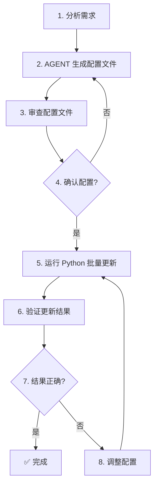

# 批量更新 CSV 测试数据工作流

## 📋 工作流程



## 🎯 核心优势

### 传统方式 vs 配置驱动方式

| 对比项 | 逐行修改 | 配置驱动 |
|--------|---------|---------|
| AGENT 调用次数 | N 次（每行一次） | 1 次（生成配置） |
| 文件 I/O 次数 | N 次 | 2 次（1 读 + 1 写） |
| 速度 | 慢 | 快 |
| 可审查性 | 差（分散在多次对话） | 好（集中在一个配置文件） |
| 可回滚性 | 差 | 好（保留配置文件） |
| 错误风险 | 高 | 低 |

## 📝 使用步骤

### 步骤 1：AGENT 生成配置文件

**用户指令示例：**
```
请为以下 user_id 生成新的 history 值，要求：
- 模拟真实人类说话
- 20% 概率穿插 ASR 异常特征（填充词、<unk>、<sil>、重复表达）
- 保持原有的意图和情绪

需要更新的 user_id：
- test_user_001: 查询天气
- test_user_002: 查询餐厅
- test_user_003: 打招呼

请生成 update_config.json 配置文件
```

**AGENT 输出示例：**
```json
{
  "description": "批量更新 CSV 文件的 history 字段配置",
  "version": "1.0",
  "updates": {
    "test_user_001": "[{\"role\":\"user\",\"text\":\"呃...呃...今天北京天气怎么样<unk>天气怎么样\"}]",
    "test_user_002": "[{\"role\":\"user\",\"text\":\"嗯...那个...帮我查一下附近的餐厅<sil>附近的餐厅\"}]",
    "test_user_003": "[{\"role\":\"user\",\"text\":\"你好呀<unk>你好呀\"}]"
  }
}
```

### 步骤 2：审查配置文件

用户可以手动审查 `update_config.json` 文件，确认：
- JSON 格式正确
- history 值符合要求
- 转义正确（双引号已转义为 `\"`）

### 步骤 3：运行批量更新脚本

```powershell
cd e:\AI测试用例\接口测试
python batch_update_csv.py
```

脚本会：
- 读取 `update_config.json`
- 读取 CSV 文件
- 批量更新指定的 user_id
- 写回 CSV 文件

### 步骤 4：验证更新结果

```powershell
# 查看更新后的记录
Get-Content data\intent_recognition_test_data_v2.csv | Select-String -Pattern "test_user_001|test_user_002|test_user_003"
```

## 🔧 高级用法

### 分批更新

如果需要更新大量记录，可以分批进行：

**批次 1：**
```json
{
  "batch": 1,
  "total_batches": 5,
  "updates": {
    "test_user_001": "...",
    "test_user_002": "...",
    ...
    "test_user_020": "..."
  }
}
```

**批次 2：**
```json
{
  "batch": 2,
  "total_batches": 5,
  "updates": {
    "test_user_021": "...",
    ...
    "test_user_040": "..."
  }
}
```

### 增量更新

只更新需要修改的记录，不需要配置所有记录：

```json
{
  "updates": {
    "test_user_001": "...",  // 只修改这一条
    "test_user_050": "..."   // 只修改这一条
  }
}
```

### 备份原文件

在更新前自动备份：

```python
import shutil
from datetime import datetime

backup_path = csv_path.replace('.csv', f'_backup_{datetime.now().strftime("%Y%m%d_%H%M%S")}.csv')
shutil.copy2(csv_path, backup_path)
print(f'已备份到: {backup_path}')
```

## 📊 性能对比

假设更新 100 条记录：

| 方式 | AGENT 调用 | 文件 I/O | 耗时 |
|------|-----------|---------|------|
| 逐行修改 | 100 次 | 200 次 | ~10 分钟 |
| 配置驱动 | 1 次 | 2 次 | ~10 秒 |

**速度提升：约 60 倍**

## 🎨 最佳实践

1. **小步快跑**：每次更新 10-20 条记录，避免一次性更新过多
2. **版本控制**：为配置文件添加版本号，便于追溯
3. **自动备份**：更新前自动备份原文件
4. **验证机制**：更新后自动验证结果
5. **日志记录**：记录每次更新的详细信息

## 🚀 扩展功能

可以根据需求扩展脚本功能：

- 支持多个字段同时更新
- 支持条件更新（如：只更新某个意图的记录）
- 支持批量删除
- 支持批量插入
- 生成更新报告
- 自动化测试验证
