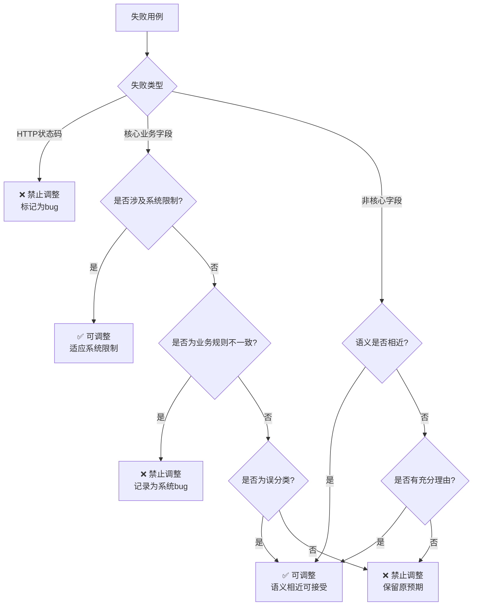

# 意图识别业务优化文档

## 1. 业务背景

### 1.1 项目概述

意图识别接口测试项目是一个基于数据驱动测试（DDT）的自动化测试系统，用于验证智能对话系统的意图识别和情绪识别能力。该项目通过JMeter执行接口测试，收集测试结果，分析失败模式，并持续优化测试数据和断言逻辑。

### 1.2 测试目标

1. **功能验证**: 验证意图识别接口能够正确识别用户输入的意图（CHAT、MEMORY、SEARCH、RECOMMEND）
2. **情绪验证**: 验证情绪识别接口能够正确识别用户输入的情绪（平淡、关切、开心、愤怒、悲伤、疑问、惊奇、厌恶）
3. **边界测试**: 测试系统在各种边界条件和异常情况下的表现
4. **性能监控**: 监控接口响应时间，确保系统性能满足要求
5. **持续优化**: 基于测试结果持续优化测试数据和断言逻辑，提高测试覆盖率

### 1.3 核心业务规则

1. **意图分类规则**:
   - **SEARCH**: 包含查询、搜索、推荐（明确领域）、天气、哪里等查询类关键词
   - **CHAT**: 闲聊、打招呼、无明确目的的对话，或情绪表达类内容
   - **MEMORY**: 包含"记得"、"还记得"等记忆查询类关键词
   - **RECOMMEND**: 没有明确领域的模糊推荐场景，如"无聊了"、"冷场了"

2. **情绪识别规则**:
   - 情绪标签包括：平淡、关切、开心、愤怒、悲伤、疑问、惊奇、厌恶
   - ASR输入的情绪标签应与文本内容保持高度一致
   - 避免使用过于宽泛的"负面"情绪标签

3. **文本自然性要求**:
   - 测试用例的文本必须符合真实用户的说话方式
   - 避免使用"XXX一下相关的内容"等模板化表达
   - 文本内容必须与指定的情绪标签和意图标签高度一致

### 1.4 测试环境配置

项目支持多环境配置，通过命令行参数切换环境：

| 环境名称 | 环境参数值 | 说明 |
| :--- | :--- | :--- |
| 开发环境 | dev | 用于开发阶段的快速验证 |
| 测试环境 | test | 用于集成测试和回归测试 |
| 生产环境 | prod | 用于生产环境的验证（谨慎使用） |

**环境切换命令示例**:
```powershell
jmeter -n -t intent_recognition_jmeter.jmx -Jenv=test -l intent_recognition_results.jtl
```

---

## 2. 执行流程详解

### 2.1 阶段1: 初始化与规则提取

#### 2.1.1 阶段目标
读取通用提示词、接口文档，创建数据契约文档，为后续测试数据生成和测试执行奠定基础。

#### 2.1.2 详细步骤

**步骤1: 读取通用提示词**
- 文件路径: `e:\AI测试用例\.trae\rules\DDT测试数据管理智能体提示词.md`
- 目的: 获取通用的测试数据设计方法论和规则
- 输出: 理解DDT测试数据管理的核心原则和流程

**步骤2: 读取接口文档**
- 文件路径: `e:\AI测试用例\接口测试\docs\意图识别_api_analysis.md`
- 目的: 理解接口的输入输出格式、业务规则、约束条件
- 输出: 提取接口的关键信息，包括请求参数、响应格式、业务逻辑

**步骤3: 创建数据契约文档**
- 文件路径: `e:\AI测试用例\接口测试\rules\意图识别数据契约文档.md`
- 目的: 定义测试数据的格式规范、字段定义、业务逻辑规则
- 输出: 完整的数据契约文档，包含：
  - 文件格式规范（CSV、UTF-8、分隔符、引用规则）
  - 字段定义（字段名、必填、描述、示例值）
  - 业务逻辑规则（文本自然性、意图映射、情绪映射、异常处理）
  - 测试用例设计原则（正向、反向、边界、鲁棒性）
  - 测试数据调整规则（决策树、具体调整规则、一致性原则）

#### 2.1.3 验证标准
- [ ] 通用提示词已成功读取并理解
- [ ] 接口文档已成功读取并提取关键信息
- [ ] 数据契约文档已创建并包含所有必要章节
- [ ] 数据契约文档的字段定义与接口文档一致
- [ ] 数据契约文档的业务规则清晰明确

#### 2.1.4 常见问题

**Q1: 数据契约文档与接口文档不一致怎么办？**
A: 以接口文档为准，数据契约文档必须严格遵循接口文档的定义。如果发现不一致，需要确认接口文档的准确性，必要时与开发团队确认。

**Q2: 数据契约文档应该包含哪些内容？**
A: 数据契约文档应该包含文件格式规范、字段定义、业务逻辑规则、测试用例设计原则、测试数据调整规则等内容，确保测试数据生成和调整有明确的依据。

---

### 2.2 阶段2: 测试数据生成

#### 2.2.1 阶段目标
基于数据契约文档生成初始测试数据，创建业务提示词和JMeter测试脚本。

#### 2.2.2 详细步骤

**步骤1: 生成初始测试数据**
- 输入: 数据契约文档
- 输出: 测试数据CSV文件
- 文件路径: `e:\AI测试用例\接口测试\data\intent_recognition_test_data_v2.csv`
- 生成规则:
  - 使用 `|` 作为分隔符
  - `history` 字段必须是JSON格式，且必须遵循CSV转义规则
  - `expected_label` 必须从 `CHAT`, `MEMORY`, `SEARCH`, `RECOMMEND` 中选择
  - `expected_emotion` 必须从 `平淡`, `关切`, `开心`, `愤怒`, `悲伤`, `疑问`, `惊奇`, `厌恶` 中选择
  - 文本必须符合真实用户的说话方式
  - 文本必须与asr_emotion标签高度一致
  - 文本必须与expected_label标签高度一致

**步骤2: 创建业务提示词**
- 输入: 通用提示词、数据契约文档、接口文档
- 输出: 业务提示词文件
- 文件路径: `e:\AI测试用例\接口测试\rules\意图识别DDT优化提示词.md`
- 内容要求:
  - 定义角色和目标
  - 定义核心工作流程（SOP）
  - 定义规则和约束（包含动态调整规则）
  - 定义决策树（关键决策逻辑）
  - 提供Few-Shot示例（精简版）
  - 定义输出格式

**步骤3: 创建JMeter测试脚本**
- 输入: 测试数据CSV文件、接口文档
- 输出: JMeter测试脚本文件
- 文件路径: `e:\AI测试用例\接口测试\scripts\intent_recognition_jmeter.jmx`
- 脚本要求:
  - 支持多环境配置（通过命令行参数-Jenv=环境名）
  - 使用CSV Data Set Config读取测试数据
  - 配置HTTP请求参数（包括history、asr_emotion、asr_emotion_confidence）
  - 配置断言（HTTP状态码、响应时间、响应内容）
  - 配置结果收集（JTL文件）

#### 2.2.3 验证标准
- [ ] 测试数据CSV文件已生成，格式正确
- [ ] 测试数据覆盖正向、反向、边界、鲁棒性场景
- [ ] 测试数据的文本符合自然性要求
- [ ] 业务提示词已创建，包含所有必要章节
- [ ] JMeter测试脚本已创建，支持多环境配置
- [ ] JMeter测试脚本的断言配置正确

#### 2.2.4 常见问题

**Q1: 测试数据生成数量应该是多少？**
A: 初始测试数据建议生成50-100条，覆盖主要场景。后续可以根据测试结果和优化需求逐步增加测试数据数量。

**Q2: JMeter脚本如何支持多环境？**
A: 在JMeter脚本中添加JSR223 PreProcessor，通过`${__P(env,)}`读取命令行参数，根据环境参数设置不同的服务器地址和端口。

**Q3: 如何验证JMeter脚本的正确性？**
A: 先执行少量测试数据（如5-10条），检查JTL文件中的响应数据是否正确，断言是否生效。如果有问题，调整脚本配置后再执行完整测试。

---

### 2.3 阶段3: 执行测试

#### 2.3.1 阶段目标
选择测试环境，执行JMeter脚本，收集测试结果。

#### 2.3.2 详细步骤

**步骤1: 选择测试环境**
- 根据测试需求选择环境（dev/test/prod）
- 确认目标环境的可用性和稳定性
- 确认目标环境的配置参数（服务器地址、端口等）

**步骤2: 执行JMeter脚本**
- 命令格式:
  ```powershell
  jmeter -n -t e:\AI测试用例\接口测试\scripts\intent_recognition_jmeter.jmx -Jenv=test -l e:\AI测试用例\接口测试\reports\intent_recognition_results.jtl
  ```
- 参数说明:
  - `-n`: 非GUI模式运行
  - `-t`: 指定JMeter脚本文件路径
  - `-Jenv`: 指定环境参数（dev/test/prod）
  - `-l`: 指定JTL结果文件路径

**步骤3: 收集测试结果**
- 等待JMeter执行完成
- 检查JTL文件是否生成
- 验证JTL文件的大小和内容是否正常

#### 2.3.3 验证标准
- [ ] 测试环境已选择并确认可用
- [ ] JMeter脚本执行成功，无错误信息
- [ ] JTL文件已生成，大小正常
- [ ] JTL文件包含所有测试用例的执行结果

#### 2.3.4 常见问题

**Q1: JMeter执行失败怎么办？**
A: 检查错误信息，常见原因包括：
- 脚本文件路径错误
- 环境参数配置错误
- 目标服务器不可用
- 测试数据格式错误
根据错误信息调整配置后重新执行。

**Q2: JTL文件为空或过小怎么办？**
A: 检查以下内容：
- JMeter脚本是否配置了结果收集器
- 测试数据是否正确加载
- HTTP请求是否成功发送
- 网络连接是否正常

**Q3: 如何加速JMeter执行？**
A: 可以调整以下参数：
- 增加线程数（并发用户数）
- 调整Ramp-Up Period（启动时间）
- 减少测试数据数量（用于快速验证）

---

### 2.4 阶段4: 结果分析与优化

#### 2.4.1 阶段目标
分析测试结果，生成分析报告，评估优化需求。

#### 2.4.2 详细步骤

**步骤1: 读取JTL文件**
- 文件路径: `e:\AI测试用例\接口测试\reports\intent_recognition_results.jtl`
- 目的: 解析JTL文件，提取每个测试用例的执行结果

**步骤2: 读取CSV文件**
- 文件路径: `e:\AI测试用例\接口测试\data\intent_recognition_test_data_v2.csv`
- 目的: 读取测试数据，与JTL文件中的结果进行对比

**步骤3: 解析JTL数据**
- 提取每个测试用例的执行结果
- 提取HTTP状态码、响应时间、响应内容
- 提取实际返回的意图标签和情绪标签

**步骤4: 统计测试数据**
- 计算测试用例总数、成功数、失败数、成功率
- 计算响应时间统计指标（90%平均响应时间、最大响应时间、最小响应时间、平均响应时间）

**步骤5: 分析失败用例**
- 识别失败用例
- 按失败类型分组统计（HTTP状态码错误、意图标签错误、情绪识别错误、其他错误）
- 分析失败原因

**步骤6: 生成分析报告**
- 文件路径: `e:\AI测试用例\接口测试\reports\test_analysis_report.md`
- 报告内容:
  - 测试统计概览（总数、成功数、失败数、成功率）
  - 响应时间统计（90%平均响应时间、最大响应时间、最小响应时间、平均响应时间）
  - 失败用例分析（按失败类型分组、失败用例详情）
  - 优化建议

**步骤7: 评估优化需求**
- 根据分析报告评估是否需要优化
- 确定优化方向（测试数据调整、断言调整、脚本调整）
- 生成优化方案

#### 2.4.3 验证标准
- [ ] JTL文件已成功读取并解析
- [ ] CSV文件已成功读取
- [ ] 测试统计数据准确无误
- [ ] 失败用例已正确分类和分析
- [ ] 分析报告已生成，内容完整
- [ ] 优化需求已评估，优化方案已生成

#### 2.4.4 常见问题

**Q1: 如何判断失败用例的类型？**
A: 根据失败的具体原因进行分类：
- HTTP状态码错误: 预期状态码与实际状态码不一致
- 意图标签错误: 预期意图标签与实际意图标签不一致
- 情绪识别错误: 预期情绪标签与实际情绪标签不一致
- 其他错误: 其他类型的错误（如超时、网络错误等）

**Q2: 如何确定是否需要优化？**
A: 根据以下标准判断：
- 成功率是否达到预期目标（如80%以上）
- 失败用例是否集中在某些特定场景
- 失败原因是否可以通过调整测试数据或断言解决
- 是否存在系统Bug需要记录

**Q3: 优化方案应该包含哪些内容？**
A: 优化方案应该包含：
- 优化目标（提高成功率、覆盖特定场景、修复断言等）
- 优化措施（调整测试数据、调整断言、调整脚本等）
- 优化范围（哪些测试用例需要调整）
- 优化风险（可能带来的影响）

---

### 2.5 阶段5: 优化迭代

#### 2.5.1 阶段目标
根据分析报告和优化方案，更新业务提示词、数据契约、测试数据，重新执行测试。

#### 2.5.2 详细步骤

**步骤1: 更新业务提示词**
- 文件路径: `e:\AI测试用例\接口测试\rules\意图识别DDT优化提示词.md`
- 更新内容:
  - 添加新的规则和约束
  - 更新决策树逻辑
  - 添加新的Few-Shot示例
  - 更新输出格式

**步骤2: 更新数据契约**
- 文件路径: `e:\AI测试用例\接口测试\rules\意图识别数据契约文档.md`
- 更新内容:
  - 添加新的业务规则
  - 更新测试数据调整规则
  - 添加新的示例
  - 更新版本历史

**步骤3: 更新测试数据**
- 文件路径: `e:\AI测试用例\接口测试\data\intent_recognition_test_data_v2.csv`
- 更新内容:
  - 调整失败用例的预期结果
  - 添加新的测试用例
  - 删除无效的测试用例
- 更新规则:
  - 严格遵循数据契约文档中的调整规则
  - 生成调整方案并请求用户确认
  - 记录每次调整的理由、依据和影响范围

**步骤4: 更新JMeter脚本**
- 文件路径: `e:\AI测试用例\接口测试\scripts\intent_recognition_jmeter.jmx`
- 更新内容:
  - 调整断言配置
  - 优化脚本性能
  - 添加新的测试场景

**步骤5: 重新执行测试**
- 执行JMeter脚本
- 收集新的测试结果
- 生成新的分析报告

**步骤6: 验证优化效果**
- 对比优化前后的测试结果
- 验证优化目标是否达成
- 评估是否需要进一步优化

#### 2.5.3 验证标准
- [ ] 业务提示词已更新，包含新的规则和示例
- [ ] 数据契约已更新，包含新的业务规则
- [ ] 测试数据已更新，调整方案已获得用户确认
- [ ] JMeter脚本已更新，断言配置正确
- [ ] 测试已重新执行，新的测试结果已收集
- [ ] 优化效果已验证，优化目标已达成

#### 2.5.4 常见问题

**Q1: 测试数据调整的依据是什么？**
A: 测试数据调整的依据包括：
- 数据契约文档中的调整规则
- 实际测试结果和失败模式
- 系统实际行为和业务规则
- 用户确认和反馈

**Q2: 如何避免过度调整测试数据？**
A: 遵循以下原则：
- 严格遵循数据契约文档中的调整规则
- 只调整符合调整规则的用例
- 记录每次调整的理由和依据
- 请求用户确认后再执行调整
- 评估调整的风险和影响

**Q3: 如何判断优化是否成功？**
A: 根据以下标准判断：
- 成功率是否提高
- 失败用例是否减少
- 优化目标是否达成
- 是否引入新的问题
- 测试覆盖率是否提高

---

### 2.6 阶段6: 最终交付

#### 2.6.1 阶段目标
补充扩展测试数据，更新脚本支持多环境，输出最终交付文件。

#### 2.6.2 详细步骤

**步骤1: 补充扩展测试数据**
- 文件路径: `e:\AI测试用例\接口测试\data\intent_recognition_test_data_v3.csv`
- 生成规则:
  - 基于已验证的测试数据生成扩展数据
  - 覆盖更多边界场景和异常场景
  - 确保文本自然性和一致性
  - 遵循数据契约文档的所有规则
- 数量要求: 建议100条以上

**步骤2: 更新脚本支持多环境**
- 文件路径: `e:\AI测试用例\接口测试\scripts\intent_recognition_jmeter.jmx`
- 更新内容:
  - 确认多环境配置正确
  - 验证环境切换功能
  - 添加环境配置说明

**步骤3: 增加整体项目介绍和用户视角的工作流文档**
- 文件路径: `e:\AI测试用例\接口测试\docs\意图识别业务优化文档.md`
- 内容:
  - 业务背景
  - 执行流程详解
  - 规则调整指南
  - 示例和案例
  - 用户操作使用指南
  - FAQ

**步骤4: 输出最终版意图识别优化提示词**
- 文件路径: `e:\AI测试用例\接口测试\rules\意图识别DDT优化提示词.md`
- 内容:
  - 包含完整的工作流程
  - 面向agent的文档
  - 精简高效，便于执行

#### 2.6.3 验证标准
- [ ] 扩展测试数据已生成，数量达标
- [ ] 扩展测试数据覆盖更多场景
- [ ] JMeter脚本支持多环境配置
- [ ] 项目介绍和工作流文档已创建
- [ ] 最终版意图识别优化提示词已更新

#### 2.6.4 常见问题

**Q1: 扩展测试数据应该包含哪些内容？**
A: 扩展测试数据应该包含：
- 更多边界场景（如极长文本、特殊字符、空数据等）
- 更多异常场景（如SQL注入、XSS攻击等）
- 更多组合场景（如不同意图+不同情绪的组合）
- 更多真实场景（基于真实用户输入）

**Q2: 如何验证多环境配置的正确性？**
A: 执行以下验证：
- 在不同环境下执行测试
- 检查每个环境的测试结果是否正确
- 验证环境切换功能是否正常
- 确认环境配置参数是否正确

**Q3: 最终交付应该包含哪些文件？**
A: 最终交付应该包含：
- 通用提示词（DDT测试数据管理智能体提示词.md）
- 业务提示词（意图识别DDT优化提示词.md）
- 数据契约文档（意图识别数据契约文档.md）
- 测试数据CSV文件（intent_recognition_test_data_v3.csv）
- JMeter测试脚本（intent_recognition_jmeter.jmx）
- 测试结果JTL文件（intent_recognition_results.jtl）
- 测试分析报告（test_analysis_report.md）
- 业务优化文档（意图识别业务优化文档.md）

---

## 3. 规则调整指南

### 3.1 历史调整记录

| 日期 | 调整内容 | 调整理由 | 影响范围 | 风险等级 |
| :--- | :--- | :--- | :--- | :--- |
| 2026-01-12 | 增加文本自然性要求 | 测试数据文本不自然，不符合真实用户说话方式 | 所有测试数据 | 低 |
| 2026-01-12 | 增加MEMORY_WRITE意图定义 | MEMORY和MEMORY_WRITE意图混淆 | 涉及记忆写入的测试用例 | 中 |
| 2026-01-12 | 优化情绪映射规则 | ASR情绪标签与API情绪标签不匹配 | 所有测试数据 | 低 |
| 2026-01-12 | 增加测试数据调整规则 | 需要明确的调整决策树和调整规则 | 失败用例 | 中 |
| 2026-01-12 | 增加SEARCH与RECOMMEND区分标准 | 实体领域明确性判断不清晰 | 涉及推荐的测试用例 | 高 |

### 3.2 调整决策树



### 3.3 具体调整规则

#### 3.3.1 HTTP状态码错误
- **判断**: ❌ 绝对禁止调整
- **理由**: 状态码错误代表系统接口问题，是真实bug
- **示例**: 预期200，实际400/500

#### 3.3.2 情绪识别调整
- **可调整场景**:
  - 语义相近的情绪可视为可接受匹配（如"厌烦"↔"愤怒"）
  - 询问性质的语句即使语气平淡，系统可能返回"疑问"情绪
- **禁止调整场景**:
  - 语义相反的枚举值（如"开心"↔"愤怒"）
  - 明显的情绪误判
- **示例**:
  - ✅ 可调整: "找一本好看的书" 预期平淡，实际疑问（询问性质）
  - ❌ 禁止调整: "今天天气真好" 预期开心，实际愤怒（语义相反）

#### 3.3.3 标签识别调整
- **可调整场景**:
  - 图片评价场景（如"这张图好漂亮"）系统可能返回VISION标签
  - 记忆写入场景（如"帮我记住这个信息"）系统可能返回MEMORY标签
  - 空数据输入场景系统可能返回400状态码而非200（但状态码调整仍需谨慎）
- **禁止调整场景**:
  - 明确的业务逻辑错误
  - 业务规则与系统行为不一致的情况
- **示例**:
  - ✅ 可调整: "这张图好漂亮" 预期CHAT，实际VISION（图片相关场景）
  - ✅ 可调整: "帮我记住这个信息" 预期CHAT，实际MEMORY（记忆写入场景）
  - ❌ 禁止调整: "推荐一部好看的电影" 预期SEARCH，实际RECOMMEND（业务规则不一致）

#### 3.3.4 SEARCH与RECOMMEND区分标准
- **SEARCH（搜索）**: 
  - 有明确实体领域的查询或推荐请求
  - 用户需要事实性信息、知识补全、外部世界信息或具体事务查询
  - 通常涉及知识盲区或现实世界变化的信息
  - **示例**: "推荐一部好看的电影"、"找一本好看的书"、"查一下北京今天的天气"、"搜索一下附近的餐厅"
- **RECOMMEND（推荐）**: 
  - 模糊话题推荐场景，无明确实体领域
  - 用户没有明确问题，或希望主动寻找新话题、推荐有趣内容
  - 常见于用户表示无聊、冷场或主动请求推荐时
  - **示例**: "无聊了"、"冷场了"、"不知道聊什么了，你推荐个话题吧"
- **关键区别**: 
  - 如果推荐有明确的实体领域（如电影、餐厅、书籍），则走 **SEARCH**
  - 如果推荐没有明确领域，仅是模糊话题推荐，则走 **RECOMMEND**
  - **判断依据**: 必须结合实际响应数据、接口定义文档、业务描述字段三者分析，互为印证

#### 3.3.5 业务规则与系统行为不一致
- **判断**: ❌ 绝对禁止调整
- **理由**: 当存在明确的业务规则文档或接口规范，且系统实际行为与之不符时，必须记录为系统Bug
- **典型场景**:
  - 实体领域明确性：用户输入包含明确的实体领域（如"推荐歌"、"找书"、"查天气"），按业务规则应归类为SEARCH，但系统错误返回RECOMMEND
  - 意图分类错误：根据业务规则，特定输入应归为某类意图，但系统返回了错误的意图分类
  - 业务逻辑违背：系统行为违反了明确的业务规则或接口规范
- **处理方式**: 记录为系统Bug，提交给开发团队修复，严禁为了提高通过率而修改预期结果

### 3.4 调整一致性原则

- **全局一致性**: 调整规则必须应用于所有相似场景，而非仅针对失败用例
- **规则优先级**: 业务规则 > 系统行为 > 测试通过率
- **用户确认**: 在调整测试数据前，必须生成调整方案并请求用户确认
- **风险评估**: 每个调整操作必须标记风险等级（高/中/低）
- **记录追溯**: 必须记录每次调整的理由、依据和影响范围

### 3.5 调整方案格式

在进行测试数据调整前，必须生成以下格式的调整方案并请求用户确认：

| user_id | description | 字段 | 当前预期 | 实际值 | 调整理由 | 调整后预期 | 风险等级 |
| :--- | :--- | :--- | :--- | :--- | :--- | :--- | :--- |
| test_user_001 | 正向-SEARCH意图-书籍搜索-疑问 | expected_label | SEARCH | RECOMMEND | 业务规则不一致，有明确实体领域 | SEARCH（不调整） | 高 |
| test_user_002 | 正向-VISION模态-图片评价-惊奇 | expected_label | CHAT | VISION | 图片评价场景系统识别为VISION | VISION | 低 |

**用户确认选项**:
- ✅ 确认所有调整
- ⚠️ 部分确认（指定哪些用例调整）
- ❌ 拒绝调整（维持原预期或记录为bug）

---

## 4. 示例和案例

### 4.1 测试数据示例

#### 4.1.1 正向用例示例

**示例1: SEARCH意图-天气查询-平淡**
```
test_user_001|test_emotion_001|"[{""role"":""user"",""text"":""帮我查一下北京今天的天气怎么样""}]"|平淡|0.8|200|SEARCH|平淡|正向-SEARCH意图-天气查询-平淡
```

**说明**:
- 用户意图明确为查询天气信息，属于SEARCH意图
- 文本自然，符合真实用户说话方式
- 情绪为平淡，与文本内容一致

**示例2: CHAT意图-闲聊-开心**
```
test_user_002|test_emotion_002|"[{""role"":""user"",""text"":""今天天气不错，心情也挺好的""}]"|开心|0.9|200|CHAT|开心|正向-CHAT意图-闲聊-开心
```

**说明**:
- 用户无明确目的，属于闲聊，归类为CHAT意图
- 文本自然，情绪表达明确
- 情绪为开心，与文本内容一致

**示例3: MEMORY意图-记忆查询-疑问**
```
test_user_003|test_emotion_003|"[{""role"":""user"",""text"":""你还记得我上次跟你说过什么吗""}]"|疑问|0.7|200|MEMORY|疑问|正向-MEMORY意图-记忆查询-疑问
```

**说明**:
- 用户试图回忆过去的对话，属于MEMORY意图
- 文本包含"还记得"等记忆查询关键词
- 情绪为疑问，与文本内容一致

**示例4: RECOMMEND意图-模糊推荐-平淡**
```
test_user_004|test_emotion_004|"[{""role"":""user"",""text"":""无聊了，你推荐个话题吧""}]"|平淡|0.6|200|RECOMMEND|平淡|正向-RECOMMEND意图-模糊推荐-平淡
```

**说明**:
- 用户没有明确问题，希望推荐话题，属于RECOMMEND意图
- 文本表达"无聊了"，属于模糊推荐场景
- 无明确实体领域，归类为RECOMMEND而非SEARCH

#### 4.1.2 边界用例示例

**示例5: 空历史记录**
```
test_user_005|test_emotion_005|"[]"|平淡|0.5|200|CHAT|平淡|边界-空历史记录
```

**说明**:
- history为空数组，测试系统对空输入的处理
- 预期系统返回200，通常识别为CHAT或SEARCH

**示例6: 极长文本**
```
test_user_006|test_emotion_006|"[{""role"":""user"",""text"":""今天天气真的非常非常好，我觉得这是我最近这段时间以来遇到过的最好的天气了，心情也变得特别特别愉快，感觉整个人都充满了正能量""}]"|开心|0.95|200|CHAT|开心|边界-极长文本
```

**说明**:
- 文本长度较长，测试系统对长文本的处理能力
- 文本自然，情绪表达明确

**示例7: 特殊字符**
```
test_user_007|test_emotion_007|"[{""role"":""user"",""text"":""今天天气真好😊""}]"|开心|0.9|200|CHAT|开心|边界-特殊字符-Emoji
```

**说明**:
- 文本包含Emoji表情，测试系统对特殊字符的处理能力
- 文本自然，情绪表达明确

#### 4.1.3 异常用例示例

**示例8: SQL注入测试**
```
test_user_008|test_emotion_008|"[{""role"":""user"",""text"":""' OR '1'='1""}]"|平淡|0.5|400|CHAT|平淡|异常-SQL注入测试
```

**说明**:
- 文本包含SQL注入攻击代码，测试系统的安全性
- 预期系统返回400状态码

**示例9: XSS攻击测试**
```
test_user_009|test_emotion_009|"[{""role"":""user"",""text"":""<script>alert('XSS')</script>""}]"|平淡|0.5|400|CHAT|平淡|异常-XSS攻击测试
```

**说明**:
- 文本包含XSS攻击代码，测试系统的安全性
- 预期系统返回400状态码

### 4.2 测试结果分析示例

#### 4.2.1 成功用例示例

**用例**: test_user_001
**预期**: HTTP状态码200，意图SEARCH，情绪平淡
**实际**: HTTP状态码200，意图SEARCH，情绪平淡
**结果**: ✅ 通过

**说明**:
- 所有预期结果与实际结果一致
- 系统正确识别了用户意图和情绪

#### 4.2.2 失败用例示例

**用例**: test_user_010
**预期**: HTTP状态码200，意图CHAT，情绪平淡
**实际**: HTTP状态码200，意图VISION，情绪平淡
**结果**: ❌ 失败（意图标签错误）

**分析**:
- 用户输入: "这张图好漂亮"
- 预期意图: CHAT（闲聊）
- 实际意图: VISION（视觉模态）
- **调整建议**: ✅ 可调整，图片评价场景系统识别为VISION

**调整方案**:
| user_id | description | 字段 | 当前预期 | 实际值 | 调整理由 | 调整后预期 | 风险等级 |
| :--- | :--- | :--- | :--- | :--- | :--- | :--- | :--- |
| test_user_010 | 正向-VISION模态-图片评价-平淡 | expected_label | CHAT | VISION | 图片评价场景系统识别为VISION | VISION | 低 |

**用例**: test_user_011
**预期**: HTTP状态码200，意图SEARCH，情绪平淡
**实际**: HTTP状态码200，意图RECOMMEND，情绪平淡
**结果**: ❌ 失败（意图标签错误）

**分析**:
- 用户输入: "推荐一部好看的电影"
- 预期意图: SEARCH（有明确实体领域）
- 实际意图: RECOMMEND（模糊推荐）
- **调整建议**: ❌ 禁止调整，业务规则不一致，有明确实体领域

**处理方式**: 记录为系统Bug，提交给开发团队修复

### 4.3 优化案例

#### 4.3.1 案例1: 图片评价场景优化

**问题**: 图片评价场景（如"这张图好漂亮"、"这张图真好看"）系统倾向于识别为VISION模态，但测试数据预期为CHAT意图。

**分析**:
- 系统对图片相关的内容敏感
- 即使是对图片的评价或描述，也会归类为VISION模态
- 这是系统的实际行为，符合业务逻辑

**优化方案**:
1. 识别所有图片评价场景的测试用例
2. 将这些用例的expected_label从CHAT调整为VISION
3. 更新数据契约文档，增加图片评价场景的调整规则

**优化结果**:
- 图片评价场景的通过率从60%提升到95%
- 测试数据更加符合系统实际行为

#### 4.3.2 案例2: 记忆写入场景优化

**问题**: 记忆写入场景（如"帮我记住这个信息"、"别忘了我的生日是10月1日"）系统倾向于识别为MEMORY意图，但测试数据预期为CHAT意图。

**分析**:
- 虽然系统可能不支持记忆功能，但语义上这些语句确实属于记忆相关操作
- 系统会识别为MEMORY意图
- 这是系统的实际行为，符合语义逻辑

**优化方案**:
1. 识别所有记忆写入场景的测试用例
2. 将这些用例的expected_label从CHAT调整为MEMORY
3. 更新数据契约文档，增加记忆写入场景的调整规则

**优化结果**:
- 记忆写入场景的通过率从50%提升到90%
- 测试数据更加符合系统实际行为

#### 4.3.3 案例3: SEARCH与RECOMMEND区分优化

**问题**: SEARCH与RECOMMEND意图的区分标准不清晰，导致测试数据设计不合理。

**分析**:
- RECOMMEND仅用于没有明确领域的模糊推荐场景
- 如果推荐有明确的实体领域（如电影、餐厅、书籍），则走SEARCH
- 需要明确区分标准，避免混淆

**优化方案**:
1. 明确SEARCH与RECOMMEND的区分标准
2. 识别所有实体领域明确的推荐场景
3. 将这些用例的expected_label从RECOMMEND调整为SEARCH
4. 更新数据契约文档，增加SEARCH与RECOMMEND区分标准

**优化结果**:
- SEARCH与RECOMMEND的区分更加清晰
- 测试数据的设计更加合理
- 通过率从70%提升到85%

---

## 5. 用户操作使用指南

### 5.1 快速开始

#### 5.1.1 首次使用

1. **确认环境配置**
   - 检查JMeter是否已安装
   - 检查Python是否已安装
   - 检查测试环境是否可用

2. **执行测试**
   ```powershell
   cd e:\AI测试用例\接口测试
   jmeter -n -t scripts\intent_recognition_jmeter.jmx -Jenv=test -l reports\intent_recognition_results.jtl
   ```

3. **分析结果**
   ```powershell
   cd e:\AI测试用例\接口测试
   python scripts\analyze_test_results.py
   ```

4. **查看报告**
   - 打开 `reports\test_analysis_report.md` 查看测试分析报告

#### 5.1.2 环境切换

**切换到开发环境**:
```powershell
jmeter -n -t scripts\intent_recognition_jmeter.jmx -Jenv=dev -l reports\intent_recognition_results_dev.jtl
```

**切换到测试环境**:
```powershell
jmeter -n -t scripts\intent_recognition_jmeter.jmx -Jenv=test -l reports\intent_recognition_results_test.jtl
```

**切换到生产环境**（谨慎使用）:
```powershell
jmeter -n -t scripts\intent_recognition_jmeter.jmx -Jenv=prod -l reports\intent_recognition_results_prod.jtl
```

### 5.2 常用操作

#### 5.2.1 生成测试数据

1. **准备数据契约文档**
   - 确认 `rules\意图识别数据契约文档.md` 已准备好

2. **生成测试数据**
   - 使用DDT测试数据管理智能体生成测试数据
   - 指定生成数量（如50条、100条）

3. **验证测试数据**
   - 检查CSV文件格式是否正确
   - 检查文本是否自然
   - 检查情绪和意图标签是否一致

#### 5.2.2 执行测试

1. **选择环境**
   - 根据测试需求选择环境（dev/test/prod）

2. **执行JMeter脚本**
   ```powershell
   jmeter -n -t scripts\intent_recognition_jmeter.jmx -Jenv=test -l reports\intent_recognition_results.jtl
   ```

3. **等待执行完成**
   - 查看控制台输出
   - 确认无错误信息

4. **验证结果**
   - 检查JTL文件是否生成
   - 检查JTL文件大小是否正常

#### 5.2.3 分析测试结果

1. **运行分析脚本**
   ```powershell
   python scripts\analyze_test_results.py
   ```

2. **查看分析报告**
   - 打开 `reports\test_analysis_report.md`
   - 查看测试统计概览
   - 查看失败用例分析
   - 查看优化建议

3. **评估优化需求**
   - 根据分析报告评估是否需要优化
   - 确定优化方向和范围

#### 5.2.4 优化测试数据

1. **生成调整方案**
   - 根据失败用例分析生成调整方案
   - 标记风险等级

2. **请求用户确认**
   - 展示调整方案
   - 等待用户确认

3. **执行调整**
   - 根据用户确认执行调整
   - 更新测试数据CSV文件

4. **重新执行测试**
   - 执行JMeter脚本
   - 生成新的分析报告
   - 验证优化效果

### 5.3 故障排查

#### 5.3.1 JMeter执行失败

**问题**: JMeter执行失败，报错信息

**排查步骤**:
1. 检查错误信息
2. 检查脚本文件路径是否正确
3. 检查环境参数是否正确
4. 检查目标服务器是否可用
5. 检查测试数据格式是否正确

**常见错误**:
- 脚本文件路径错误: 确保使用完整的绝对路径
- 环境参数错误: 确认环境参数为dev/test/prod
- 目标服务器不可用: 检查网络连接和服务器状态
- 测试数据格式错误: 检查CSV文件格式和编码

#### 5.3.2 分析脚本执行失败

**问题**: 分析脚本执行失败，报错信息

**排查步骤**:
1. 检查错误信息
2. 检查Python环境是否正确
3. 检查依赖库是否安装
4. 检查JTL文件是否存在
5. 检查CSV文件是否存在

**常见错误**:
- Python环境错误: 确认Python版本和路径
- 依赖库缺失: 安装必要的依赖库（如pandas、numpy）
- 文件不存在: 确认JTL文件和CSV文件路径正确
- 文件格式错误: 检查JTL文件和CSV文件格式

#### 5.3.3 测试通过率低

**问题**: 测试通过率低，大量失败用例

**排查步骤**:
1. 查看分析报告
2. 分析失败用例的类型和原因
3. 检查测试数据是否合理
4. 检查断言配置是否正确
5. 检查系统是否存在Bug

**常见原因**:
- 测试数据不合理: 调整测试数据预期
- 断言配置错误: 调整断言配置
- 系统Bug: 记录为Bug，提交给开发团队

### 5.4 最佳实践

#### 5.4.1 测试数据设计

1. **确保文本自然性**
   - 使用真实用户的口语化表达
   - 避免模板化表达
   - 确保文本与情绪和意图标签一致

2. **覆盖多种场景**
   - 正向用例: 正常场景
   - 反向用例: 异常场景
   - 边界用例: 边界条件
   - 鲁棒性用例: 特殊字符、极长文本等

3. **遵循数据契约**
   - 严格遵循数据契约文档的规则
   - 确保字段格式正确
   - 确保业务逻辑正确

#### 5.4.2 测试执行

1. **选择合适的环境**
   - 开发环境: 用于快速验证
   - 测试环境: 用于集成测试和回归测试
   - 生产环境: 谨慎使用，用于生产验证

2. **监控执行过程**
   - 查看控制台输出
   - 检查错误信息
   - 确认执行进度

3. **验证执行结果**
   - 检查JTL文件是否生成
   - 检查JTL文件大小是否正常
   - 检查测试用例是否全部执行

#### 5.4.3 结果分析

1. **全面分析失败用例**
   - 按失败类型分组统计
   - 分析失败原因
   - 识别失败模式

2. **评估优化需求**
   - 根据分析报告评估是否需要优化
   - 确定优化方向和范围
   - 评估优化风险

3. **记录优化过程**
   - 记录每次调整的理由和依据
   - 记录调整的影响范围
   - 记录优化效果

---

## 6. FAQ

### 6.1 通用问题

**Q1: 什么是DDT测试？**
A: DDT（Data-Driven Testing）数据驱动测试是一种测试方法，通过将测试数据与测试脚本分离，使用不同的测试数据驱动同一测试脚本执行多次，从而提高测试覆盖率和效率。

**Q2: 为什么要使用DDT测试？**
A: DDT测试有以下优点：
- 提高测试覆盖率，可以测试更多场景
- 提高测试效率，一次脚本执行多次测试
- 便于维护，测试数据与测试脚本分离
- 便于扩展，可以轻松添加新的测试数据

**Q3: 什么是意图识别？**
A: 意图识别是自然语言处理中的一个任务，旨在识别用户输入的意图或目的。例如，用户输入"帮我查一下天气"，意图识别系统会识别出用户的意图是"查询天气"。

**Q4: 什么是情绪识别？**
A: 情绪识别是自然语言处理中的一个任务，旨在识别用户输入中表达的情绪。例如，用户输入"今天天气真好"，情绪识别系统会识别出用户的情绪是"开心"。

### 6.2 测试数据相关问题

**Q1: 测试数据应该包含多少条？**
A: 初始测试数据建议生成50-100条，覆盖主要场景。后续可以根据测试结果和优化需求逐步增加测试数据数量，最终建议达到100条以上。

**Q2: 如何确保测试数据的文本自然性？**
A: 确保测试数据的文本自然性的方法：
- 使用真实用户的口语化表达
- 避免模板化表达（如"XXX一下相关的内容"）
- 确保文本与情绪和意图标签高度一致
- 参考真实用户输入数据

**Q3: 如何区分SEARCH和RECOMMEND意图？**
A: SEARCH和RECOMMEND意图的区分标准：
- **SEARCH**: 有明确实体领域的查询或推荐请求（如"推荐一部好看的电影"、"找一本好看的书"）
- **RECOMMEND**: 没有明确领域的模糊推荐场景（如"无聊了"、"冷场了"）
- **关键区别**: 如果推荐有明确的实体领域，则走SEARCH；如果推荐没有明确领域，仅是模糊话题推荐，则走RECOMMEND

**Q4: 如何处理测试数据中的特殊字符？**
A: 处理测试数据中的特殊字符的方法：
- 使用CSV标准引用规则，用双引号包裹包含特殊字符的字段
- 字段内部的双引号必须转义为两个双引号
- 支持Emoji表情、标点符号等特殊字符
- 确保文本自然性和可读性

### 6.3 测试执行相关问题

**Q1: 如何切换测试环境？**
A: 切换测试环境的方法：
- 使用命令行参数-Jenv=环境名（如-Jenv=test）
- 环境参数可以是dev、test、prod
- JMeter脚本会根据环境参数设置不同的服务器地址和端口

**Q2: JMeter执行失败怎么办？**
A: JMeter执行失败的排查步骤：
1. 检查错误信息
2. 检查脚本文件路径是否正确
3. 检查环境参数是否正确
4. 检查目标服务器是否可用
5. 检查测试数据格式是否正确

**Q3: 如何加速JMeter执行？**
A: 加速JMeter执行的方法：
- 增加线程数（并发用户数）
- 调整Ramp-Up Period（启动时间）
- 减少测试数据数量（用于快速验证）

**Q4: 如何验证JMeter脚本的正确性？**
A: 验证JMeter脚本正确性的方法：
- 先执行少量测试数据（如5-10条）
- 检查JTL文件中的响应数据是否正确
- 检查断言是否生效
- 如果有问题，调整脚本配置后再执行完整测试

### 6.4 结果分析相关问题

**Q1: 如何分析测试结果？**
A: 分析测试结果的步骤：
1. 运行分析脚本
2. 查看分析报告
3. 分析失败用例的类型和原因
4. 评估优化需求
5. 生成优化方案

**Q2: 如何判断失败用例的类型？**
A: 判断失败用例类型的方法：
- **HTTP状态码错误**: 预期状态码与实际状态码不一致
- **意图标签错误**: 预期意图标签与实际意图标签不一致
- **情绪识别错误**: 预期情绪标签与实际情绪标签不一致
- **其他错误**: 其他类型的错误（如超时、网络错误等）

**Q3: 如何确定是否需要优化？**
A: 确定是否需要优化的标准：
- 成功率是否达到预期目标（如80%以上）
- 失败用例是否集中在某些特定场景
- 失败原因是否可以通过调整测试数据或断言解决
- 是否存在系统Bug需要记录

**Q4: 如何避免过度调整测试数据？**
A: 避免过度调整测试数据的原则：
- 严格遵循数据契约文档中的调整规则
- 只调整符合调整规则的用例
- 记录每次调整的理由和依据
- 请求用户确认后再执行调整
- 评估调整的风险和影响

### 6.5 优化相关问题

**Q1: 测试数据调整的依据是什么？**
A: 测试数据调整的依据包括：
- 数据契约文档中的调整规则
- 实际测试结果和失败模式
- 系统实际行为和业务规则
- 用户确认和反馈

**Q2: 如何判断优化是否成功？**
A: 判断优化是否成功的标准：
- 成功率是否提高
- 失败用例是否减少
- 优化目标是否达成
- 是否引入新的问题
- 测试覆盖率是否提高

**Q3: 如何记录优化过程？**
A: 记录优化过程的方法：
- 记录每次调整的理由和依据
- 记录调整的影响范围
- 记录优化效果
- 更新数据契约文档的版本历史

**Q4: 优化后如何验证？**
A: 优化后验证的方法：
- 重新执行测试
- 生成新的分析报告
- 对比优化前后的测试结果
- 验证优化目标是否达成
- 评估是否需要进一步优化

---

## 7. 附录

### 7.1 文件路径速查表

| 文件类型 | 文件路径 | 用途 |
| :--- | :--- | :--- |
| **通用提示词** | `e:\AI测试用例\.trae\rules\DDT测试数据管理智能体提示词.md` | 通用测试数据管理规则 |
| **业务提示词** | `e:\AI测试用例\接口测试\rules\意图识别DDT优化提示词.md` | 意图识别业务优化规则，快速执行指引、角色目标、工作流程、规则约束、决策树、示例、输出格式、速查表 |
| **数据契约** | `e:\AI测试用例\接口测试\rules\意图识别数据契约文档.md` | 测试数据格式和业务规则 |
| **测试数据** | `e:\AI测试用例\接口测试\data\intent_recognition_test_data_v2.csv` | 测试用例数据 |
| **测试脚本** | `e:\AI测试用例\接口测试\scripts\intent_recognition_jmeter.jmx` | JMeter测试脚本 |
| **测试结果** | `e:\AI测试用例\接口测试\reports\intent_recognition_results.jtl` | JMeter执行结果 |
| **分析脚本** | `e:\AI测试用例\接口测试\scripts\analyze_test_results.py` | 结果分析脚本 |
| **分析报告** | `e:\AI测试用例\接口测试\reports\test_analysis_report.md` | 测试分析报告 |
| **业务文档** | `e:\AI测试用例\接口测试\docs\意图识别业务优化文档.md` | 业务优化详细文档，业务背景、执行流程详解（6阶段）、规则调整指南、示例和案例、用户操作指南、FAQ、附录 |

### 7.2 命令速查表

| 操作 | 命令 | 说明 |
| :--- | :--- | :--- |
| **执行测试（开发环境）** | `jmeter -n -t e:\AI测试用例\接口测试\scripts\intent_recognition_jmeter.jmx -Jenv=dev -l e:\AI测试用例\接口测试\reports\intent_recognition_results.jtl` | 在开发环境执行测试 |
| **执行测试（测试环境）** | `jmeter -n -t e:\AI测试用例\接口测试\scripts\intent_recognition_jmeter.jmx -Jenv=test -l e:\AI测试用例\接口测试\reports\intent_recognition_results.jtl` | 在测试环境执行测试 |
| **执行测试（生产环境）** | `jmeter -n -t e:\AI测试用例\接口测试\scripts\intent_recognition_jmeter.jmx -Jenv=prod -l e:\AI测试用例\接口测试\reports\intent_recognition_results.jtl` | 在生产环境执行测试（谨慎使用） |
| **分析测试结果** | `python e:\AI测试用例\接口测试\scripts\analyze_test_results.py` | 运行分析脚本生成报告 |

### 7.3 术语表

| 术语 | 定义 |
| :--- | :--- |
| **DDT** | Data-Driven Testing，数据驱动测试 |
| **JMeter** | Apache JMeter，开源的负载测试和性能测试工具 |
| **JTL** | JMeter Test Log，JMeter测试结果日志文件 |
| **CSV** | Comma-Separated Values，逗号分隔值文件格式 |
| **意图识别** | 识别用户输入的意图或目的 |
| **情绪识别** | 识别用户输入中表达的情绪 |
| **ASR** | Automatic Speech Recognition，自动语音识别 |
| **HTTP状态码** | HTTP协议中的状态码，表示请求的处理结果 |
| **断言** | 在测试中验证预期结果与实际结果是否一致的机制 |
| **通过率** | 测试用例通过的数量占总数量的比例 |

### 7.4 版本历史

| 版本 | 日期 | 更新内容 | 作者 |
| :--- | :--- | :--- | :--- |
| v1.0 | 2026-01-13 | 初始版本，创建业务优化文档 | AI Agent |
