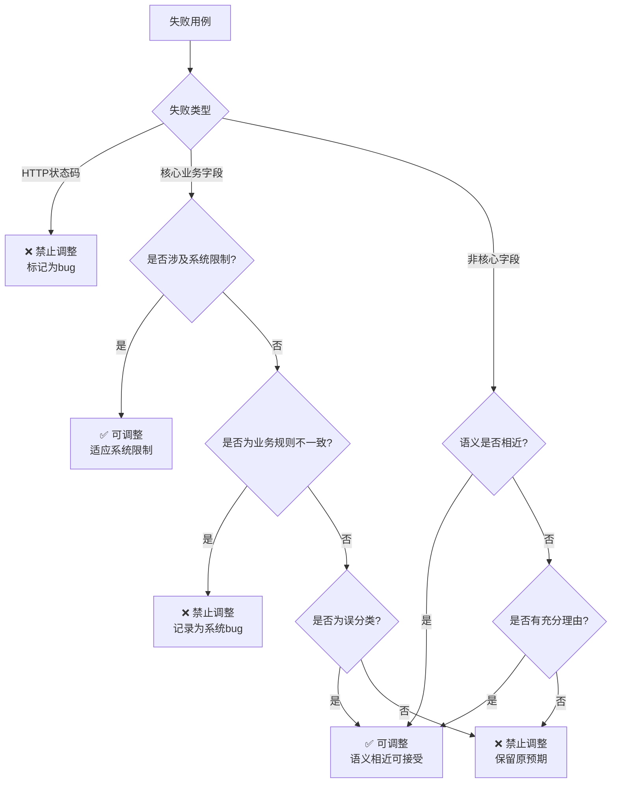

# DDT Generation Rules (Data Contract)

## 1. 文件格式规范 (Technical Contract)
*   **文件类型**: CSV
*   **编码**: UTF-8
*   **分隔符**: `|` (竖线)
*   **引用规则 (Quoting)**: **必须开启标准 CSV 引用**。
    *   任何包含特殊字符（如双引号、换行符）的字段必须用双引号 `"` 包围。
    *   字段内部的双引号必须转义为两个双引号 `""`。
    *   **示例**: JSON 字符串 `[{"role":"user"}]` 在 CSV 中应写作 `"[{{""role"":""user""}}]"`.

## 2. 字段定义 (Schema)
| 顺序 | 字段名 | 必填 | 描述 | 示例值 |
| :--- | :--- | :--- | :--- | :--- |
| 1 | `user_id` | 是 | 用户唯一标识 | `test_user_001` |
| 2 | `session_id` | 是 | 会话唯一标识 | `test_emotion_001` |
| 3 | `history` | 是 | 历史对话上下文 (JSON Array) | `"[{{""role"":""user"",""text"":""哈哈哈太好笑了""}}]"` |
| 4 | `asr_emotion` | 是 | ASR 识别的情绪标签 | `平淡`, `关切`, `开心`, `愤怒`, `悲伤`, `疑问`, `惊奇`, `厌恶` |
| 5 | `asr_emotion_confidence` | 是 | ASR 置信度 (0.0-1.0) | `0.6` |
| 6 | `expected_status` | 是 | 预期 HTTP 状态码 | `200` |
| 7 | `expected_label` | 是 | 预期意图标签 (Label) | `CHAT`, `MEMORY`, `SEARCH`, `RECOMMEND` |
| 8 | `expected_emotion` | 是 | 预期情绪标签 (Emotion) | `平淡`, `关切`, `开心`, `愤怒`, `悲伤`, `疑问`, `惊奇`, `厌恶` |
| 9 | `description` | 是 | 用例描述 | `正向-SEARCH意图-天气查询-平淡` |

## 3. 业务逻辑规则 (Business Logic)

### 3.1 文本自然性要求 (Text Naturalness)
**核心原则**: 测试用例的 `history` 字段中的文本必须符合真实用户的说话方式，避免机械化的表达。

#### 3.1.1 文本生成规则
1. **自然对话表达**: 使用真实用户的口语化表达，避免机械化、程序化的语言
2. **情绪一致性**: 文本内容必须与指定的情绪标签高度一致
3. **意图一致性**: 文本内容必须与指定的意图标签高度一致
4. **避免模板化**: 避免使用"XXX一下相关的内容"等模板化表达

#### 3.1.2 文本与情绪一致性规则
| 情绪标签 | 文本特征 | 示例 |
| :--- | :--- | :--- |
| `平淡` | 平静、客观、无明显情绪色彩 | "今天天气不错"、"你叫什么名字" |
| `开心` | 积极、愉悦、兴奋 | "太好了！我通过了考试"、"今天心情特别好" |
| `愤怒` | 愤怒、不满、抱怨 | "气死我了，怎么又出错了"、"别来烦我" |
| `悲伤` | 失望、沮丧、难过 | "唉，最近心情不太好"、"失败了，很难过" |
| `关切` | 关心、担忧、询问 | "你还好吗？"、"要注意身体哦" |
| `疑问` | 疑惑、询问、不确定 | "这是什么意思？"、"真的吗？" |
| `惊奇` | 惊讶、意外、不可思议 | "哇，真的吗？"、"太神奇了！" |
| `厌恶` | 厌恶、反感、排斥 | "太恶心了"、"真讨厌" |

#### 3.1.3 文本与意图一致性规则
| 意图标签 | 文本特征 | 示例 |
| :--- | :--- | :--- |
| `SEARCH` | 查询、搜索、询问信息 | "帮我查一下北京今天的天气"、"搜索一下附近的餐厅" |
| `CHAT` | 闲聊、打招呼、无明确目的 | "你好呀"、"今天天气不错，心情也挺好的" |
| `MEMORY` | 记忆查询、回忆 | "你记得我上次跟你说过什么吗"、"还记得我喜欢的颜色吗" |
| `RECOMMEND` | 模糊推荐、无明确领域 | "有点无聊，推荐点好玩的"、"不知道聊什么了，你推荐个话题吧" |

**注意**: 
1. **VISION** 用于判断是否需要调用摄像头或视觉能力
2. **RECOMMEND** 仅用于没有明确领域的模糊推荐场景，如果有明确实体领域（如推荐电影、餐厅），则走 **SEARCH**
3. **MEMORY** 仅用于记忆查询，不包含记忆写入操作

#### 3.1.4 文本生成示例
**错误示例（不自然）**:
```
Text: "保存一下相关的内容"
Text: "视觉一下相关的内容"
Text: "查询一下相关的内容"
```

**正确示例（自然）**:
```
Text: "帮我记一下，这个很重要"
Text: "看看这张图片里有什么"
Text: "帮我查一下北京今天的天气怎么样"
```

### 3.2 意图映射 (Intent Mapping)
根据 `history` 中最新的用户文本内容推导 `expected_label`：
*   **SEARCH**: 包含"查询"、"搜索"、"推荐"（明确领域）、"天气"、"哪里"等查询类关键词，或询问具体事实性信息、知识补全、外部世界信息。
*   **CHAT**: 闲聊、打招呼、无明确目的的对话，或情绪表达类内容。
*   **MEMORY**: 包含"记得"、"还记得"、"你记得我"等记忆查询类关键词，用户试图回忆、引用或追溯过去的对话或信息。
*   **RECOMMEND**: 用户没有明确问题，或希望主动寻找新话题、推荐有趣内容（无明确领域的模糊推荐）。

**注意**: 
1. **RECOMMEND** 仅用于没有明确领域的模糊推荐场景，例如用户表示无聊、冷场或主动请求推荐时
2. 如果推荐有明确的实体领域（如推荐一部好看的电影/动漫/餐厅），则走 **SEARCH**
3. **VISION** 是用于判断是否需要调用摄像头或视觉能力
4. 如果用户输入涉及"看现实世界"、"拍照片"、"识别图片"等，则 `expected_modality` 应为 `VISION`

#### 3.2.1 意图识别优化规则（基于实测系统行为）
**核心原则**: 基于系统实际行为，对特定场景的意图预期进行优化。

**图片相关场景的意图识别规则**：
- **规则**: 涉及图片内容、图片评价的场景，系统倾向于识别为 VISION 模态
- **适用场景**:
  - 图片评价场景（如"这张图好漂亮"、"这张图真好看"）
  - 图片内容描述场景（如"看看这张图片里有什么东西"）
- **预期调整**: 这类场景的 `expected_label` 应设置为 `VISION` 而非 `CHAT`
- **原因**: 系统对图片相关的内容敏感，即使是对图片的评价或描述，也会归类为 VISION 模态

**记忆写入场景的意图识别规则**：
- **规则**: 涉及记忆写入、生日提醒等场景，系统倾向于识别为 MEMORY 意图
- **适用场景**:
  - 记忆写入场景（如"帮我记住这个信息"、"别忘了我的生日是10月1日"）
  - 生日提醒场景（如"提醒我明天开会"）
- **预期调整**: 这类场景的 `expected_label` 应设置为 `MEMORY` 而非 `CHAT`
- **原因**: 虽然系统可能不支持记忆功能，但语义上这些语句确实属于记忆相关操作，系统会识别为 MEMORY

**示例**:
```
错误预期: 这张图好漂亮 -> Label: CHAT
正确预期: 这张图好漂亮 -> Label: VISION

错误预期: 帮我记住这个信息 -> Label: CHAT
正确预期: 帮我记住这个信息 -> Label: MEMORY

错误预期: 别忘了我的生日是10月1日 -> Label: CHAT
正确预期: 别忘了我的生日是10月1日 -> Label: MEMORY
```

### 3.3 情绪映射 (Emotion Mapping)
接口返回的情绪标签与 ASR 输入的对应关系（基于实测）：
*   `平淡` (ASR) -> `平淡` (Response)
*   `关切` (ASR) -> `关切` (Response)
*   `开心` (ASR) -> `开心` (Response)
*   `愤怒` (ASR) -> `愤怒` (Response)
*   `悲伤` (ASR) -> `悲伤` (Response)
*   `疑问` (ASR) -> `疑问` (Response)
*   `惊奇` (ASR) -> `惊奇` (Response)
*   `厌恶` (ASR) -> `厌恶` (Response)

**注意**: 
1. 接口返回的情绪标签包括：平淡、关切、开心、愤怒、悲伤、疑问、惊奇、厌恶
2. ASR输入的情绪标签应与文本内容保持高度一致
3. 避免使用过于宽泛的"负面"情绪标签，应使用更具体的情绪标签

#### 3.3.1 情绪识别优化规则（基于实测系统行为）
**核心原则**: 基于系统实际行为，对特定场景的情绪预期进行优化。

### 3.4 异常处理
*   **空历史记录**: `history` 为空数组 `[]` 时，接口目前返回 `200`，且通常识别为 `CHAT` 或 `SEARCH`（需根据实测数据调整，当前策略是预期 200）。
*   **特殊字符**: 支持Emoji表情、标点符号等特殊字符，但需确保文本自然性。
*   **超长文本**: 支持较长文本输入，但需确保文本自然性和可读性。

### 3.5 测试用例设计原则
1. **正向用例**: 设计1-2条全字段有效的"黄金路径"数据
2. **反向用例**: 针对每个必填字段设计缺失、空值、类型错误场景
3. **边界用例**: 针对数值/长度/时间字段设计边界值测试
4. **鲁棒性用例**: 设计特殊字符（Emoji、SQL注入、极长文本）及并发冲突场景
5. **自然性验证**: 所有用例的history字段中的文本必须符合真实用户的说话方式

### 3.6 测试数据调整规则
**核心原则**: 根据实际测试结果，对特定场景的预期结果进行调整以准确反映系统行为，同时确保调整的合理性和一致性。

#### 3.6.1 调整决策树


#### 3.6.2 具体调整规则

**1. HTTP状态码错误**
- **判断**: ❌ 绝对禁止调整
- **理由**: 状态码错误代表系统接口问题，是真实bug
- **示例**: 预期200，实际400/500

**2. 情绪识别调整**
- **可调整场景**:
  - 语义相近的情绪可视为可接受匹配（如"厌烦"↔"愤怒"）
  - 询问性质的语句即使语气平淡，系统可能返回"疑问"情绪
- **禁止调整场景**:
  - 语义相反的枚举值（如"开心"↔"愤怒"）
  - 明显的情绪误判
- **示例**:
  - ✅ 可调整: "找一本好看的书" 预期平淡，实际疑问（询问性质）
  - ❌ 禁止调整: "今天天气真好" 预期开心，实际愤怒（语义相反）

**3. 标签识别调整**
- **可调整场景**:
  - 图片评价场景（如"这张图好漂亮"）系统可能返回VISION标签
  - 记忆写入场景（如"帮我记住这个信息"）系统可能返回MEMORY标签
  - 空数据输入场景系统可能返回400状态码而非200（但状态码调整仍需谨慎）
- **禁止调整场景**:
  - 明确的业务逻辑错误
  - 业务规则与系统行为不一致的情况
- **示例**:
  - ✅ 可调整: "这张图好漂亮" 预期CHAT，实际VISION（图片相关场景）
  - ✅ 可调整: "帮我记住这个信息" 预期CHAT，实际MEMORY（记忆写入场景）
  - ❌ 禁止调整: "推荐一部好看的电影" 预期SEARCH，实际RECOMMEND（业务规则不一致）

**4. SEARCH与RECOMMEND区分标准**
- **SEARCH（搜索）**: 
  - 有明确实体领域的查询或推荐请求
  - 用户需要事实性信息、知识补全、外部世界信息或具体事务查询
  - 通常涉及知识盲区或现实世界变化的信息
  - **示例**: "推荐一部好看的电影"、"找一本好看的书"、"查一下北京今天的天气"、"搜索一下附近的餐厅"
- **RECOMMEND（推荐）**: 
  - 模糊话题推荐场景，无明确实体领域
  - 用户没有明确问题，或希望主动寻找新话题、推荐有趣内容
  - 常见于用户表示无聊、冷场或主动请求推荐时
  - **示例**: "无聊了"、"冷场了"、"不知道聊什么了，你推荐个话题吧"
- **关键区别**: 
  - 如果推荐有明确的实体领域（如电影、餐厅、书籍），则走 **SEARCH**
  - 如果推荐没有明确领域，仅是模糊话题推荐，则走 **RECOMMEND**
  - **判断依据**: 必须结合实际响应数据、接口定义文档、业务描述字段三者分析，互为印证

**5. 业务规则与系统行为不一致**
- **判断**: ❌ 绝对禁止调整
- **理由**: 当存在明确的业务规则文档或接口规范，且系统实际行为与之不符时，必须记录为系统Bug
- **典型场景**:
  - 实体领域明确性：用户输入包含明确的实体领域（如"推荐歌"、"找书"、"查天气"），按业务规则应归类为SEARCH，但系统错误返回RECOMMEND
  - 意图分类错误：根据业务规则，特定输入应归为某类意图，但系统返回了错误的意图分类
  - 业务逻辑违背：系统行为违反了明确的业务规则或接口规范
- **处理方式**: 记录为系统Bug，提交给开发团队修复，严禁为了提高通过率而修改预期结果

#### 3.6.3 调整一致性原则
- **全局一致性**: 调整规则必须应用于所有相似场景，而非仅针对失败用例
- **规则优先级**: 业务规则 > 系统行为 > 测试通过率
- **用户确认**: 在调整测试数据前，必须生成调整方案并请求用户确认
- **风险评估**: 每个调整操作必须标记风险等级（高/中/低）
- **记录追溯**: 必须记录每次调整的理由、依据和影响范围

#### 3.6.4 调整方案格式
在进行测试数据调整前，必须生成以下格式的调整方案并请求用户确认：

| user_id | description | 字段 | 当前预期 | 实际值 | 调整理由 | 调整后预期 | 风险等级 |
| :--- | :--- | :--- | :--- | :--- | :--- | :--- | :--- |
| test_user_001 | 正向-SEARCH意图-书籍搜索-疑问 | expected_label | SEARCH | RECOMMEND | 业务规则不一致，有明确实体领域 | SEARCH（不调整） | 高 |
| test_user_002 | 正向-VISION模态-图片评价-惊奇 | expected_label | CHAT | VISION | 图片评价场景系统识别为VISION | VISION | 低 |

**用户确认选项**:
- ✅ 确认所有调整
- ⚠️ 部分确认（指定哪些用例调整）
- ❌ 拒绝调整（维持原预期或记录为bug）

## 4. 给 DDT 智能体的指令 (Prompt)
请使用以下 Prompt 生成数据：
> "请基于 `e:\AI测试用例\接口测试\rules\意图识别数据契约文档.md` 生成 [N] 条测试数据。
> **严格遵守**：
> 1. 使用 `|` 作为分隔符。
> 2. `history` 字段必须是 JSON 格式，且必须遵循 CSV 转义规则（双引号包裹，内部双引号变 `""`）。
> 3. `expected_label` 必须从 `CHAT`, `MEMORY`, `SEARCH`, `RECOMMEND` 中选择。
> 4. `expected_emotion` 必须从 `平淡`, `关切`, `开心`, `愤怒`, `悲伤`, `疑问`, `惊奇`, `厌恶` 中选择。
> 5. **history字段中的文本必须符合真实用户的说话方式**，避免使用"XXX一下相关的内容"等模板化表达。
> 6. **history字段中的文本必须与asr_emotion标签高度一致**，确保文本内容能够准确表达指定的情绪。
> 7. **history字段中的文本必须与expected_label标签高度一致**，确保文本内容能够准确触发指定的意图。
> 8. **区分RECOMMEND和SEARCH意图**：RECOMMEND仅用于没有明确领域的模糊推荐场景，如果有明确实体领域（如推荐电影、餐厅），则走SEARCH。"

## 5. 常见问题与解决方案

### 5.1 文本自然性问题
**问题**: 测试用例的text字段不自然，不符合真实用户的说话方式。
**示例**: "保存一下相关的内容"、"视觉一下相关的内容"
**解决方案**: 
1. 使用真实用户的口语化表达
2. 参考第3.1节的文本自然性要求
3. 确保文本与情绪、意图标签高度一致

### 5.2 意图分类错误
**问题**: MEMORY和MEMORY_WRITE意图混淆。
**示例**: 将"帮我记一下"识别为MEMORY而非MEMORY_WRITE
**解决方案**:
1. 明确MEMORY用于记忆查询（如"你记得..."）
2. 明确MEMORY_WRITE用于记忆写入（如"帮我记..."）
3. 参考第3.2节的意图映射规则

### 5.3 情绪映射错误
**问题**: ASR情绪标签与API情绪标签不匹配。
**示例**: ASR输入"中性"，但预期API返回"平淡"
**解决方案**:
1. 参考第3.3节的情绪映射规则
2. 确保ASR输入的情绪标签与文本内容一致
3. 确保预期情绪标签与API实际返回的标签一致

### 5.4 测试用例设计问题
**问题**: 测试用例覆盖不全或设计不合理。
**示例**: 缺少边界测试、异常测试
**解决方案**:
1. 参考第3.5节的测试用例设计原则
2. 确保覆盖正向、反向、边界、鲁棒性等场景
3. 使用等价类划分方法优化测试用例数量

## 6. 版本历史
- **v1.0** (2026-01-12): 初始版本，定义基本字段和业务规则
- **v1.1** (2026-01-12): 增加文本自然性要求、MEMORY_WRITE意图定义、优化情绪映射规则
- **v1.2** (2026-01-12): 增加测试数据调整规则，包括调整决策树、具体调整规则、SEARCH与RECOMMEND区分标准、调整一致性原则和调整方案格式
