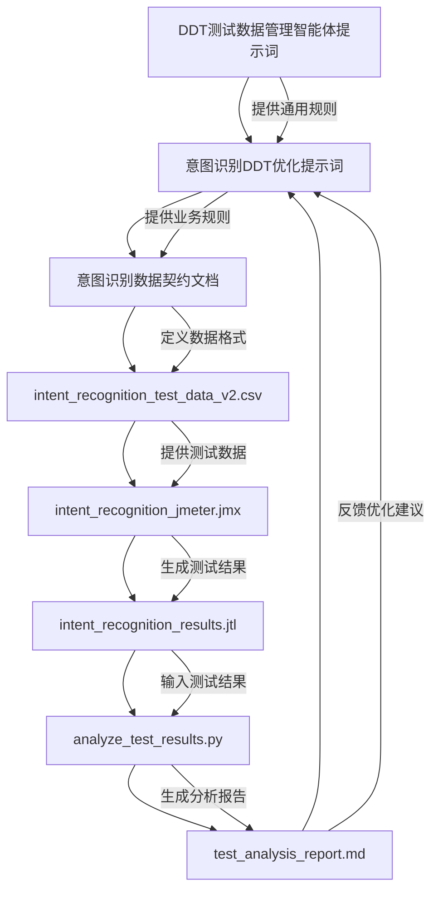
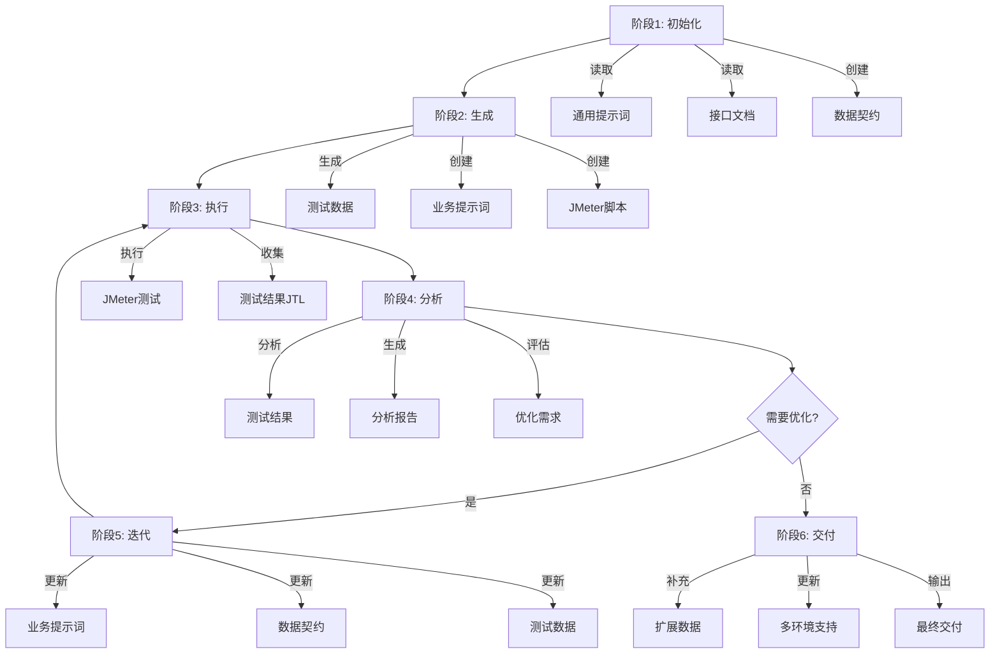
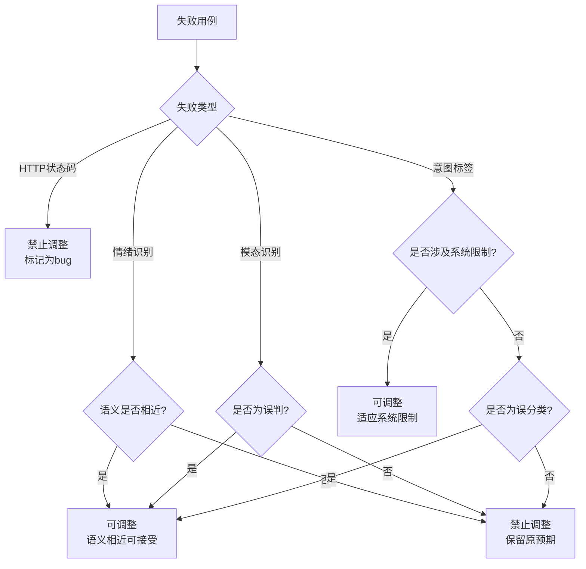
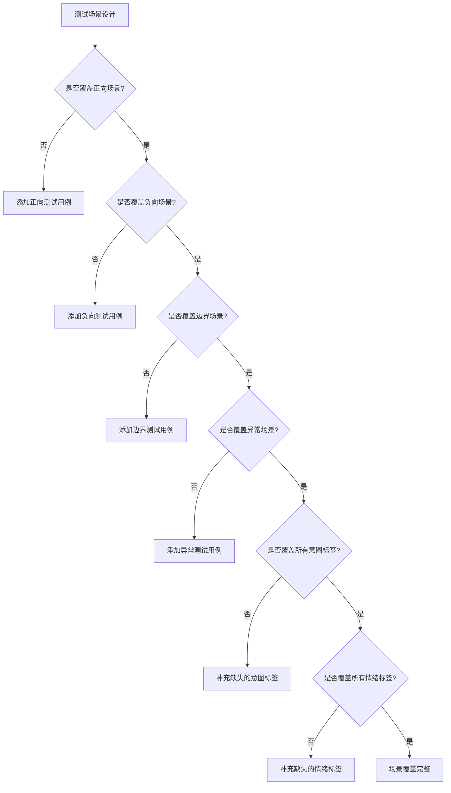

# 意图识别测试智能体工作流

## 1. 核心目标
执行意图识别接口的完整测试流程，包括测试数据生成、测试执行、结果分析和优化迭代。

## 2. 工作流架构


### 1.3 完整工作流（6阶段）



**阶段说明**：
- **阶段1: 初始化** - 读取通用提示词、接口文档，创建数据契约
- **阶段2: 生成** - 生成测试数据、业务提示词、JMeter脚本
- **阶段3: 执行** - 选择环境，执行JMeter，收集结果
- **阶段4: 分析** - 分析结果，生成报告，评估优化需求
- **阶段5: 迭代** - 更新提示词/契约/数据，重新测试
- **阶段6: 交付** - 补充扩展数据，更新多环境支持

**文件流转关系**：
```
DDT测试数据管理智能体提示词.md（通用提示词）
    ↓
意图识别DDT优化提示词.md（业务提示词）
    ↓
意图识别数据契约文档.md（数据契约）
    ↓
intent_recognition_test_data_v2.csv（测试数据）
    ↓
intent_recognition_jmeter.jmx（测试脚本）
    ↓
intent_recognition_results.jtl（测试结果）
    ↓
analyze_test_results.py（分析脚本）
    ↓
test_analysis_report.md（分析报告）
    ↓
意图识别DDT优化提示词.md（反馈优化）
```

### 1.4 交付文档   
## 3. 文件职责

| 文件路径 | 文件类型 | 核心职责 |
| :--- | :--- | :--- |
| `.trae/rules/DDT测试数据管理智能体提示词.md` | 通用提示词 | 定义DDT测试数据生成的通用规则和工作流程 |
| `rules/意图识别DDT优化提示词.md` | 业务提示词 | 定义意图识别业务的测试数据优化规则和决策逻辑 |
| `rules/意图识别数据契约文档.md` | 数据契约 | 定义测试数据的字段格式、业务规则和调整指南 |
| `data/intent_recognition_test_data_v2.csv` | 测试数据 | 存储实际的测试用例数据 |
| `scripts/intent_recognition_jmeter.jmx` | 测试脚本 | 执行意图识别接口测试，支持多环境切换 |
| `reports/intent_recognition_results.jtl` | 测试结果 | 存储JMeter执行结果 |
| `scripts/analyze_test_results.py` | 分析脚本 | 分析测试结果，生成详细报告 |
| `reports/test_analysis_report.md` | 分析报告 | 展示测试统计、失败分析和优化建议 |

## 4. 完整工作流程

### 4.1 阶段1: 初始化与规则提取

#### 4.1.1 读取通用提示词
- 文件路径：`e:\AI测试用例\.trae\rules\DDT测试数据管理智能体提示词.md`
- 提取通用DDT测试数据设计方法论
- 理解测试设计方法体系（边界值、等价类、错误猜想、正交试验、决策表等）

#### 4.1.2 读取接口文档
- 文件路径：`e:\AI测试用例\接口测试\docs\意图识别_api_analysis.md`
- 提取接口功能和用途
- 识别请求参数和响应字段
- 确认业务规则和约束条件

#### 4.1.3 创建原始契约文档
- 文件路径：`e:\AI测试用例\接口测试\rules\意图识别数据契约文档.md`
- 定义字段名称、类型、描述
- 记录业务规则和约束条件
- 提供示例值和测试用例

### 4.2 阶段2: 测试数据生成

#### 4.2.1 生成初始测试数据
- 基于数据契约文档生成测试数据CSV
- 文件路径：`e:\AI测试用例\接口测试\data\intent_recognition_test_data_v2.csv`
- 覆盖正向、负向、边界、异常场景
- 确保数据的多样性和代表性

#### 4.2.2 创建业务提示词
- 文件路径：`e:\AI测试用例\接口测试\rules\意图识别DDT优化提示词.md`
- 定义意图识别业务的测试场景
- 设计决策树和优化规则
- 提供示例和反例

#### 4.2.3 创建JMeter测试脚本
- 文件路径：`e:\AI测试用例\接口测试\scripts\intent_recognition_jmeter.jmx`
- 配置接口请求和断言
- 支持多环境切换（dev/test/prod）
- 使用CSV数据文件进行数据驱动测试

### 4.3 阶段3: 执行测试

#### 4.3.1 选择测试环境
- 确定测试环境（dev/test/prod）
- 准备环境配置（IP、端口等）

#### 4.3.2 执行JMeter脚本
- 命令格式：`jmeter -n -t <脚本路径> -Jenv=<环境名> -l <结果文件路径>`
- 使用完整绝对路径执行命令
- 示例：
  ```powershell
  jmeter -n -t e:\AI测试用例\接口测试\scripts\intent_recognition_jmeter.jmx -Jenv=dev -l e:\AI测试用例\接口测试\reports\intent_recognition_results.jtl
  ```
- 监控测试执行进度

#### 4.3.3 收集测试结果
- 保存测试结果到JTL文件
- 文件路径：`e:\AI测试用例\接口测试\reports\intent_recognition_results.jtl`
- 检查测试执行日志
- 确认测试用例覆盖率

### 4.4 阶段4: 结果分析与优化

#### 4.4.1 分析测试结果
- 读取JTL文件：`e:\AI测试用例\接口测试\reports\intent_recognition_results.jtl`
- 读取CSV文件：`e:\AI测试用例\接口测试\data\intent_recognition_test_data_v2.csv`
- 统计测试用例总数、成功数、失败数
- 计算成功率和失败率
- 分析失败原因和模式

#### 4.4.2 生成分析报告
- 执行分析脚本：
  ```powershell
  python e:\AI测试用例\接口测试\scripts\analyze_test_results.py --jtl e:\AI测试用例\接口测试\reports\intent_recognition_results.jtl --csv e:\AI测试用例\接口测试\data\intent_recognition_test_data_v2.csv --output e:\AI测试用例\接口测试\reports\test_analysis_report.md
  ```
- 文件路径：`e:\AI测试用例\接口测试\reports\test_analysis_report.md`
- 生成详细的统计信息
- 列出失败用例和原因
- 提供优化建议

#### 4.4.3 评估优化需求
- 判断是否需要调整测试数据
- 识别需要优化的测试场景
- 决定是否需要重新执行测试

### 4.5 阶段5: 优化迭代

#### 4.5.1 更新业务提示词
- 文件路径：`e:\AI测试用例\接口测试\rules\意图识别DDT优化提示词.md`
- 根据测试结果优化测试数据规则
- 动态调整断言逻辑
- 贴合业务实际需求

#### 4.5.2 更新契约文档
- 文件路径：`e:\AI测试用例\接口测试\rules\意图识别数据契约文档.md`
- 根据测试结果更新业务规则
- 补充边界条件和异常场景
- 完善字段定义和约束

#### 4.5.3 更新测试数据
- 文件路径：`e:\AI测试用例\接口测试\data\intent_recognition_test_data_v2.csv`
- 根据优化建议调整测试数据
- 补充缺失的测试场景
- 修正错误的预期值

#### 4.5.4 重新执行测试
- 重复阶段3和阶段4
- 验证优化效果
- 确保测试覆盖率提升

### 4.6 阶段6: 最终交付

#### 4.6.1 补充扩展测试数据
- 文件路径：`e:\AI测试用例\接口测试\data\intent_recognition_test_data_v3.csv`
- 补充100条扩展测试数据
- 覆盖多场景和边界条件
- 确保测试数据质量和多样性

#### 4.6.2 更新脚本支持多环境
- 文件路径：`e:\AI测试用例\接口测试\scripts\intent_recognition_jmeter.jmx`
- 支持不同环境（dev/test/prod）的配置切换
- 使用命令行参数`-Jenv`切换环境
- 确保环境配置的正确性和独立性

## 5. 关键决策树

### 5.1 测试数据调整决策树



### 5.2 测试场景覆盖决策树



## 6. 交付文件清单

### 6.1 首次交付

| 文件 | 文件路径 | 说明 |
| :--- | :--- | :--- |
| 通用提示词 | `.trae/rules/DDT测试数据管理智能体提示词.md` | DDT测试数据生成的通用规则 |
| 接口文档 | `docs/意图识别_api_analysis.md` | 意图识别接口的完整文档 |
| 契约文档 | `rules/意图识别数据契约文档.md` | 测试数据格式和业务规则 |
| 测试数据 | `data/intent_recognition_test_data_v2.csv` | 初始测试用例数据 |
| 测试脚本 | `scripts/intent_recognition_jmeter.jmx` | JMeter测试脚本 |
| 测试结果 | `reports/intent_recognition_results.jtl` | JMeter执行结果 |

### 6.2 优化交付

| 文件 | 文件路径 | 说明 |
| :--- | :--- | :--- |
| 业务提示词 | `rules/意图识别DDT优化提示词.md` | 意图识别业务的优化规则 |
| 契约文档 | `rules/意图识别数据契约文档.md` | 更新后的数据契约 |
| 测试数据 | `data/intent_recognition_test_data_v2.csv` | 更新后的测试数据 |
| 测试脚本 | `scripts/intent_recognition_jmeter.jmx` | 更新后的测试脚本 |
| 测试结果 | `reports/intent_recognition_results.jtl` | 重新执行的测试结果 |
| 分析报告 | `reports/test_analysis_report.md` | 测试分析报告 |

### 6.3 最终交付

| 文件 | 文件路径 | 说明 |
| :--- | :--- | :--- |
| 扩展测试数据 | `data/intent_recognition_test_data_v3.csv` | 补充100条扩展测试数据 |
| 多环境脚本 | `scripts/intent_recognition_jmeter.jmx` | 支持dev/test/prod环境切换 |

## 7. 命令执行规范

### 7.1 JMeter执行命令

```powershell
# 开发环境测试
jmeter -n -t e:\AI测试用例\接口测试\scripts\intent_recognition_jmeter.jmx -Jenv=dev -l e:\AI测试用例\接口测试\reports\intent_recognition_results.jtl

# 测试环境测试
jmeter -n -t e:\AI测试用例\接口测试\scripts\intent_recognition_jmeter.jmx -Jenv=test -l e:\AI测试用例\接口测试\reports\intent_recognition_results.jtl

# 生产环境测试
jmeter -n -t e:\AI测试用例\接口测试\scripts\intent_recognition_jmeter.jmx -Jenv=prod -l e:\AI测试用例\接口测试\reports\intent_recognition_results.jtl
```

### 7.2 分析脚本执行命令

```powershell
python e:\AI测试用例\接口测试\scripts\analyze_test_results.py --jtl e:\AI测试用例\接口测试\reports\intent_recognition_results.jtl --csv e:\AI测试用例\接口测试\data\intent_recognition_test_data_v2.csv --output e:\AI测试用例\接口测试\reports\test_analysis_report.md
```

## 8. 文件路径规范

所有文件路径使用完整的绝对路径，禁止使用相对路径。

| 文件类型 | 文件路径 |
| :--- | :--- |
| 通用提示词 | `e:\AI测试用例\.trae\rules\DDT测试数据管理智能体提示词.md` |
| 业务提示词 | `e:\AI测试用例\接口测试\rules\意图识别DDT优化提示词.md` |
| 契约文档 | `e:\AI测试用例\接口测试\rules\意图识别数据契约文档.md` |
| 测试数据 | `e:\AI测试用例\接口测试\data\intent_recognition_test_data_v2.csv` |
| 扩展测试数据 | `e:\AI测试用例\接口测试\data\intent_recognition_test_data_v3.csv` |
| 测试脚本 | `e:\AI测试用例\接口测试\scripts\intent_recognition_jmeter.jmx` |
| 测试结果 | `e:\AI测试用例\接口测试\reports\intent_recognition_results.jtl` |
| 分析脚本 | `e:\AI测试用例\接口测试\scripts\analyze_test_results.py` |
| 分析报告 | `e:\AI测试用例\接口测试\reports\test_analysis_report.md` |

## 9. 错误处理规范

### 9.1 文件不存在
- 验证文件路径存在性
- 文件不存在时报错并终止执行
- 使用Glob工具确认文件存在性

### 9.2 数据格式错误
- 验证CSV文件格式符合数据契约定义
- 数据格式错误时记录错误日志并跳过该条数据
- 使用Read工具读取文件内容进行验证

### 9.3 测试执行失败
- 检查JMeter执行日志
- 测试执行失败时分析失败原因
- 根据失败原因决定是否重试或终止

## 10. 质量保障规范

### 10.1 测试数据质量
- 覆盖所有意图标签（CHAT, SEARCH, RECOMMEND, MEMORY, VISION等）
- 覆盖所有情绪标签（平淡、开心、愤怒、厌烦、疑问、关切等）
- 覆盖正向、负向、边界、异常场景
- 确保数据的多样性和代表性

### 10.2 测试覆盖率
- 统计测试用例总数、成功数、失败数
- 计算成功率和失败率
- 分析失败原因和模式
- 提供优化建议

### 10.3 报告质量
- 包含测试统计概览
- 包含响应时间统计
- 包含失败用例分析
- 包含优化建议

## 11. 持续优化规范

### 11.1 经验积累
- 记录每次调整的决策过程和结果
- 建立失败模式知识库
- 优化"调整决策树"

### 11.2 迭代优化
- 根据测试结果持续优化测试数据
- 根据分析结果持续优化测试策略
- 将分析结果和优化建议记录下来

### 11.3 知识沉淀
- 将优化经验记录到业务提示词中
- 将业务规则更新到契约文档中
- 将测试数据更新到CSV文件中
